# Elucidation of mesopore-organic molecules interactions in mesoporous $\mathrm { T i O } _ { 2 }$ photocatalysts to improve photocatalytic activity

Xuan Hao Lin a, Ye Wu a, Jiao Xiang a, Da He a, Sam Fong Yau Li a,b,c,∗

a Department of Chemistry, National University of Singapore, 3 Science Drive 3, Singapore 117543, Singapore   
b NUS Environmental Research Institute (NERI), #02-01, T-Lab Building (TL), 5A Engineering Drive 1, Singapore 117411, Singapore   
c Shenzhen Engineering Laboratory for Eco-efficient Polysilicate Materials, School of Environment and Energy, Peking University Shenzhen Graduate School,   
Shenzhen 518055, China

# a r t i c l e i n f o

# a b s t r a c t

Article history:   
Received 3 February 2016   
Received in revised form 1 June 2016   
Accepted 7 June 2016   
Available online 7 June 2016

Keywords:   
Mesoporous   
Mesopore   
$\mathrm { T i O } _ { 2 }$ photocatalyst   
Reverse osmosis concentrate   
Fluorescein

Mesoporous $\mathrm { T i O } _ { 2 }$ photocatalysts were synthesized and characterized by $\Nu _ { 2 }$ sorption, XRD, SEM and spectroscopic methods. Formation of the mesopores was attributed to the decomposition of entrapped inorganic ions, which was reported before. Fluorescein molecules were used as model substrate molecules. To investigate interactions between mesopores and fluorescein molecules, a novel two-phase method to differentiate mesopore encapsulation from external surface adsorption was developed in this study, which was also not reported before. This novel two-phase method could be widely applied to study other mesoporous materials. Results showed that fluorescein molecules could enter and exit from the mesopores freely. Fluorescein molecules sealed inside the mesopores could still be photocatalytically degraded to reaction intermediates, i.e. carboxylic acids and final products. Furthermore, it was found that when the mesopores were intentionally sealed by chloroform, photocatalytic activity for the degradation of reverse osmosis concentrate (ROC) decreased. When the mesopores were open the dissolved organic compounds (DOC) in ROC could go into the mesopores and their photocatalytic degradation products could also come out from the mesopores. Correlation of photocatalytic activity to surface area and mesopore volume was investigated. Formation mechanism of mesopores was elucidated. Interactions between the mesopores and fluorescein molecules are also described.

$^ { © }$ 2016 Elsevier B.V. All rights reserved.

# 1. Introduction

Increasing demand for purified water was partially satisfied by the reverse osmosis (RO) membrane technology in the desalination plants, municipal wastewater treatment plants (WWTP) and industrial WWTP [1]. Waste, i.e. RO Concentrate (ROC), was also generated when purified water was generated using RO membrane [2]. Currently most ROC is discharged to water bodies which poses potential serious threat to the ecosystems [3]. From different membrane concentrate sources, the compositions and corresponding treatment strategies of ROC are different. RO brine from desalination plants contains high chloride content. Current treatment methods include evaporation ponds and wind-aided intensified evaporation. RO brine from industrial WWTP (e.g. mining industries) tends to have high inorganic (e.g. sulfate in mining industries)

content and thus could be treated using eutectic freeze crystallization (EFC). ROC from municipal WWTP has higher organic contents, and hence advanced oxidation processes (AOPs) are promising treatment methods. The organic contaminants in municipal RO effluents include natural organic matters (NOM), detergents, personal care products, pharmaceuticals, and so on [4]. AOPs include photooxidation, sonolysis, electrooxidation, Fenton’s reaction, and photocatalysis [1,4–17]. Photooxidation and Fenton’s reaction were reported to have relative medium to high costs of chemical consumables. Sonolysis efficiency was not satisfactory. Toxic by-products were the concerns of electroxidation. Among the AOPs, photocatalysis is a promising method with low cost and high efficiency but without toxic by-products.

Titanium dioxide $\mathrm { T i O } _ { 2 }$ has been used as photocatalysts for wastewater purification, organic synthesis, solar cells, surface selfcleaning and air purification, etc. [18–20]. $\mathrm { T i O } _ { 2 }$ was reported to have high efficiency in ROC treatment [4]. Mesopores were reported to improve the photocatalytic activity of $\mathrm { T i O } _ { 2 }$ [21–23]. Well-known mesoporous materials include MCM-41, MCM-48, SBA-15, etc. which were discovered in the early 1990s [24–26].

Mesoporous materials were reported to improve electron and mass transfers [27–30]. Over the past two decades, the research of mesoporous $\mathrm { T i O } _ { 2 }$ was mainly focused on new synthesis methods and improved photocatalytic activities [21,22,31–38]. Some researchers explored potential applications in solar cells (anode), ${ \bf C } { \bf O } _ { 2 }$ capture, DNA separation, dye adsorption, and catalysis for synthesis [32,39–46]. However there have been little research on the interactions of mesopores and organic molecules, which would be important for the understanding of photocatalytic activity with mesopores [28]. When there were mesopores in $\mathrm { T i O } _ { 2 }$ , its activity was found to be improved. In most cases, $\mathrm { T i O } _ { 2 }$ with mesopores also had higher surface areas (SA). It was not clear whether the improved activities were due to higher SA or presence of mesopores. The possible interactions between mesopores and substrate molecules have not been elucidated. In this report, we synthesized mesoporous $\mathrm { T i O } _ { 2 }$ by a sol-gel method. The mesopores were formed by the decomposition of sulfate ions. This novel mesopore forming method (without any surfactants or other templates) in $\mathrm { T i O } _ { 2 }$ is reported here. We investigated and confirmed the mass transfer in $\mathrm { T i O } _ { 2 }$ mesopores using fluorescence spectroscopy and Fourier transform infrared spectroscopy (FTIR). We also investigated the relationships among SA, mesopore volume, mass transfer by mesopores and improved photocatalytic activity. To investigate the mesopore-molecule interactions, a novel two-phase method (chloroform-water) to differentiate mesopore encapsulation from external surface adsorption was developed and reported. This novel two-phase method could be also applied in the investigation of interactions between other porous materials and organic molecules (adsorbents/reactants/substrates), which will be of importance for the understanding of catalytic mechanisms.

# 2. Experimental

Details of the photocatalytic reaction setup, ROC sample characteristics & analysis and catalyst characterization methods were described previously [47,48].

# 2.1. Materials

Titanyl sulfate $( 9 9 . 5 \%$ , AR), ethanol $9 5 \%$ , Reagent grade), ammonia $2 5 \%$ (AR), fluorescein $( 9 9 . 9 \%$ , AR), chloroform $9 9 . 9 \%$ , AR) and sodium hydroxide $( 9 9 . 9 \%$ , AR) were obtained from Sigma-Aldrich. Municipal ROC sample (5 l) was obtained from a Singapore WWTP and stored in a refrigerator at $4 ^ { \circ } \mathsf C$ for all the experiments here.

# 2.2. Catalyst preparation

$\mathrm { T i O } _ { 2 }$ photocatalysts were prepared using the sol-gel method from the hydrolysis of titanyl sulfate $\mathrm { T i O S O } _ { 4 } { \cdot } \mathbf { x } \mathrm { H } _ { 2 } 0$ in a mixture of $8 0 \% \mathrm { v / v }$ ethanol and $2 0 \% \mathrm { v } / \mathrm { v }$ water and further calcination at a certain temperature within $1 0 0 { - } 8 0 0 ^ { \circ } \mathrm { C }$ for $^ { 1 \mathrm { h } }$ [47,49]. The final catalysts were named as $\mathrm { T i O } _ { 2 }$ -100, $\mathrm { T i O } _ { 2 }$ -200, $\mathrm { T i O } _ { 2 }$ -300, $\mathrm { T i O } _ { 2 }$ - 400, $\mathrm { T i O } _ { 2 }$ -500, $\mathrm { T i O } _ { 2 }$ -600, $\mathrm { T i O } _ { 2 }$ -700 and $\mathrm { T i O } _ { 2 }$ -800 respectively according to their calcination temperature. The number behind $\mathrm { T i O } _ { 2 }$ represents the calcination temperature. The number after the temperature represents the time of calcination, e.g. the catalysts calcined at $6 0 0 ^ { \circ } \mathsf C$ for $^ { 3 \mathrm { h } }$ is named as $\mathrm { T i O } _ { 2 }$ -600-3.

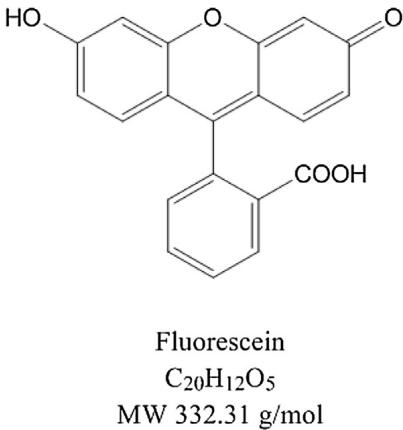  
Fig. 1. Molecular structure of fluorescein dye.

# 2.3. Preparation of fluorescein solution

To obtain better sensitivity for the detection of molecules interacted with $\mathrm { T i O } _ { 2 }$ a well-known fluorescent compound – fluorescein dye was used as a model molecule. Molecular structure of fluorescein is shown in Fig. 1. When excited at $2 5 4 \mathrm { n m }$ , fluorescein molecule emits fluorescence band from 490 to $7 0 0 \mathrm { n m }$ peaked at $5 2 1 \mathrm { n m }$ . Fluorescein is not soluble in water and most solvents including chloroform, cyclohexane, etc. It is soluble in alkaline water. $0 . 8 2 4 0 { \mathrm { g } }$ of NaOH and $0 . 5 3 3 ^ { \mathrm { g } }$ of fluorescein were dissolved in deionized (DI) water with a final volume of $5 . 0 \mathrm { m l }$ . The prepared fluorescein solution was 0.3208 M.

# 2.4. Encapsulating fluorescein molecules into $T i O _ { 2 }$ mesopores

To explore the interactions between mesopores and fluorescein molecules, a novel two-phase method was developed to differentiate external surface adsorption from mesopore encapsulation. $0 . 0 0 4 0 { \mathrm { g } }$ of mesoporous $\mathrm { T i O } _ { 2 } – 6 0 0$ catalyst was soaked in $1 0 0 \mu \mathrm { l }$ of 0.3208 M fluorescein solution for $3 0 \mathrm { { m i n } }$ (Scheme 1). Then it was centrifuged, rinsed with $6 0 0 \mu \mathrm { l }$ of DI water once to remove excess fluorescein and dried at $5 0 ^ { \circ } \mathsf C$ for 2 h. 0.5 ML of chloroform $\left( \mathrm { C H C l } _ { 3 } \right)$ ) was added to the dried fluorescein-loaded catalyst sample with soaking time of $6 0 \mathrm { { m i n } }$ to ensure chloroform went into the mesopores. Chloroform was used to seal the fluorescein molecules (if any) inside the mesopores and prevent it from rinsing off by DI water. Chloroform and water did not dissolve each other. Excess chloroform was removed and the sample was rinsed with $2 \mathrm { m l }$ of DI water for 3 times until the fluorescence of the rinsing solution was low enough indicating no adsorbed fluorescein molecules on the external surface of mesoporous $\mathrm { T i O } _ { 2 }$ -600. The rinsing solutions were named as “Encap 1st rinse”, “Encap 2nd rinse” and “Encap 3rd rinse”. The fluorescein-encapsulated $\mathrm { T i O } _ { 2 }$ - 600 sample (wet slurry) was named as “fluo-encap- $. \mathrm { T i O } _ { 2 } ^ { \cdot }$ ”. A Gilden Photonics FluoroSENS fluorescence spectrometer was used for fluorescence analysis: excitation wavelength $2 5 4 \mathrm { n m }$ , and emission wavelength scanning range was $4 7 0 { - } 7 4 0 \mathrm { n m }$ . All liquid samples for fluorescence measurement did not contain any catalysts after centrifuge.

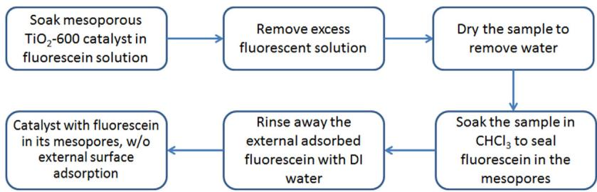  
Scheme 1. Encapsulating fluorescein molecules into the mesopores of $\mathrm { T i O } _ { 2 }$ -600 photocatalyst.

# 2.5. Release of encapsulated fluorescein from mesopores

The above fluorescein-encapsulated sample, “fluo-encap- $. \mathrm { T i O } _ { 2 } ^ { \cdot }$ , was dried at $5 0 ^ { \circ } \mathsf C$ for $^ { 1 \mathrm { h } }$ , and then $2 . 0 \mathrm { m l }$ of $1 0 . 0 \mathrm { m M } \mathrm { \ N a O H }$ was added to it with soaking time $^ { 1 \mathrm { h } }$ to extract out the fluorescein molecules from the mesopores of $\mathrm { T i O } _ { 2 }$ -600. The solution was centrifuged (named as “fluorescein released from mesopores”) and analysed with fluorescence measurement.

# 2.6. Photocatalytic degradation of encapsulated fluorescein

$3 . 5 \mathrm { m l }$ DI water was added to the above fluoresceinencapsulated (wet slurry) sample – “fluo-encap- $\cdot \mathrm { T i O } _ { 2 } ^ { \cdot }$ ”. Then with slow stirring at $2 0 \mathrm { r p m }$ (low rpm was employed to prevent chloroform from coming out of the mesopores), it was irradiated with monochromatic UV $3 6 5 \mathrm { n m }$ for $^ { 2 \mathrm { h } }$ $( 8 . 4 0 7 \times 1 0 ^ { 1 5 }$ photons/S ml; $1 8 \mathrm { m W } / \mathrm { c m } ^ { 2 } .$ ). The irradiated sample was centrifuged. The top layer was named as “Solution immediate-after-reaction” and analysed with fluorescence measurement. The reacted and centrifuged catalyst was dried at $5 0 ^ { \circ } \mathsf { C }$ for $^ { 1 \mathrm { h } }$ , soaked with $2 . 0 \mathrm { m l } 0 . 0 1 \mathrm { M } \mathrm { N a O H }$ solution for $^ { 1 \mathrm { h } }$ and then centrifuged. The centrifuged solution was named as “Extraction of the catalyst after reaction”. The same experiment without irradiation was conducted for a comparison (Fig. S3) and it showed no degradation of fluorescein.

# 2.7. Control sample-1 with adsorbed fluorescein in the mesopores and on external surface

$0 . 0 0 4 0 { \mathrm { g } }$ of mesoporous $\mathrm { T i O } _ { 2 }$ -600 catalyst was soaked in $1 0 0 \mu \mathrm { l }$ of 0.0321 M fluorescein solution for $3 0 \mathrm { { m i n } }$ . Then it was centrifuged, rinsed with $6 0 0 \mu \mathrm { l }$ of DI water once to remove excess fluorescein and dried at $5 0 ^ { \circ } \mathsf C$ for $^ { 2 \mathrm { h } }$ . It was labelled as “Control sample-1”.

# 2.8. Control sample-2 with sealed mesopores and cleaned external surface

$0 . 0 0 4 0 { \mathrm { g } }$ of mesoporous $\mathrm { T i O } _ { 2 }$ -600 catalyst was soaked in $0 . 5 \mathrm { m l }$ of chloroform for $3 0 \mathrm { { m i n } }$ to allow the solvent to penetrate into and seal the mesopores, and then excess solvent was removed. $1 0 0 \mu \mathrm { l }$ of 0.3208 M fluorescein solution was added to the sample and kept for $3 0 \mathrm { { m i n } }$ . Then it was centrifuged, rinsed with $6 0 0 \mu \mathrm { l }$ of DI water once to remove excess fluorescein, followed by several DI water rinsing till very low fluorescence from the rinsing solution. This is to ensure that (1) fluorescein adsorbed on the external surface of $\mathrm { T i O } _ { 2 }$ -600 catalyst could be completely removed and (2) with the mesopores sealed by chloroform the fluorescein molecules could not penetrate into the mesopores anymore. It was labelled as “Control sample- $2 "$ .

# 2.9. FTIR samples

3 FTIR samples were prepared, i.e. dried fluo-encap- $\cdot \mathrm { T i O } _ { 2 }$ kept in an $8 0 ^ { \circ } \mathrm { C } .$ -oven for $^ { 8 \mathrm { h } }$ , control sample-1, and control sample-2.

# 2.10. Photocatalytic activity of pore-sealed $T i O _ { 2 }$ -600 catalyst

$0 . 0 5 0 0 { \mathrm { g } }$ of $\mathrm { T i O } _ { 2 }$ -600 catalyst was soaked in $0 . 5 \mathrm { m l }$ of chloroform for $3 0 \mathrm { { m i n } }$ to seal the mesopores with solvent. Then excess solvent was removed. Immediately the sample was rinsed with DI water 3 times to ensure complete removal of excess solvent and to wet the catalyst so that highly volatile $\mathrm { C H C l } _ { 3 }$ in the mesopores did not evaporate before ROC sample was added. Then $5 0 \mathrm { m l }$ of ROC was added and irradiated with monochromatic 365 nm UV light $( 6 . 4 6 7 \times 1 0 ^ { 1 5 }$ photons/S ml; $1 8 \mathrm { m W } / \mathrm { c m } ^ { 2 } .$ ). Sampling intervals were 0, 1, 2, 4, and $^ { 6 \mathrm { h } }$ .

# 3. Results

# 3.1. Characterization

# 3.1.1. XRD

The prepared photocatalysts calcined below $7 0 0 ^ { \circ } \mathsf C$ were all nano-sized anatase phase (Fig. 2). With the increased calcination temperature, peak intensities increased indicating higher crystallinity of the catalysts. This could be due to the decomposition of impurities (mainly sulfate species originated from titanyl sulfate) at calcination, i.e. the higher calcination temperature the more impurities degraded. Their 5 characteristic peaks were assigned to anatase planes (101), $( 1 0 3 ) + ( 0 0 4 ) + ( 1 1 2 ) , ( 2 0 0 ) , ( 1 0 5 ) + ( 2 1 1 )$ and (118) at 2 angle 25.4, 38.0, 48.1, 54.7, and $6 2 . 9 ^ { \circ }$ . At low calcination temperature $( 1 0 0 - 4 0 0 ^ { \circ } { \mathsf { C } } )$ , the XRD peaks were broadened due to insufficient diffraction from nano crystals to cancel each other beyond the Bragg’s angles. $\mathrm { T i O } _ { 2 } – 6 0 0$ and $\mathrm { T i O } _ { 2 } – 6 0 0 – 3$ calcined at $6 0 0 ^ { \circ } \mathsf C$ for 1 and $^ { 3 \mathrm { h } }$ did not have significantly different XRD intensities, which indicated that calcination time did not have much impact on the catalyst crystallinity. Rutile phase started to show up when calcination temperature was increased to $8 0 0 ^ { \circ } \mathrm { C }$ . The 3 rutile peaks of $\mathrm { T i O } _ { 2 }$ -800 were assigned to planes (110), (101) and (111) at 2 angle 27.5, 36.2 and $4 0 . 7 ^ { \circ }$ .

# 3.1.2. $N _ { 2 }$ sorption isotherms

$\Nu _ { 2 }$ adsorption/desorption isotherms provided material porosity and surface area information. Isotherms of $\mathrm { T i O } _ { 2 }$ -100, $\mathrm { T i O } _ { 2 }$ -200, $\mathrm { T i O } _ { 2 }  – 3 0 0$ and $\mathrm { T i O } _ { 2 } { \cdot } 4 0 0$ were basically type II isotherms (Fig. 3a) due to minimum hysteresis. The reversible Type II isotherm is the normal form of isotherm obtained with a non-porous or macroporous adsorbent [50]. The Type II isotherm represents unrestricted monolayer-multilayer adsorption. Point B (located at around $\mathrm { P / P _ { 0 } }$ 0.1), the beginning of the almost linear middle section of the isotherm, is often taken to indicate the stage at which monolayer coverage is complete and multilayer adsorption about to begin. Although the isotherms of $\mathrm { T i O } _ { 2 }$ -100, $\mathrm { T i O } _ { 2 }$ -200, $\mathrm { T i O } _ { 2 }$ -300 and $\mathrm { T i O } _ { 2 }$ - 400 were type II isotherms, some hysteresis loops (small loop volume) could also be been from their isotherms. This indicated these 4 catalysts also had some mesopores. In this sense, these isotherms could also be classified as type IV isotherms. Isotherms of $\mathrm { T i O } _ { 2 }$ -500, $\mathrm { T i O } _ { 2 }$ -600, $\mathrm { T i O } _ { 2 }$ -600-3 and $\mathrm { T i O } _ { 2 }$ -700 were obvious type IV isotherms (Fig. 3b). Characteristic features of the Type IV isotherm are its hysteresis loop, which is associated with capillary condensation taking place in mesopores, and the limiting uptake over a range of high $\mathrm { P / P } _ { 0 }$ . The initial part of the Type IV isotherm is attributed to monolayer-multilayer adsorption since it follows the same path as the corresponding part of a Type II isotherm. Hysteresis appearing in the multilayer range of physisorption isotherms is usually associated with capillary condensation in mesopore structures. The hysteresis loops of $\mathrm { T i O } _ { 2 }$ -500, $\mathrm { T i O } _ { 2 }$ -600, $\mathrm { T i O } _ { 2 }$ -600-3 and $\mathrm { T i O } _ { 2 }$ -700 were type H2 loops. Many porous adsorbents, such as inorganic oxide gels and porous glasses, tend to give Type H2 loops, but in such systems the distribution of pore size and shape is not well-defined. Indeed, the H2 loop is especially difficult to interpret: in the past it was attributed to a difference in mechanism between condensation and evaporation processes occurring in pores with narrow necks and wide bodies (often referred to as ‘ink bottle’ pores), but it is now recognised that this provides an over-simplified picture and the role of network effects must be taken into account. Isotherm of $\mathrm { T i O } _ { 2 }$ -800 was type V isotherm (Fig. 3b). The Type $\mathsf { V }$ isotherm is uncommon; it is related to weak adsorbent-adsorbate interaction, but is obtained with certain porous adsorbents.

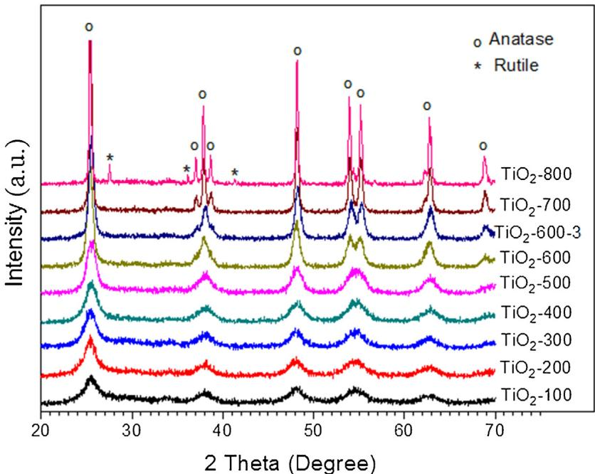  
Fig. 2. X-ray diffraction (XRD) patterns of the $\mathrm { T i O } _ { 2 }$ photocatalysts.

# 3.1.3. Pore size distribution, pore volume and BET surface area

Fig. 4a shows the pore size distribution (PSD) of the catalysts $\mathrm { T i O } _ { 2 }$ -500, $\mathrm { T i O } _ { 2 }$ -600, $\mathrm { T i O } _ { 2 }$ -600-3 and $\mathrm { T i O } _ { 2 }$ -700. The PSDs were derived from desorption plot of the $\Nu _ { 2 }$ sorption isotherms in Fig. 3. These 4 catalysts had quite narrow individual PSD, their pore sizes mainly fell into the mesopore range of $2 { - } 1 4 \mathrm { n m }$ (Fig. 4a). Their PSD peaks were centred at 3.6, 6.2, 7.4 and $1 0 . 6 \mathrm { n m }$ respectively. Estimated fluorescein molecule dimension is $1 . 0 { - } 1 . 3 \mathrm { n m }$ . Fig. 4b showed the pore volumes of micro-, meso- and macro- pores for the catalysts calcined at different temperature. It is obvious the mesopores were the majority with the $\mathrm { T i O } _ { 2 }$ catalysts calcined at $2 0 0 { - } 7 0 0 ^ { \circ } C ,$ , while micropores and macropores were the minorities.

Generally micropores are referred to pores less than $2 \mathrm { n m }$ , mesopores are in the range of $2 { - } 5 0 \mathrm { n m }$ , and macropores are larger than $5 0 \mathrm { n m }$ . Table 1 listed the pore volumes of micro-, meso- and macropores of individual catalysts. Catalysts $\mathrm { T i O } _ { 2 } { - } 5 0 0$ , $\mathrm { T i O } _ { 2 }$ -600, $\mathrm { T i O } _ { 2 }$ - 600-3 and $\mathrm { T i O } _ { 2 }$ -700 had significantly larger volumes of mesopores than other catalysts $\mathrm { T i O } _ { 2 }$ -100, $\mathrm { T i O } _ { 2 }$ -200, $\mathrm { T i O } _ { 2 }$ -300, $\mathrm { T i O } _ { 2 }$ -400 and $\mathrm { T i O } _ { 2 }$ -700 (Fig. S5). BET surface area $( S _ { \mathrm { B E T } } )$ increased to the highest $( 1 5 4 . 9 \mathrm { m } ^ { 2 } / \mathrm { g } )$ when calcination temperature increased from 100 to $3 0 0 ^ { \circ } \mathsf C ,$ , and then decreased when calcination temperature further increased (Table 1, Fig. S5). $S _ { \mathrm { B E T } }$ values were high with the catalysts $\mathrm { T i O } _ { 2 }$ -200, $\mathrm { T i O } _ { 2 }$ -300, $\mathrm { T i O } _ { 2 } – 4 0 0$ and $\mathrm { T i O } _ { 2 }$ -500, while mesopore volumes were high with the catalysts $\mathrm { T i O } _ { 2 }  – 5 0 0$ , $\mathrm { T i O } _ { 2 }$ -600, $\mathrm { T i O } _ { 2 }$ - 600-3 and $\mathrm { T i O } _ { 2 } – 7 0 0$ . This information is important in correlating photocatalytic activity and $S _ { \mathrm { B E T } }$ or mesopore volume.

# 3.1.4. SEM & FTIR

From the SEM photographs of $\mathrm { T i O } _ { 2 }  – 2 0 0$ , its primary nanoparticles formed secondary aggregates/agglomerates (Fig. 5a). The size range of its aggregates/agglomerates was $0 . 1 \mathrm { - } 5 \mu \mathrm { m }$ . $\mathrm { T i O } _ { 2 }$ -600 contained primary sphere-shaped nanoparticles with a size range of $1 0 { - } 2 0 \mathrm { n m }$ (Fig. 5b). FTIR spectrum discloses chemical bonding information. Broad peak centred at around $3 7 7 0 \mathrm { c m } ^ { - 1 }$ was assigned to Ti OH [2,47,48]. Peak at $3 4 2 0 \mathrm { c m } ^ { - 1 }$ was assigned to $\mathrm { O - H }$ stretching, while peak at $3 1 5 9 \mathrm { c m } ^ { - 1 }$ was assigned to $\mathrm { O - H }$ stretching hydrogen-bonded to sulfate species (Fig. 5c). $1 6 3 6 \mathrm { c m } ^ { - 1 }$ was assigned to $_ \mathrm { H - O - H }$ bending. 1390, 1215, 1148 and $1 0 5 1 \mathrm { c m } ^ { - 1 }$ were assigned to $( \mathrm { M O } ) \mathrm { S O } _ { 3 } \mathrm { H } .$ , $( \mathsf { M O } ) _ { 2 } \mathsf { S O } _ { 2 }$ or $( \mathrm { M O } ) _ { 3 } \mathrm { S } { = } \mathrm { O }$ . Peak at $5 9 4 \mathrm { c m } ^ { - 1 }$ (likely $5 4 4 \mathrm { c m } ^ { - 1 }$ also) was assigned to Ti O Ti asymmetric stretching. The FTIR spectra showed that $\mathrm { T i O } _ { 2 }$ -200 had more impurities, i.e. sulfate species than $\mathrm { T i O } _ { 2 }$ -600. Stretching vibration of $\mathrm { T i } { - } S 0 _ { 4 }$ Ti bonds located at $1 0 5 1 \mathrm { c m } ^ { - 1 }$ indicated that some of these sulfate species were bonded to $\mathrm { T i ^ { 4 + } }$ . Sulfate species started to decompose from ${ \sim } 2 0 0 ^ { \circ } \mathrm { C }$ . This was the reason why $\mathrm { T i O } _ { 2 }$ -600 has less sulfate species than $\mathrm { T i O } _ { 2 }$ -200. More FTIR spectra are shown in Fig. S4. With higher calcination temperature, more sulfate species were degraded.

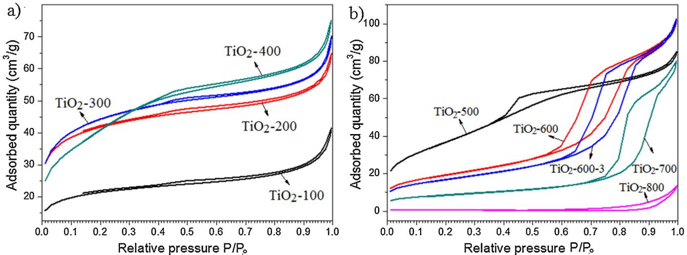  
Fig. 3. $\Nu _ { 2 }$ adsorption/desorption isotherms of the photocatalysts (a) $\mathrm { T i O } _ { 2 }$ -100, $\mathrm { T i O } _ { 2 }$ -200, $\mathrm { T i O } _ { 2 }$ -300 and $\mathrm { T i O } _ { 2 }$ -400; (b) $\mathrm { T i O } _ { 2 }$ -500, $\mathrm { T i O } _ { 2 }$ -600, $\mathrm { T i O } _ { 2 }$ -600-3, $\mathrm { T i O } _ { 2 }$ -700, and $\mathrm { T i O } _ { 2 }$ -800.

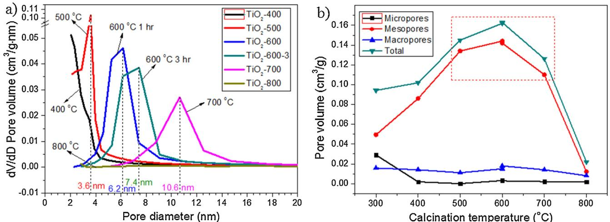  
Fig. 4. (a) Pore size distribution of $\mathrm { T i O } _ { 2 }$ -400, $\mathrm { T i O } _ { 2 }$ -500, $\mathrm { T i O } _ { 2 }$ -600, $\mathrm { T i O } _ { 2 }$ -600-3, $\mathrm { T i O } _ { 2 }$ -700, and $\mathrm { T i O } _ { 2 }$ -800; (b) Volume of micropores, mesopores and macropores with different calcination temperature.

# 3.1.5. UV–vis DRS and band gap

All 3 catalysts $\mathrm { T i O } _ { 2 }$ -200, $\mathrm { T i O } _ { 2 } { \cdot } 4 0 0$ and $\mathrm { T i O } _ { 2 }$ -600 strongly absorbed UV light with wavelength less than $3 5 0 \mathrm { n m }$ due to charge transfer from $0 ^ { 2 - }$ to $\mathrm { T i ^ { 4 + } }$ at 220 and $2 8 8 \mathrm { n m }$ or interband transition at $3 4 0 \mathrm { n m }$ , i.e. vertical transition without involving phonons (Fig. 6a) [51]. $\mathrm { T i O } _ { 2 }$ -400 and $\mathrm { T i O } _ { 2 }$ -600 partially absorbed light with wavelength 350–420 nm – the Urbach tail region, where the transitions involved phonons. $\mathrm { T i O } _ { 2 }$ -400 and $\mathrm { T i O } _ { 2 }$ -600 did not absorb any light within visible region $\chi > 4 2 0 \mathrm { n m }$ ). $\mathrm { T i O } _ { 2 }$ -100 did not absorbed visible light also. However, $\mathrm { T i O } _ { 2 }  – 2 0 0$ $\mathrm { T i O } _ { 2 }  – 3 0 0$ also) absorbed some visible light within $4 0 0 { - } 8 0 0 \mathrm { n m }$ . The appearance of $\mathrm { T i O } _ { 2 }$ -200 (cid:) $\mathrm { T i O } _ { 2 }$ -300 also) was yellowish while both $\mathrm { T i O } _ { 2 }$ -400 and $\mathrm { T i O } _ { 2 }$ -600 were white. The reason could be originated from the decomposition of sulfate species (Eqs. (1) & (2)). The sulfate species decomposed to $S 0 _ { 3 }$ gas when calcined at ${ } { > } 2 0 0 ^ { \circ } \mathrm { C }$ and the released $S 0 _ { 3 }$ gas could be partially adsorbed on $\mathrm { T i O } _ { 2 }$ (physic-sorption) or formed bonding with $\mathrm { T i O } _ { 2 }$ (chemi-sorption). Another possibility was that S-doped $\mathrm { T i O } _ { 2 }$ was formed. However, the indirect bandgap $\mathtt { E _ { g } }$ of $\mathrm { T i O } _ { 2 }$ -200 was $3 . 2 1 \mathrm { e V }$ equitable to UV light wavelength $3 8 7 \mathrm { n m }$ which ruled out the possibility of S-doped $\mathrm { T i O } _ { 2 }$ $\mathrm { ~ E _ { g } ~ } 2 . 4 \mathrm { - } 3 . 0 \mathrm { } \mathrm { e V } )$ [52]. All 3 catalysts $\mathrm { T i O } _ { 2 }$ -200, $\mathrm { T i O } _ { 2 }$ -400 and $\mathrm { T i O } _ { 2 }$ -600 had similar $\mathrm { E _ { g } } 3 . 2 1 \mathrm { - } 3 . 2 4 \mathrm { e V }$ (Fig. 6b). Therefore, the yellowish color of $\mathrm { T i O } _ { 2 }$ -200 ( $\mathrm { T i O } _ { 2 }$ -300 also) and their absorbance in visible region were mainly due to the physically-adsorbed or chemically-bonded $S 0 _ { 3 }$ which left when the calcination temperature was higher than $4 0 0 ^ { \circ } \mathsf C$ .

$$
\begin{array} { r l } & { \mathsf { H } _ { 2 } \mathsf { S O } _ { 4 } \stackrel { > 3 0 0 ^ { \circ } \mathsf { C } } {  } \mathsf { S O } _ { 3 } \mathsf { H } _ { 2 } 0 } \\ & { ( \mathsf { N H } _ { 4 } ) _ { 2 } \mathsf { S O } _ { 4 } \stackrel { > 2 0 0 ^ { \circ } \mathsf { C } } {  } \mathsf { N H } _ { 4 } \mathsf { H S O } _ { 3 } + \mathsf { N H } _ { 3 } \stackrel { > 2 5 0 ^ { \circ } \mathsf { C } } {  } \mathsf { S O } _ { 3 } + 2 \mathsf { N H } _ { 3 } } \end{array}
$$

# 3.2. Photocatalytic activity

RO Concentrate (ROC) with 26.09 ppm of total organic content (TOC) was used to test the photocatalytic activities of catalysts [47]. The photocatalytic activities of the $\mathrm { T i O } _ { 2 }$ catalysts increased from $\mathrm { T i O } _ { 2 }$ -100 to $\mathrm { T i O } _ { 2 }$ -600 with increased calcination temperature (Fig. 7a–c). When the calcination temperature further increased from 600 to $7 0 0 ^ { \circ } \mathsf C$ , the activity slightly decreased. At the optimum calcination temperature $6 0 0 ^ { \circ } \mathsf C ,$ if the calcination time increased from 1 to $^ { 3 \mathrm { h } }$ , the activity decreased. However, when the calcination temperature was as high as $8 0 0 ^ { \circ } \mathsf C$ , the activity of $\mathrm { T i O } _ { 2 }$ -800 was very low, even lower than $\mathrm { T i O } _ { 2 }$ -100. From $\mathrm { T i O } _ { 2 }$ -100 to $\mathrm { T i O } _ { 2 }$ -600, reasons for the enhanced activity could be complicated. The enhanced activity could be due to less impurity, higher crystallinity, increased particle size, higher ratio of surface/bulk core sulfate species, larger SA, more pores, and so on [47]. Fig. 7d shows a strong correlation between activity and pore volume, either mesopore volume or total pore volume. The higher pore volume the higher activities these catalysts had. $\mathrm { T i O } _ { 2 }$ -500, $\mathrm { T i O } _ { 2 }$ -600, $\mathrm { T i O } _ { 2 }$ -3 and $\mathrm { T i O } _ { 2 }$ -700 had high mesopore volume and total pore volume (Table 1). They also had high activities (Fig. 7a–c). $\mathrm { T i O } _ { 2 }$ -200, $\mathrm { T i O } _ { 2 }$ -300 and $\mathrm { T i O } _ { 2 } – 4 0 0$ had medium mesopore volume and medium activities. $\mathrm { T i O } _ { 2 }$ -100 and $\mathrm { T i O } _ { 2 }$ -800 had low mesopore volume and low activities. It could be argued that the higher activities could be due to the increased $S _ { \mathrm { B E T } }$ from the pores. However, $S _ { \mathrm { B E T } }$ had some correlation with activity but not very well. $\mathrm { T i O } _ { 2 }$ -500 had high $S _ { \mathrm { B E T } }$ and high activity (Table 1, Fig. 7a–c). $\mathrm { T i O } _ { 2 }$ -200, $\mathrm { T i O } _ { 2 }$ -300 and $\mathrm { T i O } _ { 2 }$ -400 had high $S _ { \mathrm { B E T } }$ but medium activities. $\mathrm { T i O } _ { 2 }$ -600 and $\mathrm { T i O } _ { 2 }$ -600-3 had medium $S _ { \mathrm { B E T } }$ but high activities. $\mathrm { T i O } _ { 2 }$ -700 had low $S _ { \mathrm { B E T } }$ but high activity. Therefore $S _ { \mathrm { B E T } }$ did not correlate well with activity. Instead mesopore volume correlated very well with activity.

Table 1 Textual properties of photocatalysts.   

<table><tr><td>Catalysts</td><td>Calc. temp. (C)</td><td>Calc. time (h)</td><td>BET surface area SBeT (m2/g)</td><td>Micropore volume (cm³/g)</td><td>Mesopore volume (cm³/g)</td><td>Macropore Volume (cm³/g)</td></tr><tr><td>TiO2-100</td><td>100</td><td>1</td><td>73.9</td><td>0.0173</td><td>0.0285</td><td>0.0124</td></tr><tr><td>TiO2-200</td><td>200</td><td>1</td><td>144.6</td><td>0.0343</td><td>0.0419</td><td>0.0131</td></tr><tr><td>TiO2-300</td><td>300</td><td>1</td><td>154.9</td><td>0.0290</td><td>0.0495</td><td>0.0157</td></tr><tr><td>TiO2-400</td><td>400</td><td>1</td><td>146.9</td><td>0.0019</td><td>0.0860</td><td>0.0140</td></tr><tr><td>TiO2-500</td><td>500</td><td>1</td><td>134.3</td><td>0.0000</td><td>0.1340</td><td>0.0110</td></tr><tr><td>TiO2-600</td><td>600</td><td>1</td><td>69.7</td><td>0.0031</td><td>0.1440</td><td>0.0150</td></tr><tr><td>TiO2-600-3</td><td>600</td><td>3</td><td>60.9</td><td>0.0028</td><td>0.1420</td><td>0.0180</td></tr><tr><td>TiO2-700</td><td>700</td><td>1</td><td>31.2</td><td>0.0021</td><td>0.1100</td><td>0.0140</td></tr><tr><td>TiO2-800</td><td>800</td><td>1</td><td>2.7</td><td>0.0018</td><td>0.0120</td><td>0.0080</td></tr></table>

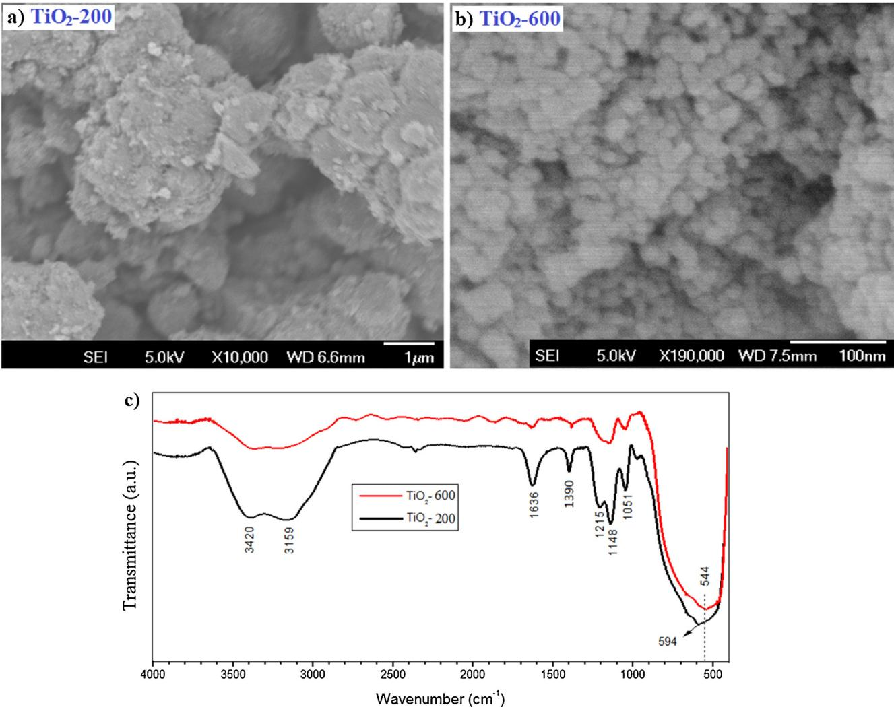  
Fig. 5. SEM images of (a) $\mathrm { T i O } _ { 2 }$ -200 and (b) $\mathrm { T i O } _ { 2 }$ -600; (c) FTIR spectra of $\mathrm { T i O } _ { 2 }$ -200 and $\mathrm { T i O } _ { 2 }$ -600.

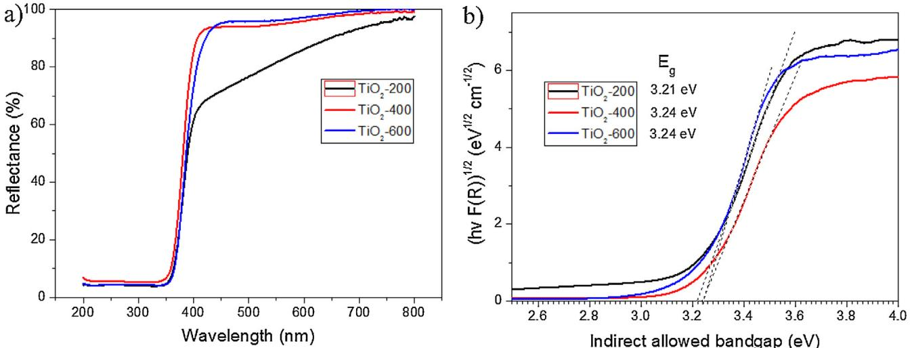  
Fig. 6. (a) UV–vis diffusion reflectance spectra (DRS) and (b) Tauc plots of the photocatalysts $\mathrm { T i O } _ { 2 }$ -200, $\mathrm { T i O } _ { 2 }$ -400 and $\mathrm { T i O } _ { 2 }$ -600.

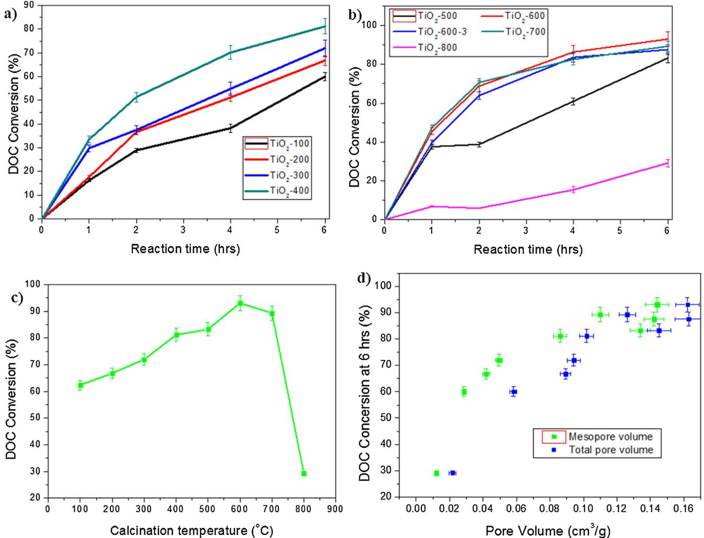  
Fig. 7. (a, b) Photocatalytic activity (DOC Conversion of ROC) of the $\mathrm { T i O } _ { 2 }$ catalysts; (c) Photocatalytic activity with different calcination temperature; (d) Correlation of photocatalytic activity with mesopore volume and total pore volume.

# 3.3. Encapsulating fluorescein molecules into $T i O _ { 2 }$ mesopores and their release

Fluorescein molecules (Fig. 1) have strong fluorescence emission from 470 to $7 4 0 \mathrm { n m }$ peaked at $5 2 1 \mathrm { n m }$ when excited at $2 5 4 \mathrm { n m }$ (Fig. 8a). In encapsulating experiments (Section 2.4), after the catalyst $\mathrm { T i O } _ { 2 }$ -600 was soaked with fluorescein solution and then dried the mesopores (with or without fluorescein molecules) were sealed/protected with $\mathrm { C H C l } _ { 3 }$ to prevent release of the fluorescein molecules. To remove the adsorbed fluorescein molecules on external surface (pores protected by $\mathrm { C H C l } _ { 3 }$ ), the catalyst was rinsed with DI water 3 times. The fluorescence spectra of the 1st, 2nd and 3rd rinse showed that their emission intensity decreased from $1 . 1 \times 1 0 ^ { 6 }$ to $3 . 0 \times 0 ^ { 4 }$ cps and then to less than 2000 cps (background level), which meant that the adsorbed fluorescein molecules had been completely removed from the external surface (Fig. 8b and c). In other words, the external surface was cleaned to be without any more fluorescein molecules. After the mesopores were opened again when $\mathrm { C H C l } _ { 3 }$ evaporated, the catalyst was soaked in DI water so that fluorescein molecules (if any) could be released to water. The fluorescence intensity of the soaked water was $1 . 0 \times 1 0 ^ { 4 }$ cps at $5 2 1 \mathrm { n m }$ much higher than the background level, which indicated the release of fluorescein molecules from mesopores to water (Fig. 8c). So the encapsulating experiment proved that fluorescein molecules in aqueous solution could go in the mesopores and come out of the mesopores freely. Besides model fluorescein molecules, this could also extend to other molecules and substrates.

Besides evidence from fluorescence spectrum based on aqueous solution, FTIR spectrum could also provide evidence based on chemical bond vibrations of catalyst powder. On $\mathrm { T i O } _ { 2 }$ -600, 4 FTIR peaks at 1636, 1390, 1148 and $1 0 5 1 \mathrm { c m } ^ { - 1 }$ could be seen (Fig. 9). $1 6 3 6 \mathrm { c m } ^ { - 1 }$ was assigned to in-plane bending of H O H. $1 3 9 0 \mathrm { c m } ^ { - 1 }$ was assigned to $S { - } 0 { - } \mathrm { H }$ out-of-plane bending. $1 1 4 8 \mathrm { c m } ^ { - 1 }$ and $1 0 5 1 \mathrm { c m } ^ { - 1 }$ were assigned to $- S O _ { 4 }$ and $\mathrm { T i } { - } S 0 _ { 4 }$ Ti stretching, respectively. When fluorescein molecules were adsorbed inside the mesopores and on the external surface of $\mathrm { T i O } _ { 2 }$ -600 (Control sample-1), an additional peak at $1 3 4 5 \mathrm { c m } ^ { - 1 }$ showed up. $1 3 4 5 \mathrm { c m } ^ { - 1 }$ could be assigned to the breathing vibrations of the conjugated benzene rings of fluorescein molecules. When fluorescein molecules were adsorbed onto the external surface of $\mathrm { T i O } _ { 2 } – 6 0 0$ and then washed away from the external surface, control sample-2 did not have a peak at $1 3 4 5 \mathrm { c m } ^ { - 1 }$ indicating complete desorption of fluorescein molecules with the cleaning steps. Control sample-2 was to prove that the cleaning steps used could remove fluorescein molecules from the external surface of $\mathrm { T i O } _ { 2 }$ -600. Such cleaning method was used to clean the external surface to obtain the dried “fluo-encap- $\cdot \mathrm { T i O } _ { 2 }$ ” sample. When fluorescein molecules were adsorbed inside the mesopores only but with clean external surface, the “fluo-encap- $\cdot \mathrm { T i O } _ { 2 }$ ” sample also had a peak at $1 3 4 5 \mathrm { c m } ^ { - 1 }$ indicating encapsulating of fluorescein molecules inside the mesopores.

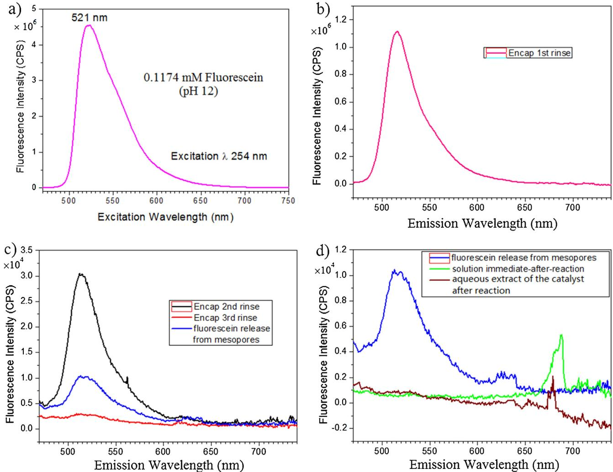  
Fig. 8. Fluorescence emission spectra of (a) $0 . 1 1 7 4 \mathrm { m M }$ fluorescein basic solution at $\mathsf { p H } 1 2 . 0$ , excitation $2 5 4 \mathrm { n m }$ , emission peak $5 2 1 \mathrm { n m }$ ; (b) 1st rinsing solution from the encapsulating process (Section 2.4); (c) 2nd & 3rd rinse solution from the encapsulating process (Section 2.4) and the solution with released fluorescein molecules from mesopores of $\mathrm { T i O } _ { 2 }$ -600 (Section 2.5); (d) The solution immediate-after-reaction and the aqueous extract of the catalyst after reaction (Section 2.6).

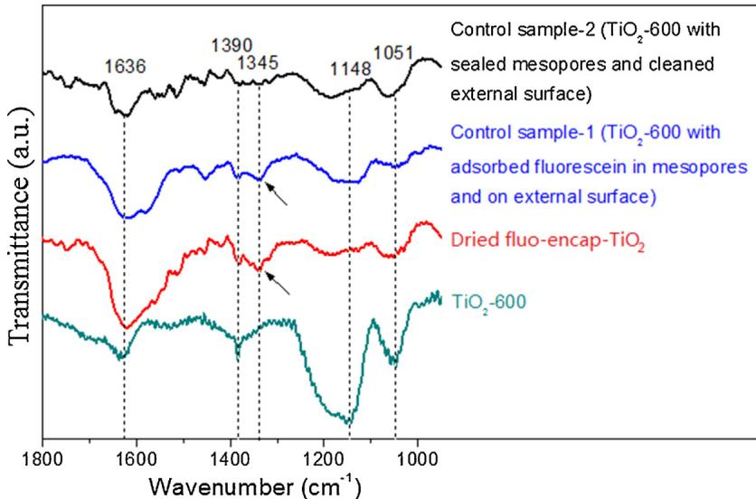  
Fig. 9. FTIR spectra of $\mathrm { T i O } _ { 2 }$ -600, dried fluo-encap- $\cdot \mathrm { T i O } _ { 2 }$ , control sample-1 and control sample-2.

  
Fig. 10. Photocatalytic activities of the catalysts $\mathrm { T i O } _ { 2 }$ -600 with mesopores open or sealed (Section 2.10)

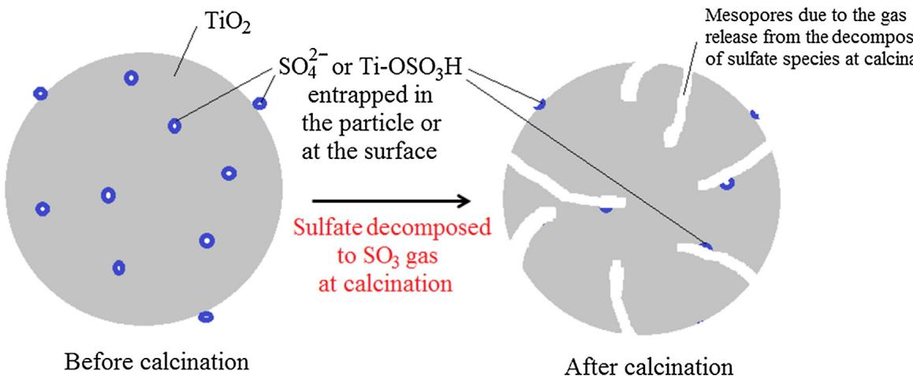  
Fig. 11. Proposed mesopore formation mechanism of the photocatalysts $\mathrm { T i O } _ { 2 }$ -500, $\mathrm { T i O } _ { 2 }$ -600, $\mathrm { T i O } _ { 2 }$ -600-3 and $\mathrm { T i O } _ { 2 }$ -700.

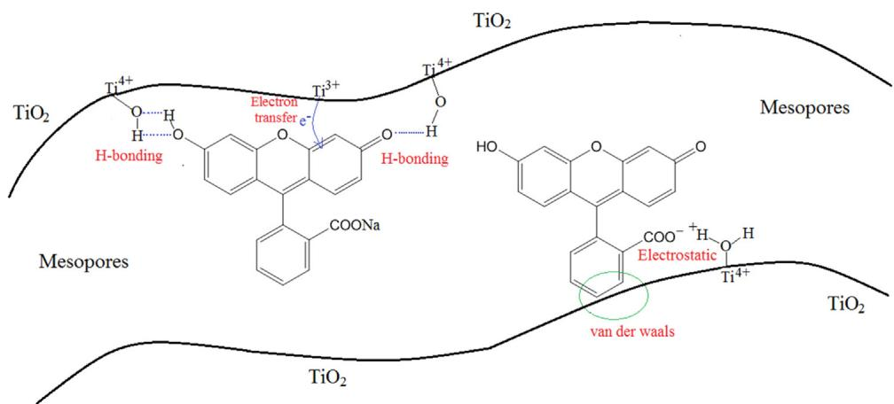  
Fig. 12. Illustrative interactions between mesopores and fluorescein molecules, including H-bonding, electrostatic force, van der waals force and charge transfer.

# 3.4. Photocatalytic degradation of encapsulated fluorescein molecules

It is also interesting to know whether the encapsulated fluorescein molecules interact with the holding mesopores. We probed such interactions using photocatalytic reaction. After the fluorescein molecules were sealed inside the mesopores of $\mathrm { T i O } _ { 2 }$ -600 by $\mathrm { C H C l } _ { 3 }$ , the catalyst was dispersed in DI water and irradiated with UV light for $^ { 2 \mathrm { h } }$ (Section 2.6). Although $\mathrm { C H C l } _ { 3 }$ could also be slowly and photocatalytically degraded into carbon dioxide and chloride ions, both species did not interfere the fluorescence of fluorescein. Therefore, the slow photocatalytic degradation of chloroform is not discussed here. If the fluorescein molecules did not interact with the mesopores, it should be possible to detect them (fluorescence spectra $5 2 1 \mathrm { n m }$ ) either in the “solution immediateafter-reaction” (if mesopores opened during irradiation) or in the “aqueous extract of the catalyst after reaction” (if mesopores still sealed during irradiation). But they were not detected either in the “solution immediate-after-reaction” or “aqueous extract of the catalyst after reaction”, which implied that they photocatalytically degraded (Fig. 8d). Instead, some carboxylic acid-like compounds were detected at $6 8 0 { - } 6 9 0 \mathrm { n m }$ in the fluorescence spectra of both the “solution immediate-after-reaction” and the “extraction of the catalyst after reaction”. Carboxylic acids were the most common intermediate degradation products of organic compounds by photocatalysis. This implied that fluorescein molecules sealed inside the mesopores of $\mathrm { T i O } _ { 2 }$ -600 by $\mathrm { C H C l } _ { 3 }$ solvent photocatalytically degraded to some intermediate carboxylic acids and final ${ \bf C } { \bf O } _ { 2 }$ and $\mathrm { H } _ { 2 } \mathrm { O } .$ . After fluorescein degradation, intermediates and final products might diffuse from the mesopores to solution. Although mesopores were sealed by $\mathrm { C H C l } _ { 3 }$ solvent, adsorbed $0 _ { 2 }$ and $_ { \mathrm { H } _ { 2 } \mathrm { O } }$ molecules on the walls of mesopores could still react with photogenerated electrons $( \mathsf { e } ^ { - } )$ and holes $\left( \mathrm { h } ^ { + } \right)$ to produce hydroxyl radicals $\bullet _ { \mathrm { O H } }$ , which further oxidized fluorescein molecules to degradation intermediates and final products.

# 3.5. Photocatalytic activity of pore-sealed $T i O _ { 2 }$ -600 catalyst

When mesopores of $\mathrm { T i O } _ { 2 }$ -600 were sealed by chloroform, its photocatalytic activity decreased $2 3 . 3 2 \%$ on 6 h photocatalytic degradation of the organic contaminants of ROC (Fig. 10). This indicated for the catalyst $\mathrm { T i O } _ { 2 } – 6 0 0 2 3 . 3 2 \%$ activity was attributed to its mesopores and $7 6 . 6 8 \%$ activity was attributed to its external surface. This also partially explained why $\mathrm { T i O } _ { 2 }$ -600 had better activity than $\mathrm { T i O } _ { 2 }$ -300 while it had smaller SA $\left( 6 9 . 7 \mathrm { m } ^ { 2 } / \mathrm { g } \right)$ than $\mathrm { T i O } _ { 2 }$ -300 $( 1 5 4 . 9 \mathrm { m } ^ { 2 } / \mathrm { g } )$ .

# 4. Discussion

# 4.1. Pore formation mechanism

The $\mathrm { T i O } _ { 2 }$ catalysts were prepared from the hydrolysis of $\mathrm { T i O S O _ { 4 } }$ . Although the hydrolysed slurry was rinsed with $0 . 1 \mathsf { M }$ aqueous ammonia a few times, in the final $\mathrm { T i O } _ { 2 }$ catalysts sulfur were detected. In $\mathrm { T i O } _ { 2 } – 4 0 0 , 3 . 7 9 \%$ wt of S were quantitatively determined by ICP-MS [47]. With higher calcination temperature, the S content decreased. $\mathrm { T i O } _ { 2 }$ -600 and $\mathrm { T i O } _ { 2 }$ -700 had $1 . 3 8 \%$ wt and $0 . 1 2 \%$ wt of S content. The decreased S content with increased calcination temperature indicated sulfate species decomposed at calcination. When sulfate species gradually decomposed above $2 0 0 ^ { \circ } \mathsf C$ , $S 0 _ { 3 }$ gas molecules were generated (Eqs. (1) & (2)). Calcined at $1 0 0 ^ { \circ } \mathsf C$ , $\mathrm { T i O } _ { 2 }$ - 100 was white. But when they were calcined at 200 and $3 0 0 ^ { \circ } \mathsf C$ $\mathrm { T i O } _ { 2 }$ -200 and $\mathrm { T i O } _ { 2 }  – 3 0 0$ were yellowish. When the $S O _ { 3 }$ gas pressure was not high, $S 0 _ { 3 }$ molecules could be encapsulated and hold inside the $\mathrm { T i O } _ { 2 }$ particles or be adsorbed on the particle surface. The encapsulated or adsorbed $S 0 _ { 3 }$ could be the reason why $\mathrm { T i O } _ { 2 }$ -200 and $\mathrm { T i O } _ { 2 }$ -300 were yellowish. When calcination temperature was higher than $4 0 0 ^ { \circ } \mathsf C$ , the catalysts were white again implying the removal of $S 0 _ { 3 }$ from the encapsulation or the surface. At higher calcination temperature, the $S 0 _ { 3 }$ gas pressure was high enough to break through the surrounded $\mathrm { T i O } _ { 2 }$ and created mesopores (Fig. 11). This explained why $\mathrm { T i O } _ { 2 }  – 5 0 0$ , $\mathrm { T i O } _ { 2 }$ -600 and $\mathrm { T i O } _ { 2 }$ -600- 3 had more mesopores than $\mathrm { T i O } _ { 2 }$ -400, $\mathrm { T i O } _ { 2 }$ -300, $\mathrm { T i O } _ { 2 }$ -200 and $\mathrm { T i O } _ { 2 }$ -100. When the calcination temperature further went up to be closer to $7 0 0 { - } 8 0 0 ^ { \circ } C$ (the anatase-to-rutile phase transformation range), the mesopores might collapse causing decrease of mesopore volume. The proposed mechanism of the mesopore formation as described above is illustrated in Fig. 11. Evidences from catalyst color, mesopore volume and S content supported the proposed mesopore formation mechanism.

# 4.2. Pore-molecule interaction

Spectroscopic evidences from fluorescence and FTIR spectrum proved that fluorescein molecules could go into and come out from the mesopores of the $\mathrm { T i O } _ { 2 }$ catalysts. Photocatalytic degradation of the encapsulated fluorescein molecules and decreased activity of the mesopore-sealed $\mathrm { T i O } _ { 2 }$ catalyst implied strong interactions between the mesopores and fluorescein molecules or other substrates. There were 4 possible interactions between fluorescein molecules and the mesopores of $\mathrm { T i O } _ { 2 }$ : hydrogen-bonding, van der waals force, electrostatic force and charge (photo-generated electrons and holes) transfer (Fig. 12). H-bonding may exist between Ti OH groups and functional groups $( - 0 \mathrm { H } , - 0$ , COOH, ${ \mathsf { C } } { \mathrm { - } } 0 { \mathrm { - } } { \mathsf { C } } $ and so on) of fluorescein molecules. Van der waals force was weak but may exist between fluorescein and $\mathrm { T i O } _ { 2 }$ when they were close enough, such as in the case of adsorption. Electrostatic forces could be mainly attributed to the carboxylate groups and the protonated $\mathrm { T i } { - } \mathrm { O H } _ { 2 } { ^ + }$ . Charge transfer may exist between fluorescein and $\mathrm { T i O } _ { 2 }$ or OH radical, which was supported by the photocatalytic degradation of encapsulated fluorescein molecules and decreased activity of the mesopore-sealed $\mathrm { T i O } _ { 2 }$ catalyst.

# 5. Conclusions

Mesopores were formed in $\mathrm { T i O } _ { 2 }$ catalysts due to the decomposition of entrapped sulfate species during calcination. Calcined at $5 0 0 { - } 7 0 0 ^ { \circ } C$ for $^ { 1 \mathrm { h } }$ , $\mathrm { T i O } _ { 2 }$ catalysts showed typical mesoporous $\Nu _ { 2 }$ adsorption/desorption Type $_ { \mathrm { I V } }$ isotherms. Evidences of mesopore formation mechanism were from the catalyst color, mesopore volume and S content. We developed and proved a novel two-phase approach to study the mass transfer and interactions between molecules and pores excluding external surface. Mass transfer between mesopores and fluorescein model molecules was evidenced by fluorescence and FTIR spectroscopy. Photocatalytic activities of the $\mathrm { T i O } _ { 2 }$ catalysts correlated very well with their mesopore volumes but did not correlate well with their surface area. When mesopores of $\mathrm { T i O } _ { 2 }$ -600 was sealed by chloroform, its photocatalytic activity for the degradation of organics in ROC decreased $2 3 . 3 2 \%$ . Interactions between fluorescein molecules and mesopores were confirmed by the photocatalytic degradation of encapsulated fluorescein molecules and decreased activity of the mesopore-sealed $\mathrm { T i O } _ { 2 }$ catalyst. There were four types of possible interactions between fluorescein molecules and the mesopores of $\mathrm { T i O } _ { 2 }$ : hydrogen-bonding, van der waals force, electrostatic force and charge (photo-generated electrons and holes) transfer.

