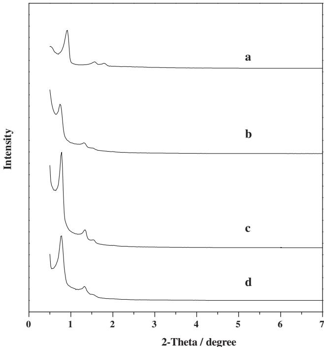
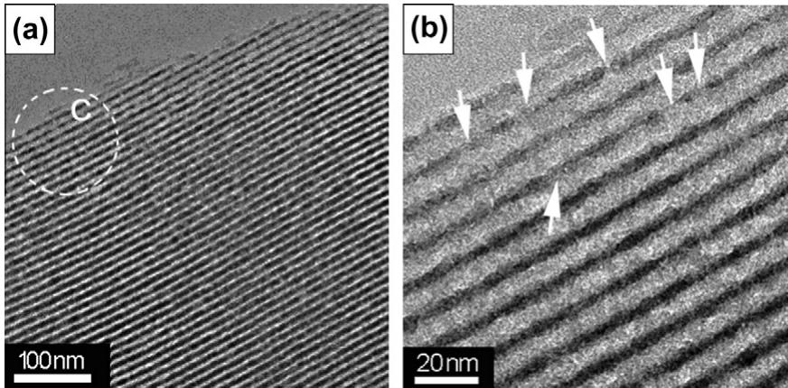
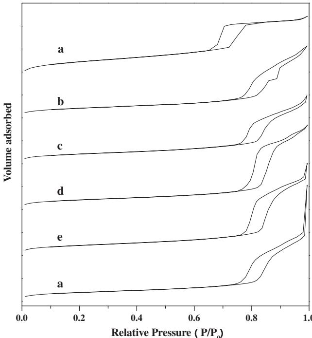
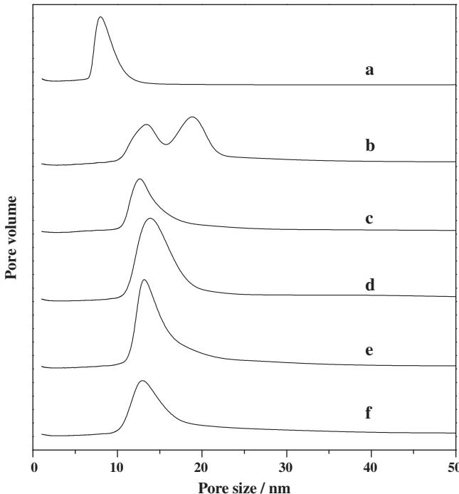
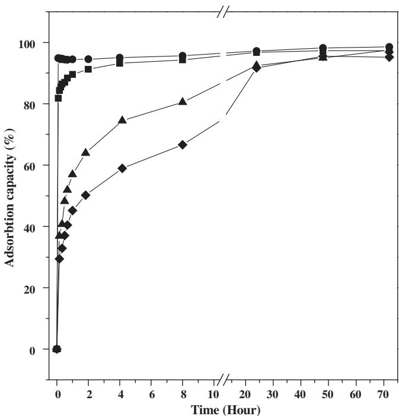
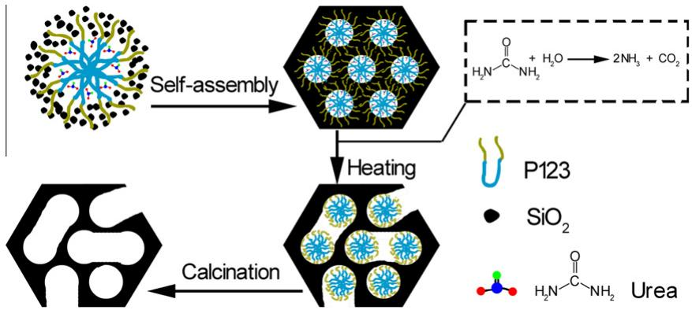

# Ordered hexagonal mesoporous silica materials (SBA-15) with additional disordered large-mesopore networks formed by gaseous expansion

Sen Liu b , Haiyan Zhang b , Xiangju Meng a , Yonglai Zhang b , Limin Ren b , Faisal Nawaz b , Jiayin Liu c , Zhengqiang Li c , Feng-Shou Xiao a,\*

Department of Chemistry, Zhejiang University, Hangzhou 310028, China b College of Chemistry and State Key Laboratory of Inorganic Synthesis and Preparative Chemistry, Jilin University, Changchun 130012, China c Key Lab for Molecular Enzymology and Engineering, The Ministry of Education, Jilin University, Changchun 130023, China

# a r t i c l e i n f o

# a b s t r a c t

Article history:   
Received 15 May 2010   
Received in revised form 5 August 2010   
Accepted 13 August 2010   
Available online 17 August 2010

Keywords:   
Ordered mesoporous silica materials   
Disordered large-mesopores   
Gaseous expansion   
Urea   
Enzymes adsorption

Ordered hexagonal mesoporous silica materials with additional disordered large-mesopore networks (DL-SBA-15s) have been prepared by one-pot process using urea as a producer of gas. Combined characterizations of XRD, SEM, and TEM techniques show that DL-SBA-15s not only have ordered 2D hexagonal mesopores (about $1 0 \mathrm { n m }$ ) similar to SBA-15, but also have another disordered large-mesopore network (about $2 0 \mathrm { n m } \cdot$ ) interconnected with hexagonal mesoporous channels, which are confirmed by nitrogen isotherms. The ordered hexagonal mesopores are templated by polymer surfactant micelle, and disordered large-mesopores are formed by gaseous expansion due to the decomposition of urea added in the silica gel. $^ { 2 9 } \mathrm { S i }$ MAS NMR and FT-IR spectra show DL-SBA-15s have high degree of silica condensation and low silanols on the surface, compared with SBA-15. Furthermore, we have compared the adsorption capacity of myoglobin over conventional SBA-15 and DL-SBA-15 samples, and the results show that DLSBA-15s exhibit much higher adsorption rate than conventional SBA-15 due to the presence of additional disordered large-mesopore networks and larger pore volume, which is potentially important for immobilization of enzymes on ordered mesoporous materials.

$^ { © }$ 2010 Elsevier Inc. All rights reserved.

# 1. Introduction

Since the discovery of M41S [1,2], ordered mesoporous materials have been paid much attention due to their uniform pores, high surface area and large-pore volume, which ensure their potential applications in the processes for adsorption and separation of biomolecules, drug release and catalysis with bulky molecules [3–8]. Particularly, SBA-15 templated from a tri-block copolymer (Pluronic P123, $\mathrm { E O } _ { 2 0 } \mathrm { P O } _ { 7 0 } \mathrm { E O } _ { 2 0 } $ ) in strong acidic media, has been intensively studied because of its relatively large-pore size and good hydrothermal stability, compared with MCM-41 [9,10]. Recently, it has been reported that SBA-15 is a good candidate for adsorption and separation of biomolecules such as protein [11]. However, the diffusion of large biomolecules and proteins in SBA-15 is limited due to its pore size and 2D channels.

To increase the diffusion rate of bulky molecules, scientists design to synthesize SBA-15 with relatively large-mesopores. For examples, large-mesoporous SBA-15s $1 1 - 1 8 ~ \mathrm { n m } )$ are prepared from increasing synthesis temperature [12–18], adding swelling agents (trimethylbenzene, alkanes) [19–24], using buffer solution [25,26], and in neutral media with aid of salt and alcohol [27].

Alternatively, the scientists are to prepare SBA-15 with hierarchical pores for increasing the diffusion rate of substrates. For examples, hierarchical mesoporous SBA-15 are synthesized from the use of TMB [28], carboxylate-terminated P123 [29], and tetramethoxysilane (TMOS) [30,31].

The immobilization of enzymes on solid materials such as carbon, polymer, zeolites, mesoporous materials has been a hot topic for a long time, which enables the use of enzymes as reusable and robust biocatalysts [32–37]. Especially, ordered mesoporous silica materials such as MCM-41 and SBA-15 were widely applied to immobilize the enzymes, due to their good biocompatibility, low toxicity, and designable mesoporous structure [38–47]. Among them, SBA-15 was found to be appealing material because of its low cost and simple synthetic process. Furthermore, SBA-15s with large pores or hierarchical pores play an important role in increasing the diffusion rate of enzymes [26]. However, conventional routes for synthesizing hierarchical mesoporous SBA-15 require high-cost additives and unique silica source [28–31]. Thus, it is strongly desirable to synthesize large or hierarchical mesoporous SBA-15 by a simple route.

In the previous reports, we have shown the synthesis of SBA15s with high hydrothermal stability by using urea as a pH-adjustor [48–50]. In this work, we have demonstrated a simple and effective method to prepare hierarchical mesoporous SBA-15s from the use of urea in the starting gel. After heating, the gaseous $\mathrm { N H } _ { 3 }$ and ${ \mathrm { C O } } _ { 2 }$ decomposed from urea results in the formation of SBA15s with additional disordered large-mesopores (DL-SBA-15). Interestingly, DL-SBA-15s show much higher capacity in the adsorption of myoglobin than conventional SBA-15.

# 2. Experimental sections

# 2.1. Materials

P123 $\mathrm { ' E O } _ { 2 0 } \mathrm { P O } _ { 7 0 } \mathrm { E O } _ { 2 0 }$ , $M = 5 8 0 0$ ) was purchased from BASF Co. Hydrochloric acid (HCl, 36–40 wt. $\%$ , AR), urea $9 9 \%$ , AR), and tetraethylorthosilicate (TEOS, $9 8 \%$ , AR) were purchased from Beijing Chemical Co. Myoglobin (AR) was purchased from Aldrich Chemical Co. All chemicals were used as received without any further purification. For hydrothermal synthesis of all SBA-15 samples, a $1 0 0 \mathrm { m L }$ of Teflon-lined autoclave was used.

# 2.2. Samples preparation

For synthesis of SBA-15 with additional disordered large-mesopore networks (DL-SBA-15s), ordered hexagonal mesopores was templated by P123, while the additional disordered large-mesopore networks were formed by gaseous expansion due to decomposition of urea in the synthesis. In a typical run, (1) $_ { 2 \mathrm { ~ g ~ } }$ of P123 was dissolved in $5 5 ~ \mathrm { m L }$ of HCl solution $( 1 . 1 \mathrm { M } )$ , followed by addition of $4 . 5 { \mathrm { g } }$ of urea. (2) After stirring for $1 0 \mathrm { { m i n } }$ , a clear aqueous was obtained. (3) After addition of $4 . 5 \mathrm { m L }$ of TEOS and stirring for $^ { 4 \mathrm { h } }$ at $4 0 ^ { \circ } \mathsf C$ , the mixture was heated to $8 5 ~ ^ { \circ } \mathrm { C } .$ (4) After stirring for $^ { 1 2 \mathrm { ~ h ~ } }$ at $8 5 ~ ^ { \circ } \mathsf { C }$ , the pH value of solution was gradually changed to about 5–6. During this process, a complete decomposition of urea at $8 5 ~ ^ { \circ } \mathrm { C }$ required about $^ { 1 2 \mathrm { ~ h ~ } }$ . (5) Finally, the gel was transferred into a Teflon-lined autoclave and heated at $1 0 0 ^ { \circ } \mathsf C$ for $4 8 \mathrm { { h } }$ . After filtration, drying at room temperature, and calcination in air at $5 5 0 ~ ^ { \circ } C$ for $^ { 3 \mathrm { h } }$ , the solid sample was obtained, which was designated as DL-SBA-15-85, where 85 stands for stirring temperature. In addition, DL-SBA-15-75, DL-SBA-15-80, DL-SBA-15-90, and DLSBA-15-90 were synthesized with similar procedures, but their stirring time for complete decomposition of urea was quite distinguishable due to their different stirring temperature.

In comparison, conventional SBA-15 and large-pore SBA-15 (LPSBA-15) were prepared according to published literature [9,15].

# 2.3. Characterizations

Powder X-ray diffraction (XRD) data were recorded on a Siemens D5005 $4 0 \mathrm { k V } ,$ , 30 mA) using nickel-filtered $\mathtt { C u } \mathtt { K } \mathtt { \simeq }$ radiation with wavelength of $\lambda = 1 . 5 4 0 6 \mathring \mathrm { A } .$ . Nitrogen isotherms were obtained at $- 1 9 6 ^ { \circ } C$ on a Micromeritics Tri-star. Samples were normally prepared for measurement by treating at $1 5 0 ^ { \circ } \mathrm { C }$ under nitrogen atmosphere for $^ { 1 2 \mathrm { ~ h ~ } }$ . Pore size distributions were calculated using Barrett–Joyner–Halenda (BJH) method. Scanning electron micrograph (SEM) experiments were performed on Hitachi S-5200 electron microscope. Transmission electron microscopy (TEM) experiments were performed on a JEM-200CX electron microscopy (JEOL, Japan) with an acceleration voltage of $2 0 0 \mathrm { k V }$ . Fourier transform infrared (FT-IR) spectroscopy was performed on Perking–Elmer Spectrum One FT-IR spectrophotometer using KBr pellets. $^ { 2 9 } \mathrm { S i }$ MAS NMR spectra were recorded on a Varian Infinity plus 400 spectrometer, fitting the samples in a $7 \mathrm { m m } \mathrm { Z r } 0 _ { 2 }$ rotor, spinning at $8 \mathrm { \ k H z }$

# 2.4. Enzyme adsorption

Kinetic experiments for adsorption of myoglobin on DL-SBA-15- $x$ materials were conducted by mixing $1 0 ~ \mathrm { m L }$ of myoglobin solution $( 0 . 7 5 \mathrm { m g / m L }$ , potassium phosphate as a buffer at $\mathsf { p H } 7 . 0 $ with $8 0 \mathrm { m g }$ of mesoporous silica samples in $5 0 \mathrm { m L }$ flask under stirring at $2 0 ^ { \circ } \mathsf C$ . Then $0 . 6 ~ \mathrm { m L }$ of mixture was withdrawn periodically, after centrifugation and separation, the upper liquid was used for analysis. The amounts adsorbed were calculated from the difference in enzyme concentration before and after adsorption measured by UV spectroscopy (Shimadzu UV1700) at $2 8 0 \mathrm { n m }$ . After each analysis, the samples and myoglobin solution were returned to the mixture for further adsorption.

# 3. Results and discussion

# 3.1. Mesostructure of DL-SBA-15 samples

Fig. 1 shows small angle XRD patterns of SBA-15 and DL-SBA$_ { 1 5 - x }$ samples. Notably, all samples exhibit three well resolved peaks, which are indexed as the (1 0 0), (1 1 0), and (2 0 0) diffractions associated with p6mm hexagonal symmetry. The $d$ -spacing values of DL-SBA-15-x samples are $1 1 . 3 \substack { - 1 1 . 6 \mathrm { n m } }$ , which are obviously larger than that of SBA-15 $9 . 6 \mathrm { n m } \cdot$ ). Additionally, the comparison of XRD intensity shows that the intensity of DL-SBA-15- 85 is stronger than that of DL-SBA-15-90 and DL-SBA-15-80, suggesting that mesostructured ordering of DL-SBA-15-85 is better than that of others.

Fig. 2 shows SEM images of DL-SBA-15-85. The inset image in Fig. 2a shows low magnification SEM images of DL-SBA-15-85, exhibiting uniform and short rods with the length in the range of $2 \mathrm { - } 3 \mu \mathrm { m }$ . The magnified image for the circle part (Fig. 2a) shows that mesoporous channels in the rod are parallel to the long axis. High-magnification SEM image of the rectangle region (Fig. 2b) exhibits abundant pores with the size at about $2 0 \mathrm { n m }$ (see arrows). Furthermore, SEM image (Fig. 2c) clearly shows that abundant disordered large-mesopores are interconnected with hexagonal mesopores, as proposed in the scheme (Fig. 2d).

Fig. 3 shows TEM images of DL-SBA-15-85 viewed from (1 1 0) direction, exhibiting uniform pores, which is very similar to those of conventional SBA-15. The pore size based on TEM image is about

  
Fig. 1. Small-angle XRD powder patterns for (a) SBA-15, (b) DL-SBA-15-80, (c) DLSBA-15-85, and (d) DL-SBA-15-90.

  
Fig. 2. SEM images of DL-SBA-15-85 in (a) low magnification, (b) high magnification of area A and (c) high magnification, and (d) schematic drawing of interconnected pore channels in area B.

$1 0 \mathrm { n m }$ , which is obviously larger than that $( 7 - 8 \mathrm { n m } )$ of conventional SBA-15. This phenomenon could be attributed to their distinguishable synthetic conditions. Conventional SBA-15 is prepared at $4 0 ^ { \circ } C$ in strongly acidic media, while DL-SBA-15-85 is synthesized at $8 5 ~ ^ { \circ } \mathrm { C }$ in near neutral condition $\left( \mathrm { p H } 5  – 6 \right)$ . The higher aging temperature and neutral condition is favorable for increasing hydrophobic part of P123, giving mesoporous silica with relatively large pores [51,52]. It is worth noting that high-magnification TEM image (Fig. 3b) clearly shows that disordered large-mesopores are randomly distributed on the silica walls of DL-SBA-15-85 (see arrows), in good agreement with the results observed in SEM images (Fig. 2).

Fig. 4 shows $\Nu _ { 2 }$ isotherms of SBA-15 and DL-SBA-15-x samples, and their textural parameters are presented in Table 1. All samples exhibit typical IV-type isotherms, giving a clear H1 hysteresis loop at high relative pressure, in good agreement with ordered hexagonal mesostructured SBA-15s. Notably, there is still a step for nitrogen adsorption at relative pressure of 0.85–0.98 over DL-SBA-15-x samples, indicating the presence of large-mesoporosity [53,54]. Interestingly, DL-SBA- $_ { 1 5 - x }$ samples have relatively low surface area $( 3 5 5 - 4 3 0 \mathrm { m } ^ { 2 } / \mathrm { g } )$ . In contrast, SBA-15 exhibits the BET at $7 6 7 \mathrm { m } ^ { 2 } / \mathrm { g }$ . This phenomenon is assigned to the absence of microporosity in DL-SBA-15-x samples, confirmed by t-plots shown in Fig. S5. In general, conventional SBA-15 has a large number of micropores in the walls [9]. However, DL-SBA-15-x samples exhibit relatively high pore volume, compared with conventional SBA-15. For example, the pore volume of DL-SBA-15-85 is as high as $1 . 9 6 \mathrm { c m } ^ { 3 } / \mathrm { g }$ , which is much higher than that of conventional SBA15 $( 1 . 0 6 \mathrm { c m } ^ { 3 } / \mathrm { g } )$ and that of large-pore SBA-15 (LP-SBA-15, $0 . 8 8 \mathrm { c m } ^ { 3 } / \mathrm { g }$ , Table 1). The larger pore volume is strongly related to the presence of additional disordered large-mesopores in DLSBA-15-85.

  
Fig. 3. TEM images of DL-SBA-15-85 viewed from (1 1 0) directions in (a) low magnification and (b) high magnification of area C (arrows: additional disordered large mesopores).

  
Fig. 4. Nitrogen isotherms for (a) SBA-15, (b) DL-SBA-15-75, (c) DL-SBA-15-80, (d) DL-SBA-15-85, (e) DL-SBA-15-90, and (f) DL-SBA-15-95. The isotherms (a), (b), (c), (d), and (e) are offset by 2500, 2000, 1500, 1000, and $5 0 0 \mathrm { c m } ^ { 3 } / \mathrm { g }$ along the vertical axis for clarity, respectively.

  
Fig. 5. Pore sizes distribution for (a) SBA-15, (b) DL-SBA-15-75, (c) DL-SBA-15-80, (d) DL-SBA-15-85, (e) DL-SBA-15-90, and (f) DL-SBA-15-95. The isotherms (a), (b), (c), (d), and (e) are offset by 25, 20, 15, 10, and $5 \mathrm { c m } ^ { 3 } / \mathrm { g }$ along the vertical axis for clarity, respectively.

Moreover, it is also observed that there is a big difference in pore volume for various DL-SBA- $. 1 5 - x$ samples. DL-SBA-15-75 and DL-SBA-15-80 show pore volume at 1.10, and 1.13, respectively, which is close to conventional SBA-15 $( 1 . 0 6 \mathrm { c m } ^ { 3 } / \mathrm { g } )$ . An increase of stirring temperature to $8 5 ~ ^ { \circ } \mathrm { C }$ leads to the formation of DLSBA-15-85 with very high pore volume $( 1 . 9 6 \mathrm { c m } ^ { 3 } / \mathrm { g } )$ . By further increase of stirring temperature to 90 and $9 5 ^ { \circ } \mathsf C ,$ , DL-SBA-15-90 and DL-SBA-15-95 exhibit pore volume at 1.37 and $1 . 3 5 \mathrm { c m } ^ { 3 } / \mathrm { g }$ respectively. Considering the same P123 micelle in the synthesis of various samples, the contribution of ordered mesopores for pore volume should be similar. Therefore, different pore volume over various DL-SBA- $. 1 5 { - } x$ samples should be related to different disordered large-mesopore volume. The amount of additional disordered large-mesopores is as follows: DL-SBA- $1 5 { - } 8 5 \gg$ DL-SBA$1 5 \mathrm { - } 9 0 > \mathrm { D L \mathrm { - } S B A \mathrm { - } } 1 5 \mathrm { - } 9 5 > \mathrm { D L \mathrm { - } S B A \mathrm { - } } 1 5 \mathrm { - } 8 0 > \mathrm { D L \mathrm { - } S B A \mathrm { - } } 1 5 \mathrm { - } 7 5$ .

Table 1 Textural parameters of SBA-15 samples.a   

<table><tr><td>Samplesb</td><td>d100 (nm)</td><td>Pore size (nm)</td><td>Wall thickness (nm)</td><td>Pore volume &#x27; (cm³/g)</td><td>Vmicro (cm³/g)</td><td>Vmeso$ (cm³/g)</td><td>Surface areaf (m²/g)</td><td>Smeso (m²/g)</td><td>Adsorption capacity (mg/g)</td><td>Q41 (Q³+ Q²)</td></tr><tr><td>SBA-15</td><td>9.6</td><td>7.6</td><td>3.5</td><td>1.06</td><td>0.04</td><td>1.02</td><td>767</td><td>659</td><td>892</td><td>1.4</td></tr><tr><td>DL-SBA- 15-75</td><td>10.8</td><td>13.9/18.9</td><td>-</td><td>1.10</td><td>0</td><td>1.10</td><td>382</td><td>382</td><td></td><td></td></tr><tr><td>DL-SBA- 15-80</td><td>11.6</td><td>12.2</td><td>-</td><td>1.13</td><td>0</td><td>1.13</td><td>407</td><td>407</td><td>912</td><td>1.7</td></tr><tr><td>DL-SBA- 15-85</td><td>11.3</td><td>14.3</td><td></td><td>1.96</td><td>0</td><td>1.96</td><td>430</td><td>430</td><td>924</td><td>6.4</td></tr><tr><td>DL-SBA- 15-90</td><td>11.3</td><td>14.2</td><td>-</td><td>1.37</td><td>0</td><td>1.37</td><td>397</td><td>397</td><td>914</td><td>3.4</td></tr><tr><td>DL-SBA- 15-95</td><td>10.3</td><td>12.6</td><td>-</td><td>1.35</td><td>0</td><td>1.35</td><td>355</td><td>355</td><td></td><td></td></tr><tr><td>LP-SBA-15</td><td>11.0</td><td>11.0</td><td>1.7</td><td>0.88</td><td>0</td><td>0.88</td><td>331</td><td>331</td><td>877</td><td>2.9</td></tr></table>

a Pore size distribution and pore volumes determined from $\Nu _ { 2 }$ adsorption isotherms at $- 1 9 6 ^ { \circ } C$ and the wall thickness was calculated as follows: thickness $= \ell$ a - pore size $( a = 2 d _ { 1 0 0 } / 3 ^ { 1 / 2 } )$ . b All samples were calcined at $5 5 0 ~ \textdegree C$ for $^ { 3 \mathrm { h } }$ . c Pore volume here is the total volume. d Vmicro here is the microporous volume. e $V _ { \mathrm { m e s o } }$ here is the primary mesoporous volume. f Surface area here is the total BET surface area. g $S _ { \mathrm { m e s o } }$ here is mesoporous surface area.

Interestingly, DL-SBA- $_ { 1 5 - x }$ samples show very large-pore size distribution (Fig. 5). For example, DL-SBA-15-85 gives mesopore size distribution at $1 4 . 3 \ : \mathrm { n m }$ . Normally, the wall thickness of mesoporous materials with p6mm hexagonal symmetry can be calculated from subtraction of cell parameter $\left( a _ { 0 } \right)$ with pore size [9]. According to this formula, the wall thickness of DL-SBA-15-x samples would be negative values (Table 1), which is assigned to the presence of disordered large-mesopores in the samples. These results suggest that the pore size distribution estimated from BJH model might be not correct if the samples have hierarchical pores.

Fig. S1 shows $^ { 2 9 } \mathrm { S i }$ MAS NMR spectra of various as-synthesized SBA-15 samples. Normally, amorphous silica materials exhibit three bands centered at chemical shifts of -92, -102, and $- 1 1 2 { \mathsf { p p m } }$ , which can be attributed to $\mathrm { S i } ( \mathrm { O S i } ) _ { 2 } ( \mathrm { O H } ) _ { 2 }$ $( Q ^ { 2 } )$ , Si(O$\mathrm { S i } ) _ { 3 } ( \mathrm { O H } )$ $( Q ^ { 3 } )$ , and $\mathrm { S i } ( \mathrm { O S i } ) _ { 4 }$ $( Q ^ { 4 } )$ [55–58]. Notably, SBA-15 exhibits relatively low concentration of degree of silica condensation, giving the ratio of $Q ^ { 4 } / ( Q ^ { 3 } + Q ^ { 2 } )$ at 1.4 (Table 1). However, DL-SBA$_ { 1 5 - x }$ samples give relatively high degree of silica condensation, compared with conventional SBA-15. For example, DL-SBA-15-85 shows the ratio of $Q ^ { 4 } / ( Q ^ { 3 } + Q ^ { 2 } )$ as high as 6.4. Fig. S2 shows FT-IR spectra of various samples, exhibiting typical band at $9 8 0 \mathrm { c m } ^ { - 1 }$ associated with silanol groups. However, this band over DL-SBA$_ { 1 5 - x }$ samples is relatively weak, confirming their relatively low silanols, compared with that over SBA-15.

  
Fig. 6. Adsorption capacity for myoglobin on DL-SBA-15 samples: $( \pmb { \bigtriangledown } )$ DL-SBA-15- 80, $( \bullet )$ DL-SBA-15-85, $( \pmb { \nabla } )$ DL-SBA-15-90 and (-) SBA-15.

# 3.2. Enzyme adsorption

Myoglobin is a small globular protein $( 4 . 5 \ : \mathrm { n m } \times 3 . 5 \ : \mathrm { n m } \times 2 . 5 $ nm, Fig. S3) storing oxygen $\left( 0 _ { 2 } \right)$ in the muscle, and many researchers have made intensive efforts to immobilize myoglobin because of its important biological function [59,60]. Fig. 6 shows adsorption behavior of myoglobin on DL-SBA-15- $x$ samples in the buffer (pH at 7.0) in $0 . 7 5 \mathrm { m g / m L }$ of myoglobin concentration. Notably, DLSBA-15-x samples have high absorption capacity with 912– $9 2 4 \mathrm { m g } / \mathrm { g }$ , higher than conventional SBA-15 $( 8 9 2 \mathrm { m g } / \mathrm { g } )$ and large-pore SBA-15 $\left( 8 7 7 { \mathrm { m g / g } } \right)$ (Table 1). Additionally, the dependence of myoglobin adsorption on time (Fig. 6) shows that DLSBA-15-x samples have much faster rate than SBA-15. For example, DL-SBA-15-85 reaches $9 4 . 9 \%$ of adsorption capacity after only $5 \mathrm { { m i n } }$ , while SBA-15 takes for about $4 8 \mathrm { ~ h ~ }$ to give the same adsorption capacity (Fig. 6). Obviously, the large-mesopores are favorable for the adsorption of bulky myoglobin enzymes [61]. SBA-15 has surface area as large as $7 6 7 \mathrm { m } ^ { 2 } / \mathrm { g }$ , but its microporous contribution is very high, which is difficult for adsorption of bulky myoglobin enzyme. Additionally, as observed in $^ { 2 9 } \mathrm { S i }$ MAS NMR and FT-IR spectra, higher hydrophobicity of DL-SBA- $. 1 5 - x$ with less silanols than SBA-15 might be one of the factors for the difference in enzyme adsorption [62,63].

# 3.3. The formation of additional disordered large-mesopore networks

It should be emphasized that the introduction of urea is performed before the addition of TEOS, which is quite different from our previous reports [47–49]. When TEOS are hydrolyzed to create silica species, urea and P123 in the solution would be surrounded by silica due to the possible hydrogen-bonding between urea molecules and P123 micelles. After heating to $8 0 { - } 9 0 ^ { \circ } \mathsf C ,$ urea in the mixture would hydrolyze to gases of ammonia and carbon dioxide in the following:

$$
\mathrm { H } _ { 2 } \mathrm { N } { - } \mathrm { C O } { - } \mathrm { N H } _ { 2 } + \mathrm { H } _ { 2 } \mathrm { O } = 2 \mathrm { N H } _ { 3 } \uparrow + \mathrm { C O } _ { 2 } \uparrow
$$

Although hydrochloric acid in the mixture would react with $\mathrm { N H } _ { 3 }$ , there are still a lot of gases (mainly ${ \mathsf { C O } } _ { 2 }$ ) coming out of the mixture. The gaseous expansion in the mixture leads to the formation of disordered large-mesopores in the samples. In the synthesis of DL-SBA-15s, we think stirring temperature strongly influence assembly of P123 surfactant and decomposition of urea. Higher stirring temperature is favorable for fast decomposition of urea, but it does not help the assembly of P123 with silica species. In contrast, lower stirring temperature is favorable for the assembly of P123 with silica species, but it does not help for fast decomposition of urea. Possibly, $8 5 ~ ^ { \circ } \mathrm { C }$ is a suitable temperature for both assembly of P123 with silica species and fast decomposition of urea for gaseous expansion. As a result, DL-SBA-15-85 has largest BET surface area and pore volume in DL-SBA-15-x samples, as proposed in Scheme 1.

  
Scheme 1. Proposed mechanism on synthesis of DL-SBA-15 samples.

# 4. Conclusion

Ordered hexagonal mesoporous $\cdot 1 0 \mathrm { n m } \rangle$ silicas with additional disordered large-mesopore $( 2 0 \mathrm { n m } )$ networks (DL-SBA-15s) are successfully synthesized in the starting silica gels containing urea. Compared with conventional SBA-15, these DL-SBA-15s exhibit good adsorptive properties of myoglobin enzyme, which is potentially important for immobilization of enzymes on ordered mesoporous materials.

# Acknowledgments

This work is supported by State Basic Research Project of China (2009CB623507) and the National Natural Science Foundation of China (20773049 and 20973079).

# Appendix A. Supplementary data

Supplementary data associated with this article can be found, in the online version, at doi:10.1016/j.micromeso.2010.08.008.

# References

[1] C.T. Kresge, M.E. Leonowicz, W.J. Roth, J.C. Vartuli, J.S. Beck, Nature 359 (1992) 710.   
[2] J.S. Beck, J.C. Vartuli, W.J. Roth, M.E. Leonowicz, C.T. Kresge, K.D. Schmitt, C.T.- W. Chu, D.H. Olson, E.W. Sheppard, S.B. McCullen, J.B. Higgins, J.L. Schlenker, J. Am. Chem. Soc. 114 (1992) 10834.   
[3] A. Corma, Chem. Rev. 97 (1997) 2373.   
[4] L. Zhang, S.Z. Qiao, Y. Jin, L. Cheng, Z. Yan, G.Q. Lu, Adv. Funct. Mater. 18 (2008) 3834.   
[5] Y. Wan, D. Zhao, Chem. Rev. 107 (2007) 2821.   
[6] J.C. Rooke, A. Léonard, B.-L. Su, J. Mater. Chem. 18 (2008) 1333.   
[7] B.G. Trewyn, I.I. Slowing, S. Giri, H.-T. Chen, V.S.-Y. Lin, Acc. Chem. Res. 40 (2007) 846.   
[8] A. Vinu, D.P. Sawant, K. Ariga, M. Hartmann, S.B. Halligudi, Micropor. Mesopor. Mater. 80 (2005) 195.   
[9] D. Zhao, J. Feng, Q. Huo, N. Melosh, G.H. Fredrickson, B.F. Chmelka, G.D. Stucky, Science 279 (1998) 548.   
[10] D. Zhao, Q. Huo, J. Feng, B.F. Chmelka, G.D. Stucky, J. Am. Chem. Soc. 120 (1998) 6024.   
[11] S. Hudson, J. Cooney, E. Magner, Angew. Chem. Int. Ed. 47 (2008) 8582.   
[12] P.F. Fulvio, S. Pikus, M. Jaroniec, J. Mater. Chem. 15 (2005) 5049.   
[13] A. Galarneau, H. Cambon, F. Di Renzo, F. Fajula, Langmuir 17 (2001) 8328.   
[14] A. Sayari, B.-H. Han, Y. Yang, J. Am. Chem. Soc. 126 (2004) 14348.   
[15] N. Xiao, L. Wang, S. Liu, Y. Zou, C. Wang, Y. Ji, J. Song, F. Li, X. Meng, F.-S. Xiao, J. Mater. Chem. 19 (2009) 661.   
[16] E.B. Celer, M. Jaroniec, J. Am. Chem. Soc. 128 (2006) 14408.   
[17] M. Hartmann, A. Vinu, Langmuir 18 (2002) 8010.   
[18] A. Galarneau, H. Cambon, F. Di Renzo, R. Ryoo, M. Choi, F. Fajula, New. J. Chem. 27 (2003) 73.   
[19] L. Cao, T. Man, M. Kruk, Chem. Mater. 21 (2009) 1144.   
[20] M. Kruk, L. Cao, Langmuir 23 (2007) 7247.   
[21] J. Sun, H. Zhang, D. Ma, Y. Chen, X. Bao, A. Klein-Hoffmann, N. Pfander, D.S. Su, Chem. Commun. (2005) 5343.   
[22] H. Zhang, D. Ma, G. Weinberg, D.S. Su, X. Bao, J. Phys. Chem. B 110 (2006) 25908.   
[23] J.S. Lettow, Y.J. Han, P. Schmidt-Winkel, P. Yang, D. Zhao, G.D. Stucky, J.Y. Ying, Langmuir 16 (2000) 8291.   
[24] P. Feng, X. Bu, D.J. Pine, Langmuir 16 (2000) 5304.   
[25] J. Liu, Q. Yang, X.S. Zhao, L. Zhang, Micropor. Mesopor. Mater. 106 (2007) 62.   
[26] J. Liu, C. Li, Q. Yang, J. Yang, C. Li, Langmuir 16 (2007) 5304.   
[27] S.-Y. Chen, S. Cheng, Chem. Mater. 19 (2007) 3041.   
[28] J. Fan, C. Yu, L. Wang, B. Tu, D. Zhao, Y. Sakamoto, O. Terasaki, J. Am. Chem. Soc. 123 (2001) 12113.   
[29] Y.-C. Hsu, Y.-T. Hsu, H.-Y. Hsu, C.-M. Yang, Chem. Mater. 19 (2007) 1120.   
[30] Y. Zhou, L. Gao, F.N. Gu, J.Y. Yang, J. Yang, F. Wei, Y. Wang, J.H. Zhu, Chem. Eur. J. 15 (2009) 6748.   
[31] T. Amatani, K. Nakanishi, K. Hirao, T. Kodaira, Chem. Mater. 17 (2005) 2114.   
[32] C.-H. Lee, T.-S. Lin, C.-Y. Mou, Nano Today 4 (2009) 165.   
[33] X.-Y. Yang, Z.-Q. Li, B. Liu, A. Klein-Hofmann, G. Tian, Y.-F. Feng, Y. Ding, D. Su, F.-S. Xiao, Adv. Mater. 18 (2006) 410.   
[34] J. Sun, H. Zhang, R. Tian, D. Ma, X. Bao, D.S. Su, H. Zou, Chem. Commun. (2006) 1322.   
[35] S.B. Hartono, S.Z. Qiao, K. Jack, B.P. Ladewig, Z. Hao, G.Q. Lu, Langmuir 25 (2009) 6413.   
[36] P. Zhang, Z. Wu, N. Xiao, L. Ren, X. Meng, C. Wang, F. Li, Z. Li, F.-S. Xiao, Langmuir 25 (2009) 13169.   
[37] M. Hartmann, D. Jung, J. Mater. Chem. 20 (2010) 844.   
[38] M. Hartmann, Chem. Mater. 17 (2005) 4577.   
[39] H.H.P. Yiu, P.A. Wright, J. Mater. Chem. 15 (2005) 3690.   
[40] K. Flodstrom, C.V. Teixeira, H. Amenitsch, V. Alfredsson, M. Linden, Langmuir 20 (2004) 4885.   
[41] J.F. Diaz, K.J. Balkus Jr., J. Mol. Catal. B: Enzym. 2 (1996) 115.   
[42] J. Lei, J. Fan, C. Yu, L. Zhang, S. Jiang, B. Tu, D. Zhao, Micropor. Mesopor. Mater. 73 (2004) 121.   
[43] H.H.P. Yiu, C.H. Botting, N.P. Botting, P.A. Wright, Phys. Chem. Chem. Phys. 3 (2001) 2983.   
[44] Y.-J. Han, J.T. Watson, G.D. Stucky, A. Butler, J. Mol. Catal. B: Enzym. 17 (2002) 1.   
[45] J. Aburto, M. Ayala, I. Bustos-Jaimes, C. Montiel, E. Terres, J.M. Dominguez, E. Torres, Micropor. Mesopor. Mater. 83 (2005) 193.   
[46] A. Bhanmbhani, C.V. Kumar, Micropor. Mesopor. Mater. 109 (2008) 223.   
[47] H. Takahashi, B. Li, T. Sasaki, C. Miyazaki, T. Kajino, S. Inagaki, Micropor. Mesopor. Mater. 44–45 (2001) 755.   
[48] Y. Du, X. Lan, S. Liu, Y. Ji, Y. Zhang, W. Zhang, F.-S. Xiao, Micropor. Mesopor. Mater. 112 (2008) 225.   
[49] S. Liu, Y. Du, N. Xiao, Y. Zhang, Y. Ji, F.-S. Xiao, Chin. J. Catal. 29 (2008) 468.   
[50] Y. Du, S. Liu, Y. Zhang, F. Nawaz, Y. Ji, F.-S. Xiao, Micropor. Mesopor. Mater. 121 (2009) 185.   
[51] L. Sierra, J.-L. Guth, Micropor. Mesopor. Mater. 27 (1999) 243.   
[52] S.-S. Kim, T.R. Pauly, T.J. Pinnavaia, Chem. Commun. (2000) 1661.   
[53] M. Choi, W. Heo, F. Kleitz, R. Ryoo, Chem. Commun. (2003) 1340.   
[54] W. Cho, B. Cha, H. Lee, J. Kim, K. Char, J. Mater. Chem. 18 (2008) 4971.   
[55] Y. Han, D. Li, L. Zhao, J. Song, X. Yang, N. Li, Y. Di, C. Li, S. Wu, X. Xu, X. Meng, K. Lin, F.-S. Xiao, Angew. Chem. Int. Ed. 42 (2003) 3633.   
[56] D. Li, Y. Han, J. Song, L. Zhao, X. Xu, Y. Di, F.-S. Xiao, Chem. Eur. J. 10 (2004) 5911.   
[57] X.S. Zhao, G.Q. Lu, A.K. Whittaker, G.J. Millar, H.Y. Zhu, J. Phys. Chem. B 101 (1997) 6525.   
[58] J.D. Epping, B.F. Chmelka, Curr. Opin. Colloid Interf. Sci. 11 (2006) 81.   
[59] A. Vinu, V. Murugesan, M. Hartmann, J. Phys. Chem. B 108 (2004) 7323.   
[60] Y. Kiyota, R. Hiraoka, N. Yoshida, Y. Maruyama, T. Imai, F. Hirata, J. Am. Chem. Soc. 131 (2009) 3852.   
[61] H. Essa, E. Magner, J. Cooney, B.K. Hodnett, J. Mol. Catal. B: Enzym. 49 (2007) 61.   
[62] M. Park, S.S. Park, M. Selvaraj, D. Zhao, C.-S. Ha, Micropor. Mesopor. Mater. 124 (2009) 76.   
[63] F. Bellezza, A. Cipiciani, U. Costantino, F. Marmottini, Langmuir 22 (2006) 5064.