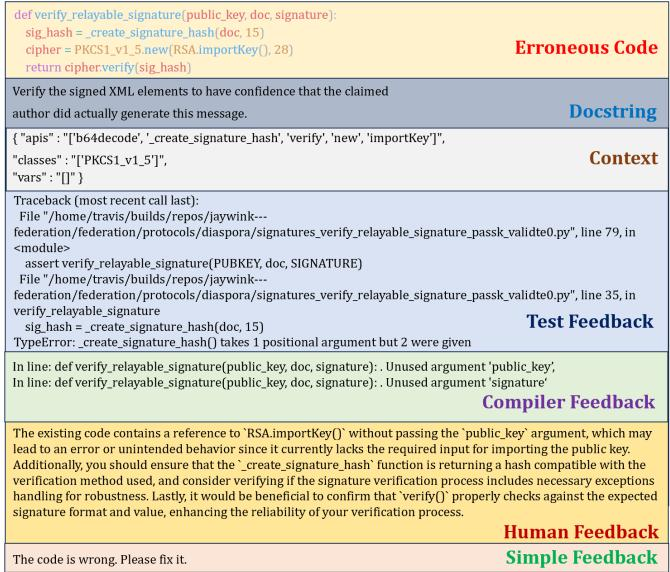
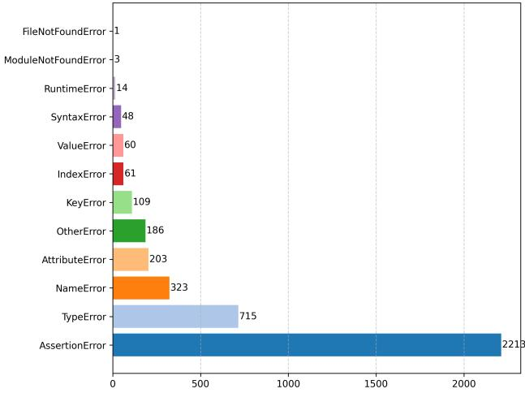
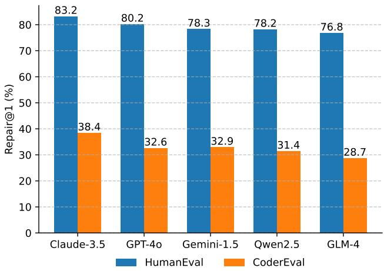
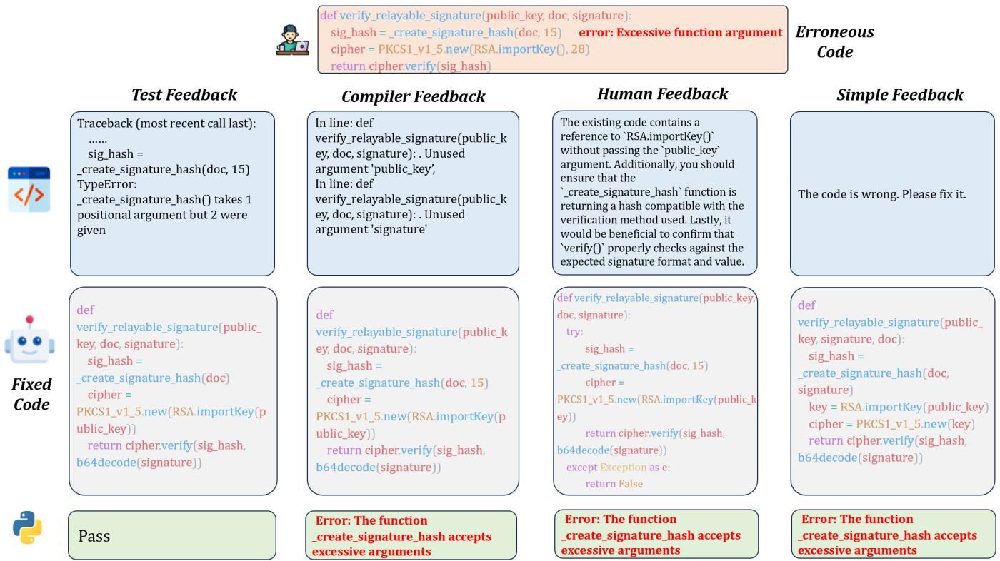
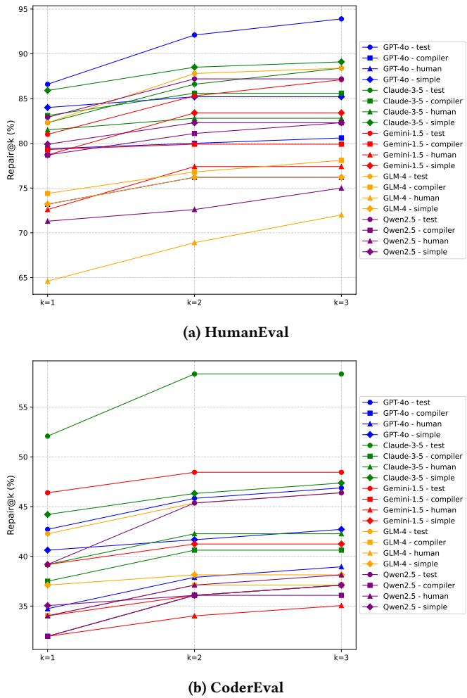
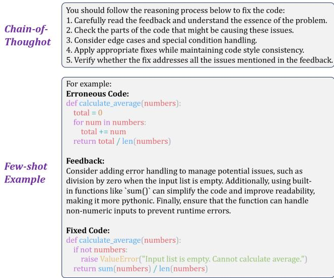
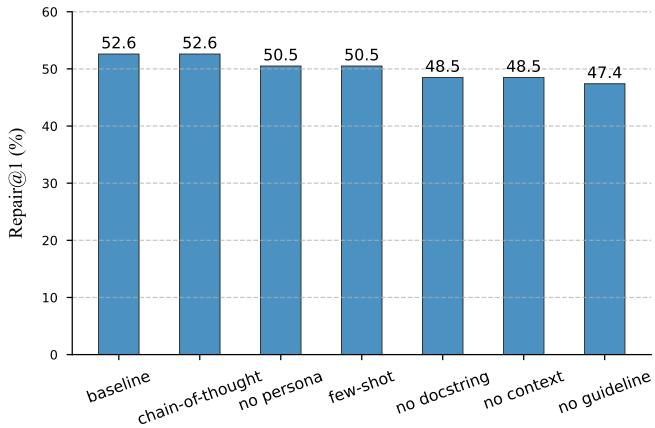

# FeedbackEval: A Benchmark for Evaluating Large Language Models in Feedback-Driven Code Repair Tasks

Dekun Dai   
School of Software Engineering   
Sun Yat-sen University   
Zhuhai, China   
daidk@mail2.sysu.edu.cn   
MingWei Liu∗   
School of Software Engineering   
Sun Yat-sen University   
Zhuhai, China   
liumw26@mail.sysu.edu.cn   
Anji Li   
School of Software Engineering   
Sun Yat-sen University   
Zhuhai, China   
lianj8@mail2.sysu.edu.cn

Jialun Cao The Hong Kong University of Science and Technology Hong Kong, China jcaoap@cse.ust.hk

Yanlin Wang   
School of Software Engineering   
Sun Yat-sen University   
Zhuhai, China   
wangylin36@mail.sysu.edu.cn   
Chong Wang   
School of Computer Science and   
Engineering   
Nanyang Technological University   
Singapore   
chong.wang@ntu.edu.sg   
Xin Peng   
School of Computer Science   
Fudan University   
Shanghai, China   
pengxin@fudan.edu.cn   
Zibin Zheng   
School of Software Engineering   
Sun Yat-sen University   
Zhuhai, China   
zhzibin@mail.sysu.edu.cn

# ABSTRACT

Code repair is a fundamental task in software development, facilitating efficient bug resolution and software maintenance. Although large language models (LLMs) have demonstrated considerable potential in automated code repair, their ability to comprehend and effectively leverage diverse types of feedback remains insufficiently understood.

To bridge this gap, we introduce FeedbackEval, a systematic benchmark for evaluating LLMs’ feedback comprehension and performance in code repair tasks. We conduct a comprehensive empirical study on five state-of-the-art LLMs, including GPT-4o, Claude3.5, Gemini-1.5, GLM-4, and Qwen2.5, to evaluate their behavior under both single-iteration and iterative code repair settings. Our results show that structured feedback, particularly in the form of test feedback, leads to the highest repair success rates, while unstructured feedback proves significantly less effective. Iterative feedback further enhances repair performance, though the marginal benefit diminishes after two or three rounds. Moreover, prompt structure is shown to be critical: incorporating docstrings, contextual information, and explicit guidelines substantially improves outcomes, whereas persona-based, chain-of-thought, and few-shot prompting strategies offer limited benefits in single-iteration scenarios. This work introduces a robust benchmark and delivers practical insights to advance the understanding and development of feedbackdriven code repair using LLMs. All code and data are available at https://github.com/SYSUSELab/FeedbackEval.

# KEYWORDS

Feedback-driven Code Repair, Large Language Models, Benchmark

# 1 INTRODUCTION

Code repair is a fundamental task in software development, enabling developers to efficiently identify and resolve errors [18, 25, 59]. With the rise of large language models (LLMs), there is increasing interest in leveraging their capabilities for automated code repair—not only for fixing human-written code but also for improving LLM-generated code by incorporating test feedback and compiler diagnostics [38, 41]. While LLMs have demonstrated promising performance in code generation [48, 52, 65, 74] and correction [18, 25, 59], their ability to interpret and effectively utilize feedback remains insufficiently explored, particularly in complex repair scenarios.

In practical software development, feedback-driven repair [17, 43, 50, 68] is essential. Developers iteratively refine their code based on test failures, compiler messages, and human reviews, relying on feedback to guide improvements. Understanding how LLMs process and act on such feedback is critical for improving their reliability in real-world development workflows. Moreover, enhancing LLMs’ feedback comprehension is foundational for advancing autonomous multi-agent systems that support end-to-end software development [54, 55].

Existing research on LLM-based code repair primarily focused on evaluating repair accuracy or assessing LLMs under specific feedback conditions, such as test failures or compiler errors [5, 14, 63]. While some studies explore feedback-driven generation, they often limit their scope to single-iteration corrections and lack systematic comparisons across different feedback types [9, 39, 56, 69]. Additionally, although prompt engineering has been shown to improve LLM performance in various tasks, its role in enhancing feedback comprehension during code repair remains underexamined [27, 30, 32]. A significant gap exists in systematically benchmarking LLMs’ ability to (1) process structured vs. unstructured feedback, (2) adapt to iterative feedback, and (3) optimize repair success through different prompting strategies.

FeedbackEval. To bridge this gap, we introduce FeedbackEval, a benchmark designed to systematically evaluate LLMs’ feedback comprehension and repair effectiveness across diverse conditions. Our benchmark consists of erroneous code segments derived from rule-based mutations, LLM-generated errors, and incorrect LLMproduced solutions, ensuring a broad representation of real-world failure cases. It encompasses multiple feedback scenarios, including structured (e.g., test and compiler feedback) and unstructured (e.g., human feedback), enabling a comprehensive assessment of LLMs’ repair capabilities.

Empirical Study. Using FeedbackEval, we conduct an empirical study of five state-of-the-art (SOTA) LLMs (GPT-4o [2], Claude3.5 [4], Gemini-1.5 [12], GLM-4 [72], and Qwen2.5 [11]) to understand how these LLMs process and utilize feedback in code repair. Specifically, we address the following research questions:

• RQ1: How do different LLMs perform in single-iteration repair tasks utilizing feedback? This question establishes a baseline for evaluating how well LLMs can resolve errors with a single feedback. • RQ2: How do different types of feedback affect LLMs’ performance in code repairs? We analyze the effectiveness of different feedback types (e.g., compiler error message, human review comments) and their influence on LLM repair. • RQ3: How does the effectiveness of feedback evolve over multiple repair iterations for different LLMs? This question investigates the iterative refinement capabilities of LLMs, emphasizing their adaptability across multiple iterations of feedback. • RQ4: To what extent do different prompting techniques impact the performance of LLMs in code repairs using feedback? We explore how prompt engineering strategies affect feedback comprehension and repair success, evaluating techniques such as chain-of-thought reasoning, few-shot learning, and the inclusion of contextual information.

Main Findings. Based on our results, we summarize the following main findings: $\textcircled{4}$ We observe that different LLMs exhibit significant performance gaps in feedback-driven code repair, with Claude-3.5 achieving an average repair accuracy of $6 0 . 8 \%$ and GPT4o reaching $5 6 . 4 \%$ , outperforming Gemini-1.5 $( 5 5 . 6 \% )$ , Qwen2.5 $( 5 4 . 8 \% )$ , and GLM-4 $( 5 2 . 7 \% )$ . $\textcircled { \pmb { \theta } }$ Structured feedback types, particularly test feedback, yield superior results. Test feedback achieves the highest average success rate of $6 1 . 0 \%$ , suggesting that LLMs benefit more from clear, targeted guidance compared to unstructured feedback. Surprisingly, simple feedback, such as “The code is wrong. Please fix it.” ranks second, suggesting LLMs can infer necessary corrections even without detailed error descriptions. $\bullet$ Iterative feedback improves LLM performance, with test and human feedback demonstrating the most significant gains. However, performance improvements diminish over successive iterations, typically stabilizing after two to three repair cycles, indicating that extended iterations yield diminishing returns. $\bullet$ Prompt structure significantly affects repair performance. Persona, chain-of-thought, and few-shot prompting exhibit minimal impact on single-iteration repair tasks. In contrast, docstrings, context, and guidelines yield substantial performance improvements, underscoring the importance of structured, context-rich input in enhancing LLM effectiveness for code repair tasks.

  
Figure 1: An example of code repair task in FeedbackEval

In summary, this paper makes the following contributions:

• A comprehensive benchmark for evaluating LLMs in feedback-driven code repair, covering diverse error types and feedback scenarios.   
• A systematic empirical evaluation of state-of-the-art LLMs, providing insights into their strengths, limitations, and adaptability in iterative repair tasks.   
• Actionable recommendations for improving LLMs’ feedback comprehension and repair effectiveness, highlighting the role of structured feedback and optimized prompting techniques.

All data/code used in this study is provided in the package [1].

# 2 BENCHMARK CONSTRUCTION

In this section, we introduce our new benchmark FeedbackEval for feedback-driven code repair. We present the benchmark format (Section 2.1), the construction procedure (Section 2.2), and the resulting benchmark (Section 2.3).

# 2.1 Benchmark Format

Each task in the benchmark consists of an erroneous code segment, a descriptive docstring, contextual information, and multiple forms of feedback, simulating realistic software development scenarios where developers receive guidance from diverse sources. The key components of the benchmark are defined as follows:

• Erroneous Code: A faulty function or code snippet requiring correction serves as the initial state for the repair task. • Docstring: A high-level description of the code’s intended functionality, providing a semantic reference to help the LLM understand the goal of the code.

• Context: Supplementary information about the project or surrounding code environment, such as related APIs, class definitions, or global variables. This offers a broader understanding of the code’s role within a larger system.   
• Test Feedback: Derived from pytest [29] test cases, this feedback explicitly identifies failing tests and expected outcomes, providing clear, actionable guidance for code correction. This emulates real-world debugging, where developers rely on test results to diagnose issues.   
• Compiler Feedback: Generated using pylint [36] static analysis, this feedback highlights syntax errors, code style violations, and potential bugs, offering technical insights into structural flaws in the code.   
Human Feedback: Simulated through GPT-4o-mini, this feedback mimics developer-generated suggestions in natural language, pointing out potential logic flaws and recommending best practices to improve code reliability and robustness.   
• Simple Feedback: A minimalistic, generic form of feedback (e.g., “The code is wrong. Please fix it.”). It evaluates whether the LLM can initiate repairs with only vague or insufficient guidance.

By incorporating multiple types of feedback, our benchmark challenges LLMs to demonstrate not only their code generation abilities but also their understanding of different feedback sources — from structured error outputs to nuanced human suggestions — reflecting the diverse forms of feedback encountered in real-world development.

# 2.2 Benchmark Construction

We follow three main steps to create FeedbackEval: (i) selecting code generation tasks, (ii) collecting erroneous code segments and (iii) generating diverse feedback types for each error instance.

2.2.1 Code Generation Task Selection. We select HumanEval [8] and CoderEval [64] as the sources for constructing FeedbackEval. HumanEval consists of 164 manually curated programming problems, each providing a function signature, a docstring, and corresponding unit tests, designed to evaluate the code generation capabilities of LLMs. The strength of this dataset lies in its high quality and diversity, covering a wide range of programming tasks, which helps assess LLMs’ ability to generate code across different contexts.

However, recent studies indicate that existing LLM-based code generation methods struggle with generating code snippets that depend on project-specific contexts, such as private APIs, classes, data structures, or type constraints. CoderEval aims to address the limitations of HumanEval in evaluating code generation in real-world development scenarios. It selects code generation tasks from real open-source projects, covering multiple domains and considering common software development challenges such as complex data types, custom types, third-party libraries, and cross-procedural calls. Additionally, CoderEval categorizes tasks into six levels based on their dependency on external contexts and provides comprehensive test cases to assess LLMs’ performance across various contextual settings.

In this study, we focus on the Python tasks of these two datasets, as the Python language is widely popular in both academia and industry. This approach not only aligns with the mainstream practices

#

You are an AI code editor and generator. Your goal is to analyze the @@Existing Code and generate mutants in it. You can generate one mutant by introducing a single, subtle alteration to the logic, structure, or syntax of the code. The mutation should impact the functionality in a meaningful way without completely changing the intent or purpose of the original code.

#

#Requirement:   
1. Provide generated mutants directly.   
2. Prohibit generating the exact same mutants.   
3. Do not explain how the mutant was generated, only output the mutated code.   
4. The output must be in the following format:   
python   
#Your codes here

in current research on LLMs but also enhances the comparability of our findings with existing literature. Consequently, it provides a reliable foundation for the comprehensive evaluation of LLMs’ performance.

2.2.2 Erroneous Code Segments Collection. We employed three distinct methods to collect erroneous code segments, ensuring coverage of a wide range of error types and realistic coding challenges.

Rule-Based Error Injection. Building on previous mutation testing research [26, 33, 40], We introduce controlled errors into correct code implementations using predefined mutation operators. These operators systematically introduce common programming mistakes by modifying code elements such as arithmetic and logical operators, loop conditions, and function calls. By applying these rule-based transformations, we generate a structured set of erroneous code samples with well-defined error patterns, enabling precise error classification and controlled experimentation.

LLM-Driven Error Injection. We follow previous studies on LLM-Driven Error Injection [51, 53] and utilize a specialized prompt to guide GPT-4o-mini in generating subtle and meaningful code mutations. The prompt, shown in figure 2, is designed to ensure that the generated mutants introduce single, impactful alterations to the logic, structure, or syntax of the original code while maintaining its overall intent.

LLM-Generated Incorrect Code. We extract erroneous code directly from LLM-generated outputs by running GPT-4o-mini on benchmark datasets (e.g., HumanEval and CoderEval) under a pass $@ 1 0$ evaluation setting. From these results, we filter out incorrect code segments that failed to pass the test cases or meet functional requirements. This approach captures naturally occurring errors generated by LLMs, providing insights into their typical failure modes and limitations in code generation tasks.

By integrating these three approaches, our benchmark captures a diverse range of coding errors, from syntactic and semantic mistakes to higher-level logical flaws.

  
Figure 3: Prompt for simulating human feedback

2.2.3 Generating Diverse Feedback Information. For each erroneous code instance, we generate four types of feedback to simulate realworld debugging scenarios:

• Test Feedback: Extracted from pytest test cases, this feedback explicitly identifies failing tests and expected outcomes, providing clear and actionable guidance for code correction. • Compiler Feedback: Generated using pylint static analysis, this feedback highlights syntax errors, code style violations, and potential bugs, offering technical and specific insights. Human Feedback: Simulated by GPT-4o-mini, this feedback mimics natural language input from a human reviewer, often containing unstructured and contextually rich suggestions [56, 69]. Figure 3 illustrates the prompt for simulating human feedback. • Simple Feedback: A minimalistic form of feedback consisting of a single sentence: “The code is wrong. Please fix it.” This feedback provides no specific guidance, evaluating the LLMs’ ability to infer necessary repairs from minimal input.

Each erroneous code segment is paired with feedback from all four categories. By systematically analyzing how LLMs interpret and act upon different feedback types, the benchmark offers insights into their feedback comprehension, adaptability, and repair strategies across varying levels of complexity.

# 2.3 Resulting Benchmark

Following this methodology, we construct a new benchmark, FeedbackEval, to systematically evaluate LLMs’ ability to interpret and utilize various feedback types in code repair. The benchmark is characterized by the following key features.

Scale. FeedbackEval consists of 394 coding tasks covering a diverse range of programming scenarios. In total, it includes 3,736 erroneous code instances, each paired with four distinct types of feedback.

Feedback Diversity. FeedbackEval systematically integrates multiple feedback types, distinguishing it from prior benchmarks that predominantly focus on compiler diagnostics or test-based verification. By encompassing both structured (compiler messages, test failures) and unstructured (human reviews, simplified feedback) guidance, FeedbackEval enables a comprehensive analysis of how different LLMs interpret and utilize feedback. This makes it a valuable resource for studying iterative code refinement and enhancing feedback-driven LLM improvements.

  
Figure 4: Distribution of Error Types in FeedbackEval

Bug Diversity. Figure 4 illustrates the distribution of error types in FeedbackEval, categorized based on the exceptions encountered during execution or compilation. AssertionError is the most prevalent (2,213 instances), reflecting test failures caused by functional correctness issues, followed by TypeError (715 instances) and NameError (323 instances). The benchmark also includes a range of other error types, from AttributeError (203 instances) to rare cases such as ModuleNotFoundError (3 instances) and FileNotFoundError (1 instance). This diverse error distribution ensures that FeedbackEval provides a comprehensive evaluation of LLMs’ ability to repair a wide spectrum of programming issues across different feedback modalities.

Overall, FeedbackEval features feedback diversity, incorporating both structured and unstructured feedback to simulate real-world debugging scenarios. Bug diversity ensures a broad representation of errors, enabling a thorough assessment of LLMs’ performance across varied fault patterns. As FeedbackEval evolves, it can be expanded with more error types and complex repair tasks, further enhancing its ability to reflect realistic, large-scale debugging challenges.

# 3 EXPERIMENTAL SETUP

To answer the RQs, we conduct a study based on FeedbackEval. This section details the experimental setup, including LLM selection and implementation procedures.

LLM Selection. We select five mainstream LLMs with strong performance in code-related tasks, including both open-source and closed-source LLMs: GPT-4o (GPT-4o-2024-11-20) [2], Claude-3.5 (Claude-3-5-Sonnet-20241022) [4], Gemini-1.5 (Gemini-1.5-pro, released at 2024-9-24) [12], GLM-4 (GLM-4-Plus, released at 2024-8- 29) [72], and Qwen2.5 (Qwen2.5-72B-Instruct, released at 2024-9- 19) [11]. These LLMs are chosen for their advanced capabilities in code understanding, generation, and feedback adaptation, which are critical aspects of our study on feedback comprehension and evaluation.

Implementation Procedure. For the experiments, we utilized a subset of FeedbackEval due to computational constraints and the need for focused analysis within a feasible runtime. We randomly selected one erroneous code instance per task, resulting a subset of 394 erroneous code instances, each paired with four distinct feedback types.

To ensure consistency and fairness in our evaluation, we apply the same experimental settings and evaluation metrics across all LLMs. Each LLM was evaluated using the same random sampling strategy with a temperature parameter set to 0.3, and all LLMs were accessed via their respective APIs. To measure performance, we introduced a new metric, Repair $@ \mathbf { k }$ , which evaluates the pass rate of code after $\mathbf { k }$ rounds of iterative repair. This metric assesses the LLMs’ ability to refine code based on feedback over multiple iterations, providing insights into their adaptability and robustness in feedback-driven scenarios.

# 4 RQ1: SINGLE-ITERATION CODE REPAIR

To understand how different LLMs handle code repair based on feedback, we evaluate their performance in single-iteration repair tasks.

# 4.1 Design

We design an experiment to evaluate the performance of five selected LLMs in single-iteration code repair tasks using feedback. For each of the 394 tasks in FeedbackEval, we randomly select an erroneous code segment and task the LLMs with repairing it in a single iteration based on one of four feedback types. To ensure a fair comparison, the same prompt templates are used across all LLMs and feedback types, as illustrated in Figure 5, adapted from prior studies [69]. The repair prompt in Figure 5 instructs the LLM to fix the given erroneous code based on specific feedback (e.g., compiler feedback, test feedback). Also, supplementary information, such as docstrings and contextual details, is provided to help the LLM better understand the task and the broader context of the code.

Performance is measured using the Repair $\ @ \mathbf { 1 }$ metric, which quantifies the pass rate of repaired code after one feedback iteration. To mitigate randomness and enhance result reliability, each experiment is conducted twice under identical conditions, with the average performance reported as the final result. This setup systematically evaluates LLMs’ ability to leverage feedback for code repair.

# 4.2 Results

Table 1 presents the average performance of different LLMs in feedback-driven single-iteration code repair on FeedbackEval.

Overall Performance. Table 1 presents the average performance of different LLMs in single-iteration code repair across various feedback types. Claude-3.5 achieves the highest overall score $( 6 0 . 8 \% )$

Figure 5: Prompt for Single-Iteration Code Repair Using Feedback   

<table><tr><td rowspan=1 colspan=1>Prompt for Code Repair Utilizing Feedback</td></tr><tr><td rowspan=1 colspan=1>You are a professional code repair assistant skilled at fixing code errors based on the@@Feedback.                                           Persona</td></tr><tr><td rowspan=1 colspan=1>Your task is to correct the given erroneous code @@Existing Code.       Task</td></tr><tr><td rowspan=1 colspan=1>@@Feedback includes error messages, descriptions of logical isues, or deviationsfrom expected functionality.@@Docstring provides a description of the function, its purpose, and details of itsinput and output parameters.@@Context refers to code elements such as types, APIs, variables, and consts definedoutside the function under generation but within the dependent third-party libraries,current class, fi le, or project.                            Description</td></tr><tr><td rowspan=1 colspan=1>@@Existing Code {@@Docstring 0Information@@Context f@@Feedback f</td></tr><tr><td rowspan=1 colspan=1>Based on the provided information, fix the erroneous code and ensure the following:1.Resolve all errors to make the code functional.2.Address the improvement points mentioned in the feedback.3.0nly need to fix the code; do not modify the function signature.4.Please return the corrected code in the following format:&quot;python# Your codes here                                      Guideline…</td></tr></table>

Table 1: Average Repair@1 on FeedbackEval for Selected LLMs   

<table><tr><td rowspan=1 colspan=7>Feedback GPT-40 Claude-3.5 Gemini-1.5 GLM-4Qwen2.5 Average</td></tr><tr><td rowspan=1 colspan=2>Test    61.7</td><td rowspan=1 colspan=1>65.0</td><td rowspan=1 colspan=1>60.4</td><td rowspan=1 colspan=1>57.6</td><td rowspan=1 colspan=1>60.6</td><td rowspan=1 colspan=1>61.0</td></tr><tr><td rowspan=1 colspan=2>Compiler   55.6</td><td rowspan=1 colspan=1>58.9</td><td rowspan=1 colspan=1>56.0</td><td rowspan=1 colspan=1>53.3</td><td rowspan=1 colspan=1>55.3  _</td><td rowspan=1 colspan=1>55.8</td></tr><tr><td rowspan=1 colspan=1>Human</td><td rowspan=1 colspan=1>50.1</td><td rowspan=1 colspan=1>55.8</td><td rowspan=1 colspan=1>51.6</td><td rowspan=1 colspan=1>46.6</td><td rowspan=1 colspan=1>48.5 |</td><td rowspan=1 colspan=1>50.5</td></tr><tr><td rowspan=1 colspan=1>Simple |</td><td rowspan=1 colspan=1>58.2</td><td rowspan=1 colspan=1>63.4</td><td rowspan=1 colspan=1>54.4  c:)</td><td rowspan=1 colspan=1>53.5</td><td rowspan=1 colspan=1>54.9 |</td><td rowspan=1 colspan=1>56.9</td></tr><tr><td rowspan=1 colspan=1>Average</td><td rowspan=1 colspan=1>56.4</td><td rowspan=1 colspan=1>60.8</td><td rowspan=1 colspan=1>55.6  |</td><td rowspan=1 colspan=1>52.7</td><td rowspan=1 colspan=1>54.8 |</td><td rowspan=1 colspan=1></td></tr></table>

  
Figure 6: Repair $\ @ \mathbf { 1 }$ Results of Different LLMs across Two Datasets

and outperforms all LLMs across every feedback type, demonstrating its superior ability to leverage feedback for code repair. GPT-4o follows with a score of $5 6 . 4 \%$ , showing decent repair capability but performing noticeably worse than Claude-3.5, especially in handling human and simple feedback. Qwen2.5 $( 5 4 . 8 \% )$ and Gemini-1.5 $( 5 5 . 6 \% )$ perform comparably, exhibiting moderate feedback utilization, while GLM-4 $( 5 2 . 7 \% )$ consistently ranks the lowest across all feedback types.

Performance Comparison Across HumanEval and CoderEval. Figure 6 presents the Repair $@ 1$ comparison of different LLMs across HumanEval and CoderEval, highlighting how task complexity affects LLM performance.

For HumanEval, which consists of relatively simple functionlevel code generation tasks such as data structure operations and numerical computations, all LLMs achieve higher performance. Claude-3.5 leads with an average score of $8 3 . 2 \%$ , followed by GPT4o $( 8 0 . 2 \% )$ , Gemini-1.5 $( 7 8 . 3 \% )$ , and Qwen2.5 $( 7 8 . 2 \% )$ , while GLM-4 lags behind $( 7 6 . 8 \% )$ .

In contrast, CoderEval introduces greater complexity, featuring repository-level tasks that require understanding broader code contexts and domain-specific logic. Challenges such as hallucinated method calls and incorrect API usage make repair tasks significantly harder. As a result, all LLMs experience a sharp performance drop (by $2 8 . 7 \%$ to $3 8 . 4 \%$ ) compared to HumanEval, though their relative rankings remain largely unchanged. Claude-3.5 again achieves the highest score $( 3 8 . 4 \% )$ , demonstrating the strongest adaptability to complex repairs, though still far from perfect. The other LLMs follow in the order of Gemini-1.5, GPT-4o, Qwen2.5, and GLM-4, with scores ranging from $3 2 . 9 \%$ to $2 8 . 7 \%$ .

The substantial performance gap between HumanEval and CoderEval underscores the increased difficulty of real-world software repair tasks. While LLMs perform well on function-level problems with limited scope, their effectiveness diminishes when handling complex, context-dependent errors. These results highlight the necessity of FeedbackEval in systematically evaluating LLMs under varying levels of complexity, providing a more comprehensive assessment of their real-world repair capabilities.

Finding 1: Claude-3.5 achieves the best performance in feedback-driven code repair, but all LLMs experience significant drops in repair success rates on tasks from CoderEval $( 2 8 . 7 \%$ - $3 8 . 4 \%$ compared to HumanEval, highlighting the challenges of complex, context-dependent errors in task-specific code repair and the need for improvement in real-world scenarios.

# 5 RQ2: IMPACT OF FEEDBACK TYPES

To evaluate the impact of different feedback types on LLM-based code repair, we analyze their effect on LLM performance and identify which type provides the most effective guidance for improving repair accuracy.

# 5.1 Design

We extend our analysis from RQ1 by assessing how different feedback types influence LLM repair performance. Specifically, we measure repair $@ 1$ across various LLMs and feedback categories to determine their relative effectiveness. Additionally, we examine the relationship between task complexity and feedback utility, exploring whether more complex errors benefit from specific feedback types.

# 5.2 Results

Overall Impact. As shown in Table 1, test feedback achieves the highest repair success rate $( 6 1 . 0 \% )$ , followed by simple feedback $( 5 6 . 9 \% )$ , compiler $( 5 5 . 8 \% )$ , and human feedback $( 5 0 . 5 \% )$ . Test feedback is the most effective for all LLMs, likely due to its explicit and structured nature, which directly pinpoints errors.

Surprisingly, simple feedback, such as “The code is wrong. Please fix it” ranks second, suggesting LLMs can infer necessary corrections even without detailed error descriptions. Compiler feedback performs slightly worse, possibly because, while precise, it requires correct interpretation of technical details. Human feedback is the least effective, likely due to its unstructured and ambiguous nature

Figure 7 shows an example of a code repair task with different feedback. The initial erroneous code fails due to excessive arguments in the _create_signature_hash function. Each feedback type yields a distinct repair outcome. Test feedback provides a traceback identifying the argument mismatch, effectively guiding the LLM to remove the redundant argument, resulting in a successful fix. Compiler feedback detects unused arguments but lacks deeper reasoning, leading to a partial correction that retains the original argument error, ultimately failing the test suite. Human feedback offers detailed, structured suggestions, addressing multiple aspects such as RSA.importKey() usage and hash compatibility. However, LLMs misinterpret parts of the feedback, producing an overly complex revision that introduces exception handling but fails to resolve the core argument issue, leading to an unsuccessful repair. In contrast, simple feedback offers only a vague directive, resulting in a superficial modification that fails due to the unresolved argument error.

Overall, structured feedback proves most helpful, while simple feedback highlights LLMs’ strong inferential abilities, and human feedback remains the most challenging.

Performance on HumanEval Vs. CoderEval Table 2 compares the effectiveness of different feedback types on repair tasks from HumanEval and CoderEval. Across both datasets, Claude-3.5 consistently outperforms other LLMs, except when test feedback is used for HumanEval tasks.

For HumanEval, test feedback leads to the highest repair success rates for most LLMs (except Gemini-1.5), with GPT-4o at $8 5 . 6 \%$ and Claude-3.5 at $8 4 . 1 \%$ . This indicates that structured, test-based guidance is the most interpretable for LLMs. Compiler feedback is also effective, as seen in Claude-3.5 ’s $8 4 . 1 \%$ , demonstrating the value of error-specific feedback for accurate code repairs. In contrast, human feedback challenges all LLMs, resulting in lower performance (GPT-4o at $7 1 . 6 \%$ , GLM-4 at $6 7 . 7 \%$ ) due to its unstructured nature and implicit reasoning demands. Simple feedback, while minimal, is beneficial, with Claude-3.5 scoring $8 5 . 3 \%$ , highlighting the LLM’s strong inferential abilities.

A similar trend is observed in CoderEval, where test feedback remains the most effective, with Claude-3.5 scoring the highest $( 4 5 . 9 \% )$ followed by Gemini-1.5 $( 4 0 . 4 \% )$ . Compiler and simple feedback show moderate effectiveness, while human feedback is again the most challenging, particularly for GLM-4, which scores only $2 5 . 6 \%$ .

Table 2: Repair $\ @ \mathbf { 1 }$ Results of Different LLMs on Code Repair Tasks with Various Feedback   

<table><tr><td rowspan="2">Feedback</td><td colspan="2">GPT-40</td><td colspan="2">Claude-3.5</td><td colspan="2">GLM-4</td><td colspan="2">Qwen2.5</td></tr><tr><td>HumanEval CoderEval</td><td></td><td>HumanEval CoderEval</td><td>HumanEval CoderEval</td><td></td><td>HumanEval CoderEval</td><td>HumanEval CoderEval</td><td></td></tr><tr><td>Test</td><td>85.6</td><td>37.8</td><td>84.1 45.9</td><td>80.4</td><td>40.4</td><td>83.5 31.6</td><td>84.1</td><td>37.0</td></tr><tr><td>Compiler</td><td>82.7</td><td>28.5</td><td>84.1 33.7</td><td>82.6</td><td>29.4</td><td>80.7 25.8</td><td>80.8</td><td>29.8</td></tr><tr><td>Human</td><td>71.6</td><td>28.5</td><td>79.1 32.4</td><td>72.9</td><td>30.3</td><td>67.7 25.6</td><td>70.7</td><td>26.2</td></tr><tr><td>Simple</td><td>81.0</td><td>35.4</td><td>85.3 41.6</td><td>77.4</td><td>31.4</td><td>75.3 31.7</td><td>77.1</td><td>32.7</td></tr><tr><td>Average</td><td>80.2</td><td>32.6</td><td>83.2 38.4</td><td>78.3</td><td>32.9</td><td>76.8 28.7</td><td>78.2</td><td>31.4</td></tr></table>

  
Figure 7: Example of Code Repair Task with Different Feedback

Finding 2: Test feedback consistently leads to the highest repair success rates across LLMs, with Claude-3.5 performing the best in both HumanEval and CoderEval. While compiler and simple feedback show moderate effectiveness, human feedback remains the most challenging due to its unstructured nature, and task complexity further impacts the utilization of different feedback types.

# 6 RQ3: MUTIPLE-ITERATION REPAIR

In this RQ, we investigate the effectiveness of feedback-driven code repair with iterative feedback, evaluating how LLMs adapt and improve their performance across multiple iterations of feedback.

# 6.1 Design

From our benchmark, we selected a subset of tasks for multiiteration repair experiments, considering the higher time and computational costs, especially for repair tasks from CoderEval. Ultimately, we used all 164 HumanEval problems and randomly sampled 100 from the original 230 CoderEval problems. For each task, an erroneous code segment was selected, ensuring diversity in error types and repair challenges. To maintain consistency, all LLMs were evaluated on the same erroneous code set, with each task paired with one of four feedback types: test feedback, compiler feedback, human feedback, or simple feedback.

For each task, the LLMs were provided with the initial erroneous code and corresponding feedback, after which they performed a repair iteration. The repaired code was subsequently re-evaluated, and new feedback (of the same type) was generated based on any remaining errors or issues. This iterative repair process continued for three iterations, allowing the LLMs to progressively refine the code based on feedback. To assess performance, we introduced the Repair $@ \mathbf { k }$ metric, which measures the pass rate of the code after $k$ repair iterations (where $k { = } 3$ in this study).

# 6.2 Results

  
Figure 8: Performance changes across repair iterations

Table 3 presents a comprehensive analysis of how different LLMs respond to various types of feedback over multiple repair iterations.

Cross-LLM Performance Comparison. GPT-4o leads on HumanEval, especially with test feedback, achieving $9 3 . 9 \%$ at repair@3. This suggests strong adaptability to structured problemsolving tasks. Claude-3.5 demonstrates balanced performance across datasets and feedback types. It performs competitively under test and simple feedback (e.g., $8 9 . 1 \%$ on HumanEval), reflecting versatility in handling both datasets’ characteristics. Gemini-1.5 achieves solid improvements on HumanEval with test feedback but lags on CoderEval, particularly under compiler and human feedback. This indicates a potential sensitivity to CoderEval’s more complex code contexts. GLM-4 and Qwen2.5 generally underperform on both datasets, particularly with compiler and human feedback. However, Qwen2.5 shows late-stage recovery on CoderEval under human feedback $( 3 8 . 1 \% )$ , indicating adaptation potential in later repair stages.

Comparative Effectiveness of Feedback Types. Test feedback remains the most effective and consistent, driving the highest performance gains for all LLMs across both datasets. Its structured, pass/fail nature appears well-suited to guiding LLMs toward correct outputs. Compiler feedback lags behind, showing only marginal improvements. This suggests that syntax-level feedback lacks sufficient information to guide higher-level code corrections effectively. Human feedback demonstrates dataset-dependent behavior. It plateaus early on HumanEval but shows late-stage gains on CoderEval, implying that human instructions may excel in complex, diverse tasks where LLM understanding needs deeper refinement. Simple feedback provides modest but stable improvements. While less effective than test feedback, its consistent performance across LLMs and datasets highlights its potential as a lightweight, generalpurpose feedback mechanism.

Performance Evolution Across Iterations. As illustrated in figure 8, the performance trajectory over iterations reveals two key trends: $\textcircled{4}$ Most LLMs, particularly GPT-4o and Claude-3.5, exhibit sharp performance gains between repair $@ 1$ and repair $@ 2$ , driven predominantly by test feedback. $\textcircled { \pmb { \theta } }$ By repair@3, gains tend to plateau, especially for compiler and simple feedback types. This suggests diminishing returns from repetitive feedback when key semantic misunderstandings remain unaddressed.

Finding 3: Iterative feedback enhances LLM code repair, with test and human feedback yielding the highest gains. However, performance gains diminish over iterations, typically stabilizing after two to three iterations of repair.

# 7 RQ4: PROMPTING TECHNIQUES IMPACT

To investigate the impact of different prompting techniques on feedback-driven code repair, we evaluate how various prompting strategies affect LLMs’ ability to interpret and apply feedback effectively during the code repair process.

# 7.1 Design

In this section, we explore the impact of various prompting techniques on feedback-driven code repair. Specifically, we investigate three key techniques: chain-of-thought reasoning [67], few-shot learning [6], and the inclusion of additional context information. As shown in Figure 9, we enhance the baseline prompt used in RQ1 by incorporating a chain-of-thought step for the chain-of-thought reasoning technique and adding a repair example for the few-shot learning approach. Furthermore, we examine the effect of providing extra context, such as docstrings, project-level context, and guidelines, by modifying the baseline prompt to remove these elements. Due to space constraints, the full details of the prompt are not included in the paper but are available in our release package [1].

Table 3: Repair $\textcircled { \pmb { \omega } } 3$ results of different LLMs on code repair tasks using various feedback.   

<table><tr><td rowspan="2">Feedback</td><td colspan="2">GPT-40</td><td colspan="2">Claude-3.5</td><td colspan="2">Gemini-1.5</td><td colspan="2">GLM-4</td><td colspan="2">Qwen2.5</td></tr><tr><td>HumanEval CoderEval</td><td></td><td>HumanEval CoderEval</td><td></td><td>HumanEval CoderEval</td><td></td><td>HumanEval CoderEval</td><td></td><td>HumanEval CoderEval</td><td></td></tr><tr><td rowspan="3">Test</td><td>86.6</td><td>42.7</td><td>82.3</td><td>52.1</td><td>81.0</td><td>46.4</td><td>82.3</td><td>42.2</td><td>82.9</td><td>39.2</td></tr><tr><td>92.1↑</td><td>45.8↑</td><td>86.6↑</td><td>58.3↑</td><td>85.3↑</td><td>48.5↑</td><td>87.8↑</td><td>45.3↑</td><td>87.2↑</td><td>45.4↑</td></tr><tr><td>93.9↑</td><td>46.9↑</td><td>88.4↑</td><td>58.3</td><td>87.1↑</td><td>48.5</td><td>88.1↑</td><td>46.4↑</td><td>88.2↑</td><td>46.4↑</td></tr><tr><td rowspan="3">Compiler(|id</td><td>79.4</td><td>32.0</td><td>83.1</td><td>37.5</td><td>79.3</td><td>34.0</td><td>74.4</td><td>34.0</td><td>78.7</td><td>32.0</td></tr><tr><td>80.0↑</td><td>36.1↑</td><td>85.6↑</td><td>40.6↑</td><td>79.9↑</td><td>37.1↑</td><td>76.8↑</td><td>37.1↑</td><td>81.1↑</td><td>36.1↑</td></tr><tr><td>80.6↑</td><td>37.1↑</td><td>85.6</td><td>40.6</td><td>79.9</td><td>37.1</td><td>78.1↑</td><td>38.1↑</td><td>82.3↑</td><td>37.1↑</td></tr><tr><td rowspan="3">Human</td><td>73.2</td><td>34.7</td><td>81.5</td><td>39.2</td><td>72.6</td><td>32.0</td><td>64.6</td><td>32.0</td><td>71.3</td><td>34.0</td></tr><tr><td>76.2↑</td><td>37.9↑</td><td>82.8↑</td><td>42.3 ↑</td><td>77.4↑</td><td>34.0↑</td><td>68.9↑</td><td>36.1↑</td><td>72.6 ↑</td><td>37.1↑</td></tr><tr><td>76.2</td><td>39.0↑</td><td>82.8</td><td>42.3</td><td>77.4</td><td>35.1↑</td><td>72.0↑</td><td>37.1↑</td><td>75.0↑</td><td>38.1↑</td></tr><tr><td rowspan="3">Simple</td><td>84.0</td><td>40.6</td><td>85.9</td><td>44.2</td><td>78.7</td><td>39.2</td><td>73.2</td><td>37.1</td><td>79.9</td><td>35.1</td></tr><tr><td>85.2 ↑</td><td>41.7↑</td><td>88.5↑</td><td>46.3↑</td><td>83.4↑</td><td>41.2↑</td><td>76.2↑</td><td>38.1↑</td><td>82.3↑</td><td>36.1↑</td></tr><tr><td>85.2</td><td>42.7↑</td><td>89.1↑</td><td>47.4↑</td><td>83.4</td><td>41.2</td><td>76.2</td><td>38.1</td><td>82.3</td><td>37.1↑</td></tr></table>

  
Figure 9: Example of chain-of-thought and few-shot

For our experiments, we select the Claude-3.5 as the base LLM due to its strong performance in previous RQs. We evaluate the impact of different prompting techniques on its performance in a single-iteration code repair task. All experiments are conducted using the CoderEval dataset, with 100 randomly sampled erroneous code segments. Each experimental condition is systematically tested to assess how variations in prompting affect the LLM’s ability to interpret and apply feedback. The baseline prompt, as described in RQ1 (Figure 5), serves as the starting point, with specific modifications introduced for each experimental condition.

  
Figure 10: Performances of different prompt techniques.

# 7.2 Results

Figure 10 illustrates the impact of different prompting techniques on the performance of Claude-3.5 in single-iteration code repair tasks. Under the baseline setting depicted in figure 5, Claude-3.5 achieves a performance score of $5 2 . 6 \%$ . Notably, integrating chain-of-thought reasoning does not yield measurable improvements, as performance remains unchanged at $5 2 . 6 \%$ . This suggests that in single-iteration code repair using test feedback, explicitly guiding the LLM through reasoning steps may be redundant, as the feedback itself already provides a structured source of reasoning. The few-shot setup, which provides example repairs before the main task, results in a performance score of $5 0 . 5 \%$ . This suggests that, unlike in other tasks where few-shot examples typically improve performance, the LLM in this code repair scenario may already extract sufficient understanding from the provided feedback and task description, reducing the necessity for additional demonstrations.

The ablation study further examines the effects of removing individual prompt components. Excluding the persona prompt results in a slight performance decline to $5 0 . 5 \%$ , indicating that while persona-based instructions may influence response formulation, their absence does not substantially impact repair accuracy. One possible explanation is that persona-based instructions primarily introduce stylistic preferences or redundant information that do not significantly enhance the LLM’s understanding of the repair task.

In contrast, the removal of docstrings, context, and guidelines leads to more pronounced performance degradation. The absence of guidelines and contextual information reduces the score to 48.5, highlighting the importance of structured task instructions and surrounding code context in LLM comprehension. The most substantial decline occurs when docstrings are removed, lowering performance to $4 7 . 4 \%$ . This underscores the critical role of docstrings in projectlevel code repair, as they provide high-level semantic descriptions that help the LLM infer function behavior and intended functionality. Without docstrings, the LLM may struggle to determine the expected output and apply appropriate corrections based solely on local code structure and test feedback.

Finding 4: Persona, chain-of-thought, and few-shot learning exhibit minimal effect, suggesting they are less essential for single-iteration repair tasks. In contrast, docstrings, context, and guidelines demonstrate substantial performance improvements, underscoring the critical role of structured, context-rich input in enhancing the LLM’s ability to perform effective code repairs.

# 8 THREATS TO VALIDITY

We have identified the following threats to our study.

Threats in Benchmark Construction. One potential threat lies in the limited size and scope of our benchmark, which currently focuses on Python and a subset of tasks from HumanEval and CoderEval. This may limit the generalizability of our findings to other programming languages or more diverse coding scenarios. To address this, we plan to extend the benchmark in the future to include more tasks, languages, and error types.

Threats in Erroneous Code. The quality of the erroneous code segments used in our benchmark is another potential threat. To ensure that the introduced errors are realistic and representative of common coding mistakes, we employ three distinct methods for generating erroneous code. This approach ensures the errors reflect common programming mistakes and support robust performance analysis.

Threats in Feedback Types. The diversity and representativeness of the feedback types used in this study present another potential threat to validity. While we incorporate four distinct feedback types, there may be additional forms of feedback not covered in our analysis. Future research could explore a broader range of feedback mechanisms to further assess the generalizability of our findings.

Threats in Empirical Study. A potential threat to validity arises from the inherent randomness in LLM responses. Due to computational and time constraints, multi-iteration repair experiments were conducted only once. While this approach allowed us to explore iterative repair scenarios, the absence of repeated trials introduces a potential risk of result variability. Future work could address this limitation by performing multiple runs of multiiteration experiments to further validate the consistency of the findings.

# 9 RELATED WORK

In this section, we mainly introduce related work on LLM-based code generation, LLM-based code repair and code benchmark.

# 9.1 LLM-based Code Generation

Recent advances in LLMs have significantly improved code generation capabilities. Code LLMs are designed specifically for codecentric tasks. For instance, models such as StarCoder [31], CodeLlama [42], and DeepSeek-Coder [19] benefit from extensive codespecific corpora and specialized training instructions [70, 71]. Recent studies have explored various applications of Code LLMs. These applications include vulnerability detection [10, 49, 58] unit test generation [44, 45, 61], code search [22, 28, 57], code summarization [3, 46, 47], and code generation [24, 34, 35].

# 9.2 LLM-based Code Repair

Recent research explores LLMs for Automated Program Repair (APR). AlphaRepair [59] pioneers a cloze-style approach, replacing buggy lines with masked tokens for LLMs to fill in. Alternative approaches typically focus on locating the fault and supplying the model with the buggy code along with its context, enabling it to generate suitable patches. For example, InferFix [25] combines static analysis with retrieval-augmented LLMs, using historical bug-fix pairs for patch generation. VulRepair [18] integrates CodeT5 with BPE tokenization and a T5 architecture, improving vulnerability repair accuracy. Further advancements include NTR [23], a twostage template-guided framework enhancing LLM fine-tuning, and ChatRepair [60], a conversation-driven approach that iteratively refines patches, resolving 162 of 337 bugs cost-effectively.

# 9.3 Code Benchmark for LLMs

Researchers have introduced several high-quality code benchmarks to evaluate the performance of Code LLMs on code-related tasks. These benchmarks cover a wide range of tasks, including code generation [7, 15, 20], program translation [62, 73], code summarization [21, 37], code completion [13, 16, 32], etc. Some benchmarks focus on the code repair task, such as CoderUJB [66] constructed Zeng et al. which evaluate LLMs across diverse Java programming tasks, including test generation and defect detection. Ouyang et al. presented [40] MuBench. This dataset includes 1,700 artificial bugs generated by various mutators to evaluate the capability of automated program repair (APR) for LLMs. Existing benchmarks mainly focus on single-iteration repairs with limited feedback types, overlooking the iterative, multi-feedback nature of real-world code repair. To address this, FeedbackEval introduces diverse error types, supports four feedback modalities, and evaluates iterative repair performance, enabling a more comprehensive assessment of LLMs’ feedback comprehension and adaptability.

# 10 CONCLUSION

In this paper, we construct a comprehensive benchmark, FeedbackEval, to systematically evaluate LLMs’ performance in feedbackdriven code repair task. Our study highlights the strengths and limitations of LLMs in processing structured and unstructured feedback, adapting to iterative refinement, and leveraging prompting techniques. We find that structured feedback, particularly test feedback, yields the highest repair success rates by providing clear, actionable error localization. Surprisingly, simple feedback ranks as the second most effective type. Despite its lack of detail, it encourages LLMs to rely on their internal understanding of code and errors, leading to more generalized fixes. In contrast, compiler feedback offers technical insights but struggles with logic errors, while human feedback, despite its contextual richness, often leads to over-complicated or misinterpreted solutions. Iterative feedback improves performance, though gains plateau after two to three iterations. Additionally, prompt structure plays a critical role: docstrings, context, and guidelines significantly enhance repair accuracy, whereas persona, chain-of-thought, and few-shot prompting provide minimal improvement in single-iteration repairs. FeedbackEval advances the field by integrating diverse error types and feedback modalities, providing actionable insights for optimizing feedback utilization. In future work, we plan to explore hybrid feedback strategies and extend the benchmark to other programming languages and broader error categories.

# ACKNOWLEDGMENTS

# REFERENCES

[1] 2025. FeedbackEval. https://github.com/SYSUSELab/FeedbackEval   
[2] Josh Achiam, Steven Adler, Sandhini Agarwal, Lama Ahmad, Ilge Akkaya, Florencia Leoni Aleman, Diogo Almeida, Janko Altenschmidt, Sam Altman, Shyamal Anadkat, et al. 2023. Gpt-4 technical report. arXiv preprint arXiv:2303.08774 (2023).   
[3] Toufique Ahmed, Kunal Suresh Pai, Premkumar Devanbu, and Earl T Barr. 2024. Automatic semantic augmentation of language model prompts (for code summarization). In 2024 IEEE/ACM 46th International Conference on Software Engineering (ICSE). IEEE Computer Society, 1004–1004.   
[4] Anthropic. 2024. Claude-3.5-Sonnet. https://www.anthropic.com/news/claude3-5-sonnet   
[5] Zhangqian Bi, Yao Wan, Zheng Wang, Hongyu Zhang, Batu Guan, Fangxin Lu, Zili Zhang, Yulei Sui, Hai Jin, and Xuanhua Shi. 2024. Iterative refinement of project-level code context for precise code generation with compiler feedback. arXiv preprint arXiv:2403.16792 (2024).   
[6] Tom Brown, Benjamin Mann, Nick Ryder, Melanie Subbiah, Jared D Kaplan, Prafulla Dhariwal, Arvind Neelakantan, Pranav Shyam, Girish Sastry, Amanda Askell, et al. 2020. Language models are few-shot learners. Advances in neural information processing systems 33 (2020), 1877–1901.   
[7] Jialun Cao, Zhiyong Chen, Jiarong Wu, Shing-Chi Cheung, and Chang Xu. 2024. JavaBench: A Benchmark of Object-Oriented Code Generation for Evaluating Large Language Models. In Proceedings of the 39th IEEE/ACM International Conference on Automated Software Engineering (ASE ’24). Association for Computing Machinery, 870–882. https://doi.org/10.1145/3691620.3695470   
[8] Mark Chen, Jerry Tworek, Heewoo Jun, Qiming Yuan, Henrique Ponde de Oliveira Pinto, Jared Kaplan, Harri Edwards, Yuri Burda, Nicholas Joseph, Greg Brockman, et al. 2021. Evaluating large language models trained on code. arXiv preprint arXiv:2107.03374 (2021).   
[9] Xinyun Chen, Maxwell Lin, Nathanael Schärli, and Denny Zhou. 2023. Teaching large language models to self-debug. arXiv preprint arXiv:2304.05128 (2023).   
[10] Anton Cheshkov, Pavel Zadorozhny, and Rodion Levichev. 2023. Evaluation of chatgpt model for vulnerability detection. arXiv preprint arXiv:2304.07232 (2023).   
[11] Alibaba Cloud. 2024. Qwen 2.5. https://github.com/QwenLM/Qwen.   
[12] Google DeepMind. 2024. Gemini-1.5-Pro. https://deepmind.google/technologies/ gemini/   
[13] Yangruibo Ding, Zijian Wang, Wasi Ahmad, Hantian Ding, Ming Tan, Nihal Jain, Murali Krishna Ramanathan, Ramesh Nallapati, Parminder Bhatia, Dan Roth, et al. 2024. Crosscodeeval: A diverse and multilingual benchmark for cross-file code completion. Advances in Neural Information Processing Systems 36 (2024).   
[14] Shihan Dou, Yan Liu, Haoxiang Jia, Limao Xiong, Enyu Zhou, Wei Shen, Junjie Shan, Caishuang Huang, Xiao Wang, Xiaoran Fan, et al. 2024. Stepcoder: Improve code generation with reinforcement learning from compiler feedback. arXiv preprint arXiv:2402.01391 (2024).   
[15] Xueying Du, Mingwei Liu, Kaixin Wang, Hanlin Wang, Junwei Liu, Yixuan Chen, Jiayi Feng, Chaofeng Sha, Xin Peng, and Yiling Lou. 2023. Classeval: A manuallycrafted benchmark for evaluating llms on class-level code generation. arXiv preprint arXiv:2308.01861 (2023).   
[16] Jia Feng, Jiachen Liu, Cuiyun Gao, Chun Yong Chong, Chaozheng Wang, Shan Gao, and Xin Xia. 2024. ComplexCodeEval: A Benchmark for Evaluating Large Code Models on More Complex Code. In Proceedings of the 39th IEEE/ACM International Conference on Automated Software Engineering (ASE ’24). Association for Computing Machinery, 1895–1906. https://doi.org/10.1145/3691620.3695552   
[17] Patrick Fernandes, Aman Madaan, Emmy Liu, António Farinhas, Pedro Henrique Martins, Amanda Bertsch, José GC de Souza, Shuyan Zhou, Tongshuang Wu, Graham Neubig, et al. 2023. Bridging the gap: A survey on integrating (human) feedback for natural language generation. Transactions of the Association for Computational Linguistics 11 (2023), 1643–1668.   
[18] Michael Fu, Chakkrit Tantithamthavorn, Trung Le, Van Nguyen, and Dinh Phung. 2022. VulRepair: a T5-based automated software vulnerability repair. In Proceedings of the 30th ACM Joint European Software Engineering Conference and Symposium on the Foundations of Software Engineering (ESEC/FSE 2022). Association for Computing Machinery, 935–947. https://doi.org/10.1145/3540250.3549098   
[19] Daya Guo, Qihao Zhu, Dejian Yang, Zhenda Xie, Kai Dong, Wentao Zhang, Guanting Chen, Xiao Bi, Y Wu, YK Li, et al. 2024. DeepSeek-Coder: When the Large Language Model Meets Programming–The Rise of Code Intelligence. arXiv preprint arXiv:2401.14196 (2024).   
[20] Dan Hendrycks, Steven Basart, Saurav Kadavath, Mantas Mazeika, Akul Arora, Ethan Guo, Collin Burns, Samir Puranik, Horace He, Dawn Song, and Jacob Steinhardt. 2021. Measuring Coding Challenge Competence With APPS. In Proceedings of the Neural Information Processing Systems Track on Datasets and Benchmarks 1, NeurIPS Datasets and Benchmarks 2021, December 2021, virtual. https://datasets-benchmarks-proceedings.neurips.cc/paper/2021/hash/ c24cd76e1ce41366a4bbe8a49b02a028-Abstract-round2.html   
[21] Chao Hu, Yitian Chai, Hao Zhou, Fandong Meng, Jie Zhou, and Xiaodong Gu. 2024. How Effectively Do Code Language Models Understand Poor-Readability Code?. In Proceedings of the 39th IEEE/ACM International Conference on Automated Software Engineering (ASE ’24). Association for Computing Machinery, 795–806. https://doi.org/10.1145/3691620.3695072   
[22] Fan Hu, Yanlin Wang, Lun Du, Hongyu Zhang, Dongmei Zhang, and Xirong Li. 2024. Tackling Long Code Search with Splitting, Encoding, and Aggregating. In Proceedings of the 2024 Joint International Conference on Computational Linguistics, Language Resources and Evaluation (LREC-COLING 2024). 15500–15510.   
[23] Kai Huang, Jian Zhang, Xiangxin Meng, and Yang Liu. 2025. Template-Guided Program Repair in the Era of Large Language Models. In 2025 IEEE/ACM 47th International Conference on Software Engineering (ICSE). IEEE Computer Society, 367–379. https://doi.org/10.1109/ICSE55347.2025.00030   
[24] Tao Huang, Zhihong Sun, Zhi Jin, Ge Li, and Chen Lyu. 2024. KareCoder: A New Knowledge-Enriched Code Generation System. In Proceedings of the 2024 IEEE/ACM 46th International Conference on Software Engineering: Companion Proceedings. 270–271.   
[25] Matthew Jin, Syed Shahriar, Michele Tufano, Xin Shi, Shuai Lu, Neel Sundaresan, and Alexey Svyatkovskiy. 2023. InferFix: End-to-End Program Repair with LLMs. In Proceedings of the 31st ACM Joint European Software Engineering Conference and Symposium on the Foundations of Software Engineering (ESEC/FSE 2023). Association for Computing Machinery, 1646–1656. https://doi.org/10.1145/ 3611643.3613892   
[26] Ahmed Khanfir, Anil Koyuncu, Mike Papadakis, Maxime Cordy, Tegawendé F Bissyandé, Jacques Klein, and Yves Le Traon. 2023. IBiR: Bug-report-driven fault injection. ACM Transactions on Software Engineering and Methodology 32, 2 (2023), 1–31.   
[27] Ranim Khojah, Francisco Gomes de Oliveira Neto, Mazen Mohamad, and Philipp Leitner. 2024. The Impact of Prompt Programming on Function-Level Code Generation. arXiv preprint arXiv:2412.20545 (2024).   
[28] Mizuki Kondo, Daisuke Kawahara, and Toshiyuki Kurabayashi. 2024. Improving Repository-level Code Search with Text Conversion. In Proceedings of the 2024 Conference of the North American Chapter of the Association for Computational Linguistics: Human Language Technologies (Volume 4: Student Research Workshop). 130–137.   
[29] Holger Krekel et al. 2023. pytest. https://github.com/pytest-dev/pytest   
[30] Jia Li, Ge Li, Yongmin Li, and Zhi Jin. 2025. Structured chain-of-thought prompting for code generation. ACM Transactions on Software Engineering and Methodology 34, 2 (2025), 1–23.   
[31] Raymond Li, Loubna Ben Allal, Yangtian Zi, Niklas Muennighoff, Denis Kocetkov, Chenghao Mou, Marc Marone, Christopher Akiki, Jia Li, Jenny Chim, et al. 2023. StarCoder: may the source be with you! arXiv preprint arXiv:2305.06161 (2023).   
[32] Xueyang Li, Guozhu Meng, Shangqing Liu, Lu Xiang, Kun Sun, Kai Chen, Xiapu Luo, and Yang Liu. 2024. Attribution-guided Adversarial Code Prompt Generation for Code Completion Models. In Proceedings of the 39th IEEE/ACM International Conference on Automated Software Engineering (ASE ’24). Association for Computing Machinery, 1460–1471. https://doi.org/10.1145/3691620.3695517   
[33] Ziyu Li and Donghwan Shin. 2024. Mutation-based consistency testing for evaluating the code understanding capability of llms. In Proceedings of the IEEE/ACM 3rd International Conference on AI Engineering-Software Engineering for AI. 150– 159.   
[34] Junwei Liu, Yixuan Chen, Mingwei Liu, Xin Peng, and Yiling Lou. 2024. STALL+: Boosting LLM-based Repository-level Code Completion with Static Analysis. arXiv preprint arXiv:2406.10018 (2024).   
[35] Mingwei Liu, Tianyong Yang, Yiling Lou, Xueying Du, Ying Wang, and Xin Peng. 2023. CodeGen4Libs: A Two-Stage Approach for Library-Oriented Code Generation. In 38th IEEE/ACM International Conference on Automated Software Engineering, ASE 2023, Luxembourg, September 11-15, 2023. IEEE, 434–445. https: //doi.org/10.1109/ASE56229.2023.00159   
[36] Logilab and PyCQA contributors. 2023. Pylint. https://github.com/PyCQA/pylint   
[37] Shuai Lu, Daya Guo, Shuo Ren, Junjie Huang, Alexey Svyatkovskiy, Ambrosio Blanco, Colin Clement, Dawn Drain, Daxin Jiang, Duyu Tang, Ge Li, Lidong Zhou, Linjun Shou, Long Zhou, Michele Tufano, Ming Gong, Ming Zhou, Nan Duan, Neel Sundaresan, Shao Kun Deng, Shengyu Fu, and Shujie Liu. 2021. CodeXGLUE: A Machine Learning Benchmark Dataset for Code Understanding and Generation. In Proceedings of the Neural Information Processing Systems Track on Datasets and Benchmarks 1, NeurIPS Datasets and Benchmarks 2021, December 2021, virtual. https://datasets-benchmarks-proceedings.neurips.cc/paper/2021/ hash/c16a5320fa475530d9583c34fd356ef5-Abstract-round1.html   
[38] Aman Madaan, Niket Tandon, Prakhar Gupta, Skyler Hallinan, Luyu Gao, Sarah Wiegreffe, Uri Alon, Nouha Dziri, Shrimai Prabhumoye, Yiming Yang, et al. 2023. Self-refine: Iterative refinement with self-feedback. Advances in Neural Information Processing Systems 36 (2023), 46534–46594.   
[39] Theo X Olausson, Jeevana Priya Inala, Chenglong Wang, Jianfeng Gao, and Armando Solar-Lezama. 2023. Is self-repair a silver bullet for code generation? arXiv preprint arXiv:2306.09896 (2023).   
[40] Yicheng Ouyang, Jun Yang, and Lingming Zhang. 2024. Benchmarking Automated Program Repair: An Extensive Study on Both Real-World and Artificial Bugs. In Proceedings of the 33rd ACM SIGSOFT International Symposium on Software Testing and Analysis (ISSTA 2024). Association for Computing Machinery, 440–452. https://doi.org/10.1145/3650212.3652140   
[41] Tal Ridnik, Dedy Kredo, and Itamar Friedman. 2024. Code generation with alphacodium: From prompt engineering to flow engineering. arXiv preprint arXiv:2401.08500 (2024).   
[42] Baptiste Roziere, Jonas Gehring, Fabian Gloeckle, Sten Sootla, Itai Gat, Xiaoqing Ellen Tan, Yossi Adi, Jingyu Liu, Tal Remez, Jérémy Rapin, et al. 2023. Code llama: Open foundation models for code. arXiv preprint arXiv:2308.12950 (2023).   
[43] William Saunders, Catherine Yeh, Jeff Wu, Steven Bills, Long Ouyang, Jonathan Ward, and Jan Leike. 2022. Self-critiquing models for assisting human evaluators. arXiv preprint arXiv:2206.05802 (2022).   
[44] Max Schäfer, Sarah Nadi, Aryaz Eghbali, and Frank Tip. 2023. An empirical evaluation of using large language models for automated unit test generation. IEEE Transactions on Software Engineering (2023).   
[45] Mohammed Latif Siddiq, Joanna Santos, Ridwanul Hasan Tanvir, Noshin Ulfat, FA Rifat, and V Carvalho Lopes. 2023. Exploring the effectiveness of large language models in generating unit tests. arXiv preprint arXiv:2305.00418 (2023).   
[46] Chia-Yi Su and Collin McMillan. 2024. Distilled GPT for source code summarization. Automated Software Engineering 31, 1 (2024), 22.   
[47] Weisong Sun, Chunrong Fang, Yudu You, Yun Miao, Yi Liu, Yuekang Li, Gelei Deng, Shenghan Huang, Yuchen Chen, Quanjun Zhang, et al. 2023. Automatic code summarization via chatgpt: How far are we? arXiv preprint arXiv:2305.12865 (2023).   
[48] Zhihong Sun, Chen Lyu, Bolun Li, Yao Wan, Hongyu Zhang, Ge Li, and Zhi Jin. 2024. Enhancing Code Generation Performance of Smaller Models by Distilling the Reasoning Ability of LLMs. arXiv preprint arXiv:2403.13271 (2024).   
[49] Karl Tamberg and Hayretdin Bahsi. 2024. Harnessing Large Language Models for Software Vulnerability Detection: A Comprehensive Benchmarking Study. arXiv:2405.15614 [cs.CR] https://arxiv.org/abs/2405.15614   
[50] Runchu Tian, Yining Ye, Yujia Qin, Xin Cong, Yankai Lin, Yinxu Pan, Yesai Wu, Haotian Hui, Weichuan Liu, Zhiyuan Liu, et al. 2024. Debugbench: Evaluating debugging capability of large language models. arXiv preprint arXiv:2401.04621 (2024).   
[51] Frank Tip, Jonathan Bell, and Max Schäfer. 2024. Llmorpheus: Mutation testing using large language models. arXiv preprint arXiv:2404.09952 (2024).   
[52] Shubham Ugare, Tarun Suresh, Hangoo Kang, Sasa Misailovic, and Gagandeep Singh. 2024. Improving llm code generation with grammar augmentation. arXiv preprint arXiv:2403.01632 (2024).   
[53] Bo Wang, Mingda Chen, Youfang Lin, Mike Papadakis, and Jie M Zhang. 2024. An exploratory study on using large language models for mutation testing. arXiv preprint arXiv:2406.09843 (2024).   
[54] Xingyao Wang, Yangyi Chen, Lifan Yuan, Yizhe Zhang, Yunzhu Li, Hao Peng, and Heng Ji. 2024. Executable code actions elicit better llm agents. In Forty-first International Conference on Machine Learning.   
[55] Xingyao Wang, Hao Peng, Reyhaneh Jabbarvand, and Heng Ji. 2023. Leti: Learning to generate from textual interactions. arXiv preprint arXiv:2305.10314 (2023).   
[56] Xingyao Wang, Zihan Wang, Jiateng Liu, Yangyi Chen, Lifan Yuan, Hao Peng, and Heng Ji. 2023. Mint: Evaluating llms in multi-turn interaction with tools and language feedback. arXiv preprint arXiv:2309.10691 (2023).   
[57] Yanlin Wang, Lianghong Guo, Ensheng Shi, Wenqing Chen, Jiachi Chen, Wanjun Zhong, Menghan Wang, Hui Li, Hongyu Zhang, Ziyu Lyu, et al. 2023. You Augment Me: Exploring ChatGPT-based Data Augmentation for Semantic Code Search. In 2023 IEEE International Conference on Software Maintenance and Evolution (ICSME). IEEE, 14–25.   
[58] Ziliang Wang, Ge Li, Jia Li, Yingfei Xiong, and Zhi Jin. 2024. M2CVD: Multi-Model Collaboration for Code Vulnerability Detection. arXiv preprint arXiv:2406.05940 (2024).   
[59] Chunqiu Steven Xia and Lingming Zhang. 2022. Less training, more repairing please: revisiting automated program repair via zero-shot learning. In Proceedings of the 30th ACM Joint European Software Engineering Conference and Symposium on the Foundations of Software Engineering (ESEC/FSE 2022). Association for Computing Machinery, 959–971. https://doi.org/10.1145/3540250.3549101   
[60] Chunqiu Steven Xia and Lingming Zhang. 2024. Automated Program Repair via Conversation: Fixing 162 out of 337 Bugs for \$0.42 Each using ChatGPT. In Proceedings of the 33rd ACM SIGSOFT International Symposium on Software Testing and Analysis (ISSTA 2024). Association for Computing Machinery, 819–831. https://doi.org/10.1145/3650212.3680323   
[61] Zhuokui Xie, Yinghao Chen, Chen Zhi, Shuiguang Deng, and Jianwei Yin. 2023. ChatUniTest: a ChatGPT-based automated unit test generation tool. arXiv preprint arXiv:2305.04764 (2023).   
[62] Weixiang Yan, Haitian Liu, Yunkun Wang, Yunzhe Li, Qian Chen, Wen Wang, Tingyu Lin, Weishan Zhao, Li Zhu, Hari Sundaram, and Shuiguang Deng. 2024. CodeScope: An Execution-based Multilingual Multitask Multidimensional Benchmark for Evaluating LLMs on Code Understanding and Generation. In Proceedings of the 62nd Annual Meeting of the Association for Computational Linguistics (Volume 1: Long Papers). Association for Computational Linguistics, 5511–5558. https://doi.org/10.18653/v1/2024.acl-long.301   
[63] John Yang, Akshara Prabhakar, Karthik Narasimhan, and Shunyu Yao. 2023. Intercode: Standardizing and benchmarking interactive coding with execution feedback. Advances in Neural Information Processing Systems 36 (2023), 23826– 23854.   
[64] Hao Yu, Bo Shen, Dezhi Ran, Jiaxin Zhang, Qi Zhang, Yuchi Ma, Guangtai Liang, Ying Li, Qianxiang Wang, and Tao Xie. 2024. Codereval: A benchmark of pragmatic code generation with generative pre-trained models. In Proceedings of the 46th IEEE/ACM International Conference on Software Engineering. 1–12.   
[65] Zhiqiang Yuan, Junwei Liu, Qiancheng Zi, Mingwei Liu, Xin Peng, and Yiling Lou. 2023. Evaluating instruction-tuned large language models on code comprehension and generation. arXiv preprint arXiv:2308.01240 (2023).   
[66] Zhengran Zeng, Yidong Wang, Rui Xie, Wei Ye, and Shikun Zhang. 2024. CoderUJB: An Executable and Unified Java Benchmark for Practical Programming Scenarios. In Proceedings of the 33rd ACM SIGSOFT International Symposium on Software Testing and Analysis (ISSTA 2024). Association for Computing Machinery, 124–136. https://doi.org/10.1145/3650212.3652115   
[67] Zhuosheng Zhang, Aston Zhang, Mu Li, and Alex Smola. 2022. Automatic chain of thought prompting in large language models. arXiv preprint arXiv:2210.03493 (2022).   
[68] Yuze Zhao, Zhenya Huang, Yixiao Ma, Rui Li, Kai Zhang, Hao Jiang, Qi Liu, Linbo Zhu, and Yu Su. 2024. Repair: Automated program repair with process-based feedback. arXiv preprint arXiv:2408.11296 (2024).   
[69] Tianyu Zheng, Ge Zhang, Tianhao Shen, Xueling Liu, Bill Yuchen Lin, Jie Fu, Wenhu Chen, and Xiang Yue. 2024. OpenCodeInterpreter: Integrating Code Generation with Execution and Refinement. In Findings of the Association for Computational Linguistics: ACL 2024, Lun-Wei Ku, Andre Martins, and Vivek Srikumar (Eds.). Association for Computational Linguistics, Bangkok, Thailand, 12834–12859. https://doi.org/10.18653/v1/2024.findings-acl.762   
[70] Zibin Zheng, Kaiwen Ning, Jiachi Chen, Yanlin Wang, Wenqing Chen, Lianghong Guo, and Weicheng Wang. 2023. Towards an understanding of large language models in software engineering tasks. arXiv preprint arXiv:2308.11396 (2023).   
[71] Zibin Zheng, Kaiwen Ning, Yanlin Wang, Jingwen Zhang, Dewu Zheng, Mingxi Ye, and Jiachi Chen. 2023. A Survey of Large Language Models for Code: Evolution, Benchmarking, and Future Trends. arXiv preprint arXiv:2311.10372 (2023).   
[72] zhipuAI. 2024. GLM-4-Plus. https://www.zhipu.ai/glm-4-plus   
[73] Ming Zhu, Karthik Suresh, and Chandan K. Reddy. 2022. Multilingual Code Snippets Training for Program Translation. (2022), 11783–11790. https://doi. org/10.1609/AAAI.V36I10.21434   
[74] Terry Yue Zhuo, Minh Chien Vu, Jenny Chim, Han Hu, Wenhao Yu, Ratnadira Widyasari, Imam Nur Bani Yusuf, Haolan Zhan, Junda He, Indraneil Paul, Simon Brunner, Chen Gong, Thong Hoang, Armel Randy Zebaze, Xiaoheng Hong,