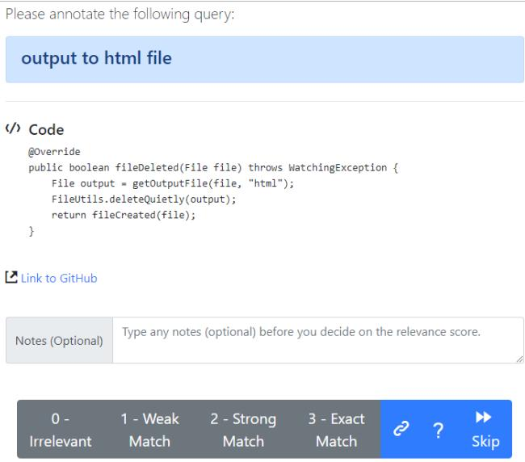
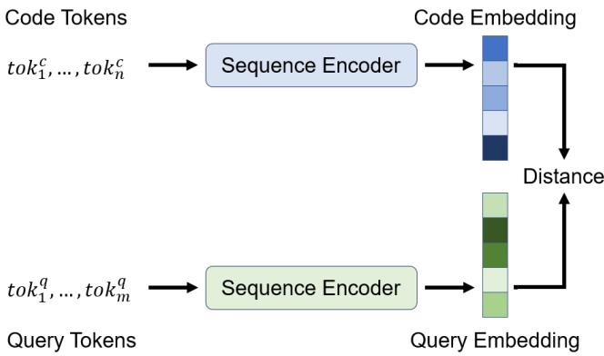

# CodeSearchNet Challenge Evaluating the State of Semantic Code Search

Hamel Husain Ho-Hsiang Wu Tiferet Gazit {hamelsmu,hohsiangwu,tiferet}@github.com GitHub

Miltiadis Allamanis Marc Brockschmidt {miallama,mabrocks}@microsoft.com Microsoft Research

# ABSTRACT

Semantic code search is the task of retrieving relevant code given a natural language query. While related to other information retrieval tasks, it requires bridging the gap between the language used in code (often abbreviated and highly technical) and natural language more suitable to describe vague concepts and ideas.

To enable evaluation of progress on code search, we are releasing the CodeSearchNet Corpus and are presenting the CodeSearchNet Challenge, which consists of 99 natural language queries with about 4k expert relevance annotations of likely results from CodeSearchNet Corpus. The corpus contains about 6 million functions from open-source code spanning six programming languages (Go, Java, JavaScript, PHP, Python, and Ruby). The CodeSearchNet Corpus also contains automatically generated query-like natural language for 2 million functions, obtained from mechanically scraping and preprocessing associated function documentation. In this article, we describe the methodology used to obtain the corpus and expert labels, as well as a number of simple baseline solutions for the task.

We hope that CodeSearchNet Challenge encourages researchers and practitioners to study this interesting task further and will host a competition and leaderboard to track the progress on the challenge. We are also keen on extending CodeSearchNet Challenge to more queries and programming languages in the future.

# 1 INTRODUCTION

The deep learning revolution has fundamentally changed how we approach perceptive tasks such as image and speech recognition and has shown substantial successes in working with natural language data. These have been driven by the co-evolution of large (labelled) datasets, substantial computational capacity, and a number of advances in machine learning models.

However, deep learning models still struggle on highly structured data. One example is semantic code search: while search on natural language documents and even images has made great progress, searching code is often still unsatisfying. Standard information retrieval methods do not work well in the code search domain, as there is often little shared vocabulary between search terms and results (e.g. consider a method called deserialize_JSON_obj_from_stream that may be a correct result for the query “read JSON data”). Even more problematic is that evaluating methods for this task is extremely hard, as there are no substantial datasets that were created for this task; instead, the community tries to make do with small datasets from related contexts (e.g. pairing questions on web forums to code chunks found in answers).

To tackle this problem, we have defined the CodeSearchNet Challenge on top of a new CodeSearchNet Corpus. The CodeSearchNet Corpus was programmatically obtained by scraping open-source repositories and pairing individual functions with their (processed) documentation as natural language annotation. It is large enough (2 million datapoints) to enable training of highcapacity deep neural models on the task. We discuss this process in detail in section 2 and also release the data preprocessing pipeline to encourage further research in this area.

The CodeSearchNet Challenge is defined on top of this, providing realistic queries and expert annotations for likely results. Concretely, in version 1.0, it consists of 99 natural languages queries paired with likely results for each of six considered programming languages (Go, Java, JavaScript, PHP, Python, and Ruby). Each query/result pair was labeled by a human expert, indicating the relevance of the result for the query. We discuss the methodology in detail in section 3.

Finally, we create a number of baseline methods using a range of state-of-the-art neural sequence processing techniques (bag of words, RNNs, CNNs, attentional models) and evaluate them on our datasets. We discuss these models in section 4 and present some preliminary results.

# 2 THE CODE SEARCH CORPUS

As it is economically infeasible to create a dataset large enough for training high-capacity models using expert annotations, we instead create a proxy dataset of lower quality. For this, we follow other attempts in the literature [5, 6, 9, 11] and pair functions in open-source software with the natural language present in their respective documentation. However, to do so requires a number of preprocessing steps and heuristics. In the following, we discuss some general principles and decisions driven by in-depth analysis of common error cases.

CodeSearchNet Corpus Collection. We collect the corpus from publicly available open-source non-fork GitHub repositories, using libraries.io to identify all projects which are used by at least one other project, and sort them by “popularity” as indicated by the number of stars and forks. Then, we remove any projects that do not have a license or whose license does not explicitly permit the re-distribution of parts of the project. We then tokenize all Go, Java, JavaScript, Python, PHP and Ruby functions (or methods) using TreeSitter — GitHub’s universal parser — and, where available, their respective documentation text using a heuristic regular expression.

Filtering. To generate training data for the CodeSearchNet Challenge, we first consider only those functions in the corpus that have documentation associated with them. This yields a set of pairs $( \mathbf { c } _ { i } , \mathbf { d } _ { i } )$ where $\mathbf { c } _ { i }$ is some function documented by ${ \bf d } _ { i }$ . To make the data more realistic proxy for code search tasks, we then implement a number of preprocessing steps:

Table 1: Dataset Size Statistics   

<table><tr><td rowspan="2"></td><td colspan="2">Number of Functions</td></tr><tr><td>w/ documentation</td><td>All</td></tr><tr><td>Go</td><td>347789</td><td>726768</td></tr><tr><td>Java</td><td>542 991</td><td>1569 889</td></tr><tr><td>JavaScript</td><td>157988</td><td>1857835</td></tr><tr><td>PHP</td><td>717313</td><td>977821</td></tr><tr><td>Python</td><td>503502</td><td>1156085</td></tr><tr><td>Ruby</td><td>57393</td><td>164048</td></tr><tr><td>All</td><td>2326976</td><td>6452 446</td></tr></table>

• Documentation ${ \bf d } _ { i }$ is truncated to the first full paragraph, to make the length more comparable to search queries and remove in-depth discussion of function arguments and return values.   
• Pairs in which ${ \bf d } _ { i }$ is shorter than three tokens are removed, since we do not expect such comments to be informative.   
• Functions $\mathbf { c } _ { i }$ whose implementation is shorter than three lines are removed, these often include unimplemented methods, getters, setters, etc.   
• Functions whose name contains the substring “test” are removed. Similarly, we remove constructors and standard extension methods such as __str__ in Python or toString in Java.   
• We remove duplicates from the dataset by identifying (near) duplicate functions and only keeping one copy of them (we use the methods described in Allamanis [1], Lopes et al. [18]). This removes multiple versions of auto-generated code and cases of copy & pasting.

The filtered corpus and the data extraction code are released at https://github.com/github/CodeSearchNet.

Dataset Statistics. The resulting dataset contains about 2 million pairs of function-documentation pairs and about another 4 million functions without an associated documentation (Table 1). We split the dataset in 80-10-10 train/valid/test proportions. We suggest that users of the dataset employ the same split.

Limitations. Unsurpsingly, the scraped dataset is quite noisy. First, documentation is fundamentally different from queries, and hence uses other forms of language. It is often written at the same time and by the same author as the documented code, and hence tends to use the same vocabulary, unlike search queries. Second, despite our data cleaning efforts we are unable to know the extent to which each documentation ${ \bf d } _ { i }$ accurately describes its associated code snippet $\mathbf { c } _ { i }$ For example, a number of comments are outdated with regard to the code that they describe. Finally, we know that some documentation is written in other languages, whereas our CodeSearchNet Challenge evaluation dataset focuses on English queries.

# 3 THE CODE SEARCH CHALLENGE

To evaluate on the CodeSearchNet Challenge, a method has to return a set of relevant results from CodeSearchNet Corpus for each of 99 pre-defined natural language queries. Note that the task is somewhat simplified from a general code search task by only allowing full functions/methods as results, and not arbitrary chunks of code.1 The CodeSearchNet Challenge evaluation dataset consists of the 99 queries with relevance annotations for a small number of functions from our corpus likely to be returned. These annotations were collected from a small set of expert programmers, but we are looking forward to widening the annotation set going forward.

Query Collection. To ensure that our query set is representative, we obtained common search queries from Bing that had high clickthrough rates to code and combined these with intent rewrites in StaQC [24]. We then manually filtered out queries that were clearly technical keywords (e.g. the exact name of a function such as tf.gather_nd) to obtain a set of 99 natural language queries. While most of the collected queries are generic, some of them are language-specific.

Expert Annotations. Obviously, we cannot annotate all query/- function pairs. To filter this down to a more realistically-sized set, we used our implementations of baseline methods and ensembled them (see section 4) to generate 10 candidate results per query and programming language. Concretely, we used ensembles of all neural models and ElasticSearch to generate candidate results, merge the suggestions and pick the top 10. We used a simple web interface for the annotation process. The web interface firsts shows instructions (see Figure 1) and then allows the annotator to pick a programming language. Then, one query/function pair is shown at a time, as shown in Figure 2. A link to the origin of the shown function is included, as initial experiments showed that some annotators found inspecting the context of the code snippet helpful to judge relevance. The order of query/code pairs shown to the user is randomized but weakly ordered by the number of expert annotations already collected. Annotators are unlikely to see several results for the same query unless they handle many examples. By randomizing the order, we aim to allow users to score the relevance of each pair individually without encouraging comparisons of different results for the same query.

Annotation Statistics. We collected 4 026 annotations across six programming languages and prioritized coverage over multiple annotations per query-snippet pair. Our annotators are volunteers with software engineering, data science and research roles and were asked to only annotate examples for languages they had significant experience with. This led to a skewed distribution of annotations w.r.t. the considered programming languages.

We observed that the obtained relevance scores are distributed differently for each language (Table 2). For example, the relevance scores for Python are evenly distributed across the four categories while for JavaScript the annotations are skewed towards lower relevance scores. There is a number of potential reasons for this, such as the quality of the used corpus, language-specific interactions

Through the annotations, we want to measure how relevant would these results be to you.

• You don't have to be absolutely certain about the correctness of the code.   
• You might be interested in copy-pasting the code, finding a library to use or just getting some understanding about how something is implemented. company or all of GitHub.   
• We ask annotators to have at least some experience on the programming language they are annotating.

Please annotate the results according to the following scheme:

• 3: Exact match. This seems exactly what I was looking for. I would copy-paste the code and make minor adaptations or will use this functionality of the library in my code. • 2: strong match. This does more or less what I was looking for. I would use the code in • 1: Weak match: That's not exactly what I was looking for, but there are some useful elements/pointers to things that I would use (e.g. APls, code structure) and can form the basis of a new query or exploration towards solving my query. • 0: Totally irrelevant. Il would never want to see this for this query.

  
Figure 1: Instructions provided to annotators.

Figure 2: Interface used for relevance annotation.   
Table 2: Annotation Dataset Statistics   

<table><tr><td rowspan="2"></td><td colspan="4">Count by Relevance Score</td><td rowspan="2">Total Annotations</td></tr><tr><td>0</td><td>1</td><td>2</td><td>3</td></tr><tr><td>Go</td><td>62</td><td>64</td><td>29</td><td>11</td><td>166</td></tr><tr><td>Java</td><td>383</td><td>178</td><td>125</td><td>137</td><td>823</td></tr><tr><td>JavaScript</td><td>153</td><td>52</td><td>56</td><td>58</td><td>319</td></tr><tr><td>PHP</td><td>103</td><td>77</td><td>68</td><td>66</td><td>314</td></tr><tr><td>Python</td><td>498</td><td>511</td><td>537</td><td>543</td><td>2089</td></tr><tr><td>Ruby</td><td>123</td><td>105</td><td>53</td><td>34</td><td>315</td></tr></table>

with our pre-filtering strategy, the queries we collected, higher expected relevance standards in the JavaScript community, etc.

For the 891 query-code pairs where we have more than one annotation, we compute the squared Cohen’s kappa interannotator agreement to estimate the quality of the task. The agreement is moderate with Cohen $\kappa = 0 . 4 7$ . This is somewhat expected given .that this task was relatively open-ended, as we will discuss next.

Qualitative Observations. During the annotation process we made some observations in discussions with the annotators and through the notes they provided in the web interface (see Fig. 2). These comments point to some general issues in implementing code search:

Code Quality A subset of the results being returned are functionally correct code, but of low quality, even though they originated in reasonably popular projects. In this context, low quality refers to unsatisfactory readability, bad security practices, known antipatterns and potentially slow code. Some annotators felt the need to give lower relevance scores to low-quality code as they would prefer not to see such results.

Query Ambiguity Queries are often ambiguous without additional context. For example, the query “how to determine if a string is a valid word” can have different correct interpretations depending on the domain-specific meaning of “valid word”.

Library vs. Project Specific Often a search yields code that is very specific to a given project (e.g. using internal utility functions), whereas other times the code is very general and verbose (e.g. containing code that could be factored out). Which of these is preferable depends on the context of the query, which we did not explicitly specify when asking for annotations.

Context Some results were semantically correct, but not relying on related helper functions and thus not self-contained. Some annotators were uncertain if such results should be considered relevant.

Directionality A common problem in results were functions implementing the inverse functionality of the query, e.g. “convert int to string” would be answered by stringToInt. This suggests that the baseline models used for pre-filtering have trouble with understanding such semantic aspects.

# 3.1 Evaluation of Ranking Models

To track the progress on the CodeSearchNet Challenge we have deployed a Weights & Biases leaderboard at https://app.wandb.ai/ github/codesearchnet/benchmark. We hope that this leaderboard will allow the community to better compare solutions to the code search task.

Metrics. We used normalized discounted cumulative gain (NDCG) to evaluate each competing method. NDCG is a commonly used metric [19] in information retrieval. We compute two variants of NDCG: (a) NDCG computed over the subset of functions with human annotations (“Within”) (b) NDCG over the whole CodeSearchNet Corpus (“All”). We make this distinction as the NDCG score computed over the whole corpus may not necessarily represent the quality of a search tool, as a new tool may yield relevant but not-annotated functions.

  
Figure 3: Model Architecture Overview.

# 4 BASELINE CODESEARCH MODELS

We implemented a range of baseline models for the code search task, using standard techniques from neural sequence processing and web search.

# 4.1 Joint Vector Representations for Code Search

Following earlier work [11, 20], we use joint embeddings of code and queries to implement a neural search system. Our architecture employs one encoder per input (natural or programming) language and trains them to map inputs into a single, joint vector space. Our training objective is to map code and the corresponding language onto vectors that are near to each other, as we can then implement a search method by embedding the query and then returning the set of code snippets that are “near” in embedding space. Although more complex models considering more interactions between queries and code can perform better [20], generating a single vector per query/snippet allows for efficient indexing and search.

To learn these embedding functions, we combine standard sequence encoder models in the architecture shown in Figure 3. First, we preprocess the input sequences according to their semantics: identifiers appearing in code tokens are split into subtokens (i.e. a variable camelCase yields two subtokens camel and case), and natural language tokens are split using byte-pair encoding (BPE) [10, 21].

Then, the token sequences are processed to obtain (contextualized) token embeddings, using one of the following architectures.

Neural Bag of Words where each (sub)token is embedded to a learnable embedding (vector representation).

Bidirectional RNN models where we employ the GRU cell [7] to summarize the input sequence.

1D Convolutional Neural Network over the input sequence of tokens [15].

Self-Attention where multi-head attention [22] is used to compute representations of each token in the sequence.

The token embeddings are then combined into a sequence embedding using a pooling function, for which we have implemented mean/max-pooling and an attention-like weighted sum mechanism.

For all models, we set the dimensionality of the embedding space to 128.

During training we are given a set of $N$ pairs $( \mathbf { c } _ { i } , \mathbf { d } _ { i } )$ of code and ,natural language descriptions and have instantiated a code encoder $E _ { c }$ and a query encoder $E _ { q }$ . We train by minimizing the loss

$$
- \frac { 1 } { N } \sum _ { i } \log \left( \frac { \exp ( E _ { c } ( \mathbf { c } _ { i } ) ^ { \top } E _ { q } ( \mathbf { d } _ { i } ) ) } { \sum _ { j } \exp ( E _ { c } ( \mathbf { c } _ { j } ) ^ { \top } E _ { q } ( \mathbf { d } _ { i } ) ) } \right) ,
$$

i.e. maximize the inner product of the code and query encodings of the pair, while minimizing the inner product between each $\mathbf { c } _ { i }$ and the distractor snippets $\mathbf { c } _ { j } \left( i \neq j \right)$ . Note that we have experimented with other similar objectives (e.g. considering cosine similarity and max-margin approaches) without significant changes in results on our validation dataset. The code for the baselines can be found at https://github.com/github/CodeSearchNet.

At test time, we index all functions in CodeSearchNet Corpus using Annoy. Annoy offers fast, approximate nearest neighbor indexing and search. The index includes all functions in the CodeSearchNet Corpus, including those that do not have an associated documentation comment. We observed that carefully constructing this index is crucial to achieving good performance. Specifically, our baseline models were underperforming when we had a small number of trees in Annoy (trees can be thought as approximate indexes of the multidimensional space).

# 4.2 ElasticSearch Baseline

In our experiments, we additionally included ElasticSearch, a widely used search engine with the default parameters. We configured it with an index using two fields for every function in our dataset: the function name, split into subtokens; and the text of the entire function. We use the default ElasticSearch tokenizer.

# 4.3 Evaluation

Following the training/validation/testing data split, we train our baseline models using our objective from above. While it does not directly correspond to the real target task of code search, it has been widely used as a proxy for training similar models [6, 23].

For testing purposes on CodeSearchNet Corpus, we fix a set of 999 distractor snippets $\mathbf { c } _ { j }$ for each test pair $( \mathbf { c } _ { i } , \mathbf { d } _ { i } )$ and test all trained models. Table 3 presents the Mean Reciprocal Rank results on this task. Overall, we see that the models achieve relatively good performance on this task, with the self-attention-based model performing best. This is not unexpected, as the self-attention model has the highest capacity of all considered models.

We have also run our baselines on CodeSearchNet Challenge and show the results in Table 4. Here, the neural bag of words model performs very well, whereas the stronger neural models on the training task do less well. We note that the bag of words model is particularly good at keyword matching, which seems to be a crucial facility in implementing search methods. This hypothesis is further validated by the fact that the non-neural ElasticSearchbased baseline performs competitively among all models we have tested. The NBoW model is the best performing model among the baselines models, despite being the simplest. As noted by Cambronero et al. [6], this can be attributed to the fact that the training data constructed from code documentation is not a good match for the code search task.

<table><tr><td colspan="2">Encoder</td><td colspan="7">CoDESEARcHNET CoRPUs (MRR)</td></tr><tr><td>Text</td><td>Code</td><td>Go</td><td>Java</td><td>JS</td><td>PHP</td><td>Python</td><td>Ruby</td><td>Avg</td></tr><tr><td>NBoW</td><td>NBoW</td><td>0.6409</td><td>0.5140</td><td>0.4607</td><td>0.4835</td><td>0.5809</td><td>0.4285</td><td>0.6167</td></tr><tr><td>1D-CNN</td><td>1D-CNN</td><td>0.6274</td><td>0.5270</td><td>0.3523</td><td>0.5294</td><td>0.5708</td><td>0.2450</td><td>0.6206</td></tr><tr><td>biRNN</td><td>biRNN</td><td>0.4524</td><td>0.2865</td><td>0.1530</td><td>0.2512</td><td>0.3213</td><td>0.0835</td><td>0.4262</td></tr><tr><td>SelfAtt</td><td>SelfAtt</td><td>0.6809</td><td>0.5866</td><td>0.4506</td><td>0.6011</td><td>0.6922</td><td>0.3651</td><td>0.7011</td></tr><tr><td>SelfAtt</td><td>NBoW</td><td>0.6631</td><td>0.5618</td><td>0.4920</td><td>0.5083</td><td>0.6113</td><td>0.4574</td><td>0.6505</td></tr></table>

Table 3: Mean Reciprocal Rank (MRR) on Test Set of CodeSearchNet Corpus. This evaluates for our training task, where given the documentation comment as a query, the models try to rank the correct code snippet highly among 999 distractor snippets.

# 5 RELATED WORK

Applying machine learning to code has been widely considered [2]. A few academic works have looked into related tasks. First, semantic parsing has received a lot of attention in the NLP community. Although most approaches are usually aimed towards creating an executable representation of a natural language utterance with a domain-specific language, general-purpose languages have been recently considered by Hashimoto et al. [13], Lin et al. [16], Ling et al. [17], Yin and Neubig [25].

Iyer et al. [14] generate code from natural language within the context of existing methods, whereas Allamanis et al. [3], Alon et al. [4] consider the task of summarizing functions to their names. Finally, Fernandes et al. [9] consider the task of predicting the documentation text from source code.

More related to CodeSearchNet is prior work in code search with deep learning. In the last few years there has been research in this area (Cambronero et al. [6], Gu et al. [11, 12], Yao et al. [23]), and architectures similar to those discussed previously have been shown to work to some extent. Recently, Cambronero et al. [6] looked into the same problem that CodeSearchNet is concerned with and reached conclusions similar to those discussed here. In contrast to the aforementioned works, here we provide a humanannotated dataset of relevance scores and test a few more neural search architectures along with a standard information retrieval baseline.

# 6 CONCLUSIONS & OPEN CHALLENGES

We hope that CodeSearchNet is a good step towards engaging with the machine learning, IR and NLP communities towards developing new machine learning models that understand source code and natural language. Despite the fact this report gives emphasis on semantic code search we look forward to other uses of the presented datasets. There are still plenty of open challenges in this area.

• Our ElasticSearch baseline, that performs traditional keywordbased search, performs quite well. It has the advantage of being able to efficiently use rare terms, which often appear in code. Researching neural methods that can efficiently and accurately represent rare terms will improve performance.

• Code semantics such as control and data flow are not exploited explicitly by existing methods, and instead search methods seem to be mainly operate on identifiers (such as variable and function) names. How to leverage semantics to improve results remains an open problem.   
• Recently, in NLP, pretraining methods such as BERT [8] have found great success. Can similar methods be useful for the encoders considered in this work?   
• Our data covers a wide range of general-purpose code queries. However, anecdotal evidence indicates that queries in specific projects are usually more specialized. Adapting search methods to such use cases could yield substantial performance improvements.   
• Code quality of the searched snippets was a recurrent issue with our expert annotators. Despite its subjective nature, there seems to be agreement on what constitutes very bad code. Using code quality as an additional signal that allows for filtering of bad results (at least when better results are available) could substantially improve satisfaction of search users.

# ACKNOWLEDGMENTS

We thank Rok Novosel for participating in the CodeSearchNet challenge and pinpointing a bug with the indexing that was significantly impacting our evaluation results.

# REFERENCES

[1] Miltiadis Allamanis. 2018. The Adverse Effects of Code Duplication in Machine Learning Models of Code. arXiv preprint arXiv:1812.06469 (2018).   
[2] Miltiadis Allamanis, Earl T Barr, Premkumar Devanbu, and Charles Sutton. 2018. A survey of machine learning for big code and naturalness. ACM Computing Surveys (CSUR) 51, 4 (2018), 81.   
[3] Miltiadis Allamanis, Hao Peng, and Charles Sutton. 2016. A Convolutional Attention Network for Extreme Summarization of Source Code. In Proceedings of the International Conference on Machine Learning (ICML).   
[4] Uri Alon, Omer Levy, and Eran Yahav. 2018. code2seq: Generating sequences from structured representations of code. arXiv preprint arXiv:1808.01400 (2018).   
[5] Antonio Valerio Miceli Barone and Rico Sennrich. 2017. A parallel corpus of Python functions and documentation strings for automated code documentation and code generation. arXiv preprint arXiv:1707.02275 (2017).   
[6] Jose Cambronero, Hongyu Li, Seohyun Kim, Koushik Sen, and Satish Chandra. 2019. When Deep Learning Met Code Search. arXiv preprint arXiv:1905.03813 (2019).   
[7] Kyunghyun Cho, Bart van Merriënboer, Dzmitry Bahdanau, and Yoshua Bengio. 2014. On the Properties of Neural Machine Translation: Encoder–Decoder Approaches. Syntax, Semantics and Structure in Statistical Translation (2014).   
[8] Jacob Devlin, Ming-Wei Chang, Kenton Lee, and Kristina Toutanova. 2018. Bert: Pre-training of deep bidirectional transformers for language understanding. arXiv preprint arXiv:1810.04805 (2018). [9] Patrick Fernandes, Miltiadis Allamanis, and Marc Brockschmidt. 2018. Structured Neural Summarization. arXiv preprint arXiv:1811.01824 (2018).   
[10] Philip Gage. 1994. A new algorithm for data compression. The C Users Journal 12, 2 (1994), 23–38.   
[11] Xiaodong Gu, Hongyu Zhang, and Sunghun Kim. 2018. Deep code search. In 2018 IEEE/ACM 40th International Conference on Software Engineering (ICSE). IEEE, 933–944.   
[12] Xiaodong Gu, Hongyu Zhang, Dongmei Zhang, and Sunghun Kim. 2016. Deep API Learning. In Proceedings of the International Symposium on Foundations of Software Engineering (FSE).   
[13] Tatsunori B Hashimoto, Kelvin Guu, Yonatan Oren, and Percy S Liang. 2018. A retrieve-and-edit framework for predicting structured outputs. In Advances in Neural Information Processing Systems. 10073–10083.   
[14] Srinivasan Iyer, Ioannis Konstas, Alvin Cheung, and Luke Zettlemoyer. 2018. Mapping language to code in programmatic context. arXiv preprint arXiv:1808.09588 (2018).   
[15] Yoon Kim. 2014. Convolutional neural networks for sentence classification. arXiv preprint arXiv:1408.5882 (2014).   
[16] Xi Victoria Lin, Chenglong Wang, Luke Zettlemoyer, and Michael D. Ernst. 2018. NL2Bash: A Corpus and Semantic Parser for Natural Language Interface to the Linux Operating System. In International Conference on Language Resources and Evaluation.   
[17] Wang Ling, Edward Grefenstette, Karl Moritz Hermann, Tomas Kocisky, Andrew Senior, Fumin Wang, and Phil Blunsom. 2016. Latent Predictor Networks for Code Generation. In Proceedings of the Annual Meeting of the Association for Computational Linguistics (ACL).   
[18] Cristina V Lopes, Petr Maj, Pedro Martins, Vaibhav Saini, Di Yang, Jakub Zitny, Hitesh Sajnani, and Jan Vitek. 2017. DéjàVu: a map of code duplicates on GitHub. Proceedings of the ACM on Programming Languages 1, OOPSLA (2017), 84.   
[19] Christopher D. Manning, Prabhakar Raghavan, and Hinrich Schütze. 2008. Introduction to Information Retrieval. Cambridge University Press.   
[20] Bhaskar Mitra, Nick Craswell, et al. 2018. An introduction to neural information retrieval. Foundations and Trends® in Information Retrieval 13, 1 (2018), 1–126.   
[21] Rico Sennrich, Barry Haddow, and Alexandra Birch. 2016. Neural machine translation of rare words with subword units. In Proceedings of the Annual Meeting of the Association for Computational Linguistics (ACL).   
[22] Ashish Vaswani, Noam Shazeer, Niki Parmar, Jakob Uszkoreit, Llion Jones, Aidan N Gomez, Łukasz Kaiser, and Illia Polosukhin. 2017. Attention is all you need. In Advances in Neural Information Processing Systems. 5998–6008.   
[23] Ziyu Yao, Jayavardhan Reddy Peddamail, and Huan Sun. 2019. CoaCor: Code Annotation for Code Retrieval with Reinforcement Learning. (2019).   
[24] Ziyu Yao, Daniel S Weld, Wei-Peng Chen, and Huan Sun. 2018. StaQC: A Systematically Mined Question-Code Dataset from Stack Overflow. In Proceedings of the 2018 World Wide Web Conference on World Wide Web. International World Wide Web Conferences Steering Committee, 1693–1703.   
[25] Pengcheng Yin and Graham Neubig. 2017. A Syntactic Neural Model for GeneralPurpose Code Generation. Proceedings of the Annual Meeting of the Association for Computational Linguistics (ACL).

<table><tr><td colspan="2">Encoder</td><td colspan="7">CoDESEARCHNET CHALLENGE– NDCG Within</td><td colspan="7">CoDESEARCHNET CHALLENGE– NDCG All</td></tr><tr><td>Text</td><td>Code</td><td>Go</td><td>Java</td><td>JS</td><td>PHP</td><td>Python</td><td>Ruby</td><td>Avg</td><td>Go</td><td>Java</td><td>JS</td><td>PHP</td><td>Python</td><td>Ruby</td><td>Avg</td></tr><tr><td colspan="2">ElasticSearch</td><td>0.307</td><td>0.257</td><td>0.318</td><td>0.338</td><td>0.406</td><td>0.395</td><td>0.337</td><td>0.186</td><td>0.190</td><td>0.204</td><td>0.199</td><td>0.256</td><td>0.197</td><td>0.205</td></tr><tr><td>NBoW</td><td>NBoW</td><td>0.591</td><td>0.500</td><td>0.556</td><td>0.536</td><td>0.582</td><td>0.680</td><td>0.574</td><td>0.278</td><td>0.355</td><td>0.311</td><td>0.291</td><td>0.448</td><td>0.360</td><td>0.340</td></tr><tr><td>1D-CNN</td><td>1D-CNN</td><td>0.379</td><td>0.407</td><td>0.269</td><td>0.474</td><td>0.473</td><td>0.420</td><td>0.404</td><td>0.120</td><td>0.189</td><td>0.099</td><td>0.176</td><td>0.242</td><td>0.162</td><td>0.165</td></tr><tr><td>biRNN</td><td>biRNN</td><td>0.112</td><td>0.165</td><td>0.066</td><td>0.148</td><td>0.193</td><td>0.185</td><td>0.145</td><td>0.030</td><td>0.056</td><td>0.017</td><td>0.042</td><td>0.070</td><td>0.060</td><td>0.046</td></tr><tr><td>SelfAtt</td><td>SelfAtt</td><td>0.484</td><td>0.431</td><td>0.446</td><td>0.522</td><td>0.560</td><td>0.515</td><td>0.493</td><td>0.211</td><td>0.233</td><td>0.175</td><td>0.232</td><td>0.367</td><td>0.219</td><td>0.240</td></tr><tr><td>SelfAtt</td><td>NBoW</td><td>0.550</td><td>0.514</td><td>0.545</td><td>0.557</td><td>0.583</td><td>0.650</td><td>0.566</td><td>0.284</td><td>0.340</td><td>0.299</td><td>0.291</td><td>0.422</td><td>0.360</td><td>0.333</td></tr></table>

Table 4: NDCG Baseline Results on CodeSearchNet Challenge. “Within” computes the NDCG only on the functions within the human-annotated examples. “All” computes NDCG over all functions in the CodeSearchNet Corpus.