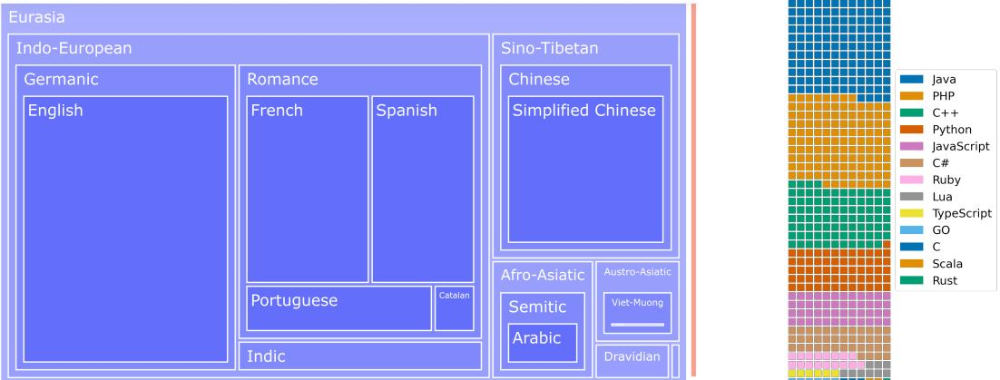
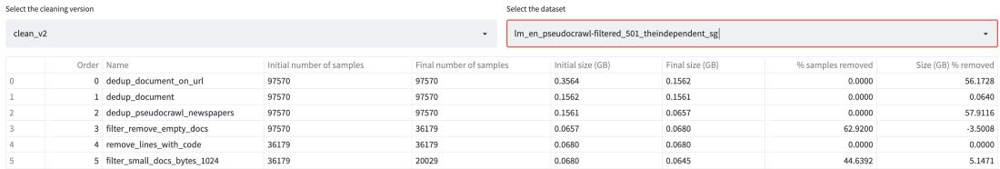
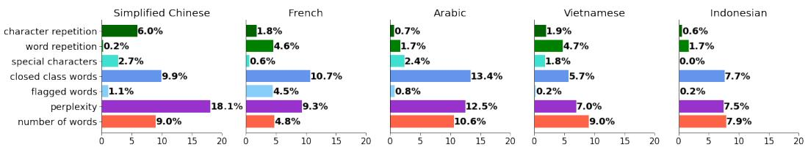
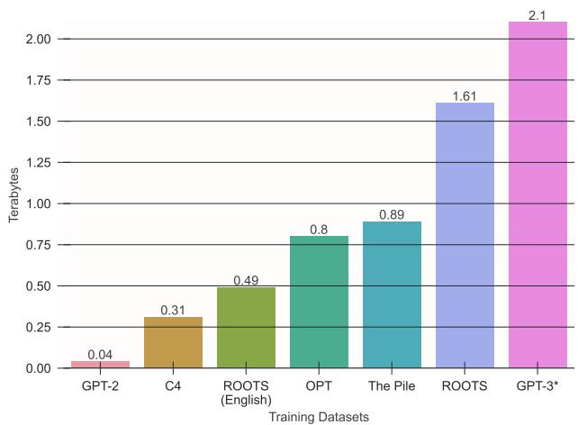
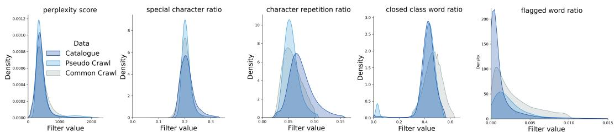
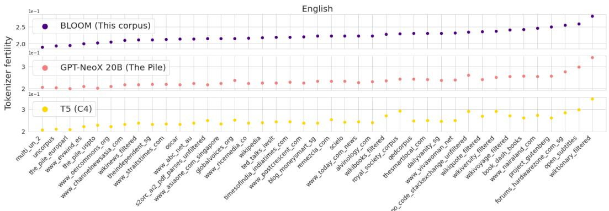
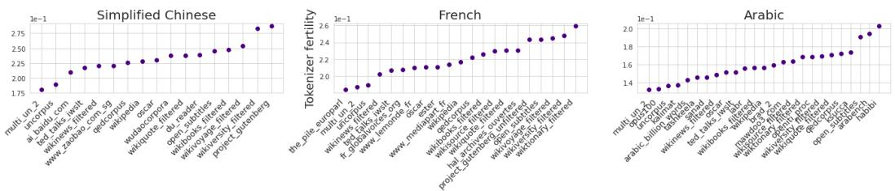
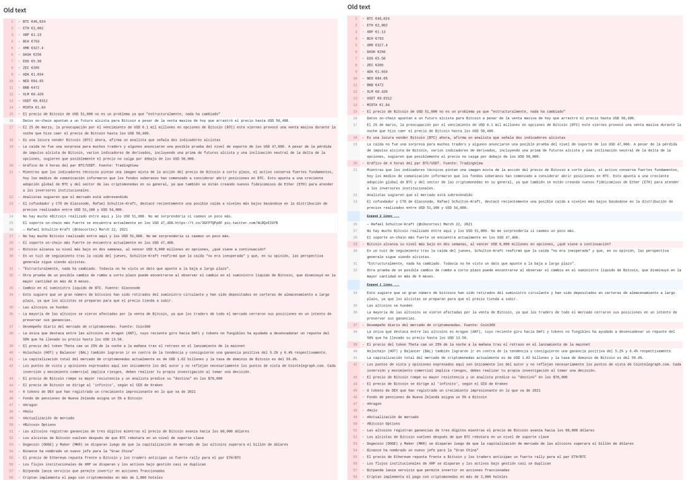

# The BigScience ROOTS Corpus: A 1.6TB Composite Multilingual Dataset

Hugo Laurençon1∗ Lucile Saulnier1∗ Thomas Wang1∗ Christopher Akiki2∗ Albert Villanova del Moral1∗ Teven Le Scao1\*

Leandro von Werra1 Chenghao Mou3 Eduardo González Ponferrada4 Huu Nguyen5 Jörg Frohberg 32 Mario Šaško 1 Quentin Lhoest 1

Angelina McMillan-Major1,6 Gérard Dupont7 Stella Biderman8,9 Anna Rogers10 Loubna Ben allal1 Francesco De Toni11 Giada Pistilli1 Olivier Nguyen 28 Somaieh Nikpoor12 Maraim Masoud13 Pierre Colombo14 Javier de la Rosa15   
Paulo Villegas16 Tristan Thrush1 Shayne Longpre17 Sebastian Nagel19 Leon Weber 20 Manuel Romero Muñoz 21 Jian Zhu 22 Daniel van Strien 23 Zaid Alyafeai 24 Khalid Almubarak 25 Vu Minh Chien 26 Itziar Gonzalez-Dios 27 Aitor Soroa 27   
Kyle Lo 29 Manan Dey 30 Pedro Ortiz Suarez 31 Aaron Gokaslan 18 Shamik Bose3 David Ifeoluwa Adelani33 Long Phan34 Hieu Tran34 Ian $\mathbf { Y } \mathbf { u } ^ { \mathrm { 3 5 } }$ Suhas $\mathbf { P a i ^ { 3 6 } }$ Jenny Chim37

Violette Lepercq1 Suzana Ilic´1 Margaret Mitchell1 Sasha Luccioni1 Yacine Jernite1

1Hugging Face 2Leipzig University 3Independent Researcher 4Ferrum Health   
5Ontocord.ai 6University of Washington 7Mavenoid 8EleutherAI 9Booz Allen Hamilton 10University of Copenhagen 11University of Western Australia 12CAIDP 13Independent Researcher 14CentraleSupélec 15National Library of Norway 16Telefonica $\mathrm { I } { + } \mathrm { D }$ (cid:) 17MIT 18Cornell University 19Common Crawl   
20Humboldt-Universität zu Berlin and Max Delbrück Center for Molecular Medicine 21Narrativa 22University of Michigan, Ann Arbor 23British Library 24King Fahd University of Petroleum and Minerals 25Prince Sattam bin Abdulaziz University (PSAU) 26DETOMO Inc. 27HiTZ Center, University of the Basque Country (UPV/EHU) 28ServiceNow   
29Allen Institute for AI 30SAP 31Mannheim University 32Apergo.ai 33Saarland University   
34VietAI Research 35Aggregate Intellect 36Bedrock AI 37Queen Mary University of London

∗ Equal contributions

# Abstract

As language models grow ever larger, the need for large-scale high-quality text datasets has never been more pressing, especially in multilingual settings. The BigScience workshop, a 1-year international and multidisciplinary initiative, was formed with the goal of researching and training large language models as a values-driven undertaking, putting issues of ethics, harm, and governance in the foreground. This paper documents the data creation and curation efforts undertaken by BigScience to assemble the Responsible Open-science Open-collaboration Text Sources (ROOTS) corpus, a 1.6TB dataset spanning 59 languages that was used to train the 176-billion-parameter BigScience Large Open-science Open-access Multilingual (BLOOM)(BigScience Workshop, 2022) language model. We further release a large initial subset of the corpus and analyses thereof, and hope to empower large-scale monolingual and multilingual modeling projects with both the data and the processing tools, as well as stimulate research around this large multilingual corpus.

# Contents

# 1 Introduction 3

1.1 Outline of the Paper . . . . 3   
1.2 Related Work 4

# 2 (Crowd) Sourcing a Language Resource Catalogue 4

2.1 Obtaining Data from the Identified Resources 5   
2.2 Processing Pipeline for Quality Improvement on Crowdsourced Datasets . . . . . 6

# 3 Processing OSCAR 7

3.1 Data cleaning and filtering   
3.2 Deduplication . 8   
3.3 Personally identifiable information 8

# 4 A First look at ROOTS 8

4.1 Natural Languages 8   
4.2 Programming Languages 9   
4.3 Tokenizer analysis of the component datasets 10

# 5 Conclusion 11

A Ethical Considerations and Broader Impacts Statement 20   
B Details on tools used to obtain crowdsourced dataset 21   
B.1 Pseudocode to recreate the text structure from the HTML code 21   
B.2 Visualization tool use cases . 21   
B.3 Exhaustive list of functions used in (Crowd)Sourced dataset 22

# C Exhaustive list of human curated filters used on OSCAR 26

D PII filtering initiative 27

E Data Sources 28

F Author contributions 34

  
Figure 1: Overview of ROOTS. Left: A treemap of natural language representation in number of bytes by language family. The bulk of the graph is overwhelmed by the 1321.89 GB allotted to Eurasia. The orange rectangle corresponds to the 18GB of Indonesian, the sole representative of the Papunesia macroarea, and the green rectangle to the 0.4GB of the Africa linguistic macroarea. Right: A waffle plot of the distribution of programming languages by number of files. One square corresponds approximately to 30,000 files.

# 1 Introduction

BigScience1 started in May 2021 as a one-year long open collaborative research initiative that gathered over a thousand participants around the world to study large language models (LLM). One of the founding goals of BigScience was to train an open-access, massively multilingual LLM, comparable in scale to GPT-3 (Brown et al., 2020) yet trained on a better documented and more representative multilingual dataset. The overall BigScience workshop was designed as a collaborative (Caselli et al., 2021; Bondi et al., 2021) and value-driven (Birhane et al., 2021) endeavor. Throughout the process of building this corpus we engaged in simultaneous investigation of ethical (Talat et al., 2022), sociopolitical (McMillan-Major et al., 2022), and data governance issues (Jernite et al., 2022) with the explicit goal of doing good for and by the people whose data we collected.

Sourcing and building the dataset was organized around four working groups: Data Governance which helped define the project’s values and design our approach to data usage and release in an international context, Data Sourcing and Preparation which was tasked with overseeing data collection, curation efforts, and Privacy for privacy risks and sanitizing the dataset, Legal Scholarship which helped define the multi-jurisdiction legal context in which the entire workshop was to operate, and we discuss practical implications throughout the paper where appropriate. An overview of the BigScience Corpus is provided in figure 1.

The goal of the current paper is twofold: (1) we present a preliminary gated, subject to committing to the BigScience ethical charter2, release of a large subset of ${ \mathrm { R O O T S } } ^ { \bar { 3 } }$ (2) we release the numerous data tools4 that were developed along the way and enabled us to curate, source, clean and inspect all 498 constituent datasets that come together to constitute ROOTS. This includes a preliminary results of the analyses that are currently being developed to study the corpus.

# 1.1 Outline of the Paper

The remainder of this paper details our approach to curating a web-scale dataset covering 59 languages, 46 natural languages and 13 programming languages — the language choice was chiefly driven by the communities who participated in the effort given the importance we placed on language expertise. Our final corpus is made up of two main components: $62 \%$ of the text comes from a community-selected and documented list of language data sources and its collection process is described in section 2, and

$38 \%$ consists of text extracted from a pre-processed web crawl, OSCAR (Ortiz Suárez et al. (2020)), filtered with the help of native speakers, which is described in section 3.

# 1.2 Related Work

Large Language Models and Large Text Corpora The current dominant paradigm in natural language processing relies heavily on pre-trained models: large language models that can then be fine-tuned on a downstream task (Howard and Ruder, 2018; Devlin et al., 2018) or even used as-is without additional data (Radford et al., 2019; Brown et al., 2020). In this paradigm, performance is directly correlated on both the model size and the dataset size and quality (Kaplan et al., 2020), with recent models trained on up to 1.4 trillion tokens (Hoffmann et al., 2022) and dataset creation pipelines representing a significant part of large language model projects. Most such datasets, however, are not released, hindering further research. Exceptions include the Pile (Gao et al., 2020), a curated corpus of datasets for language modeling that has become widely used for training state-of-the-art English-language models (Lieber et al., 2021; Smith et al., 2022; Black et al., 2022; Zhang et al., 2022), and C4 and mC4 (Raffel et al., 2020; Xue et al., 2020), which have powered the T5 family of models; CC100 (Conneau et al., 2020) which has seen heavy use for multilingual modeling; and OSCAR (Ortiz Suárez et al., 2019), which has enabled monolingual non-English models.

Tooling, Visualization, and Replication Upstream from the finalized training datasets is the issue of processing methods and pipelines: both the operations that the datasets go through and the engineering effort required to apply them at terabyte scales. Existing work tends to fall on a spectrum from no details at all (Brown et al., 2020) to detailed filtering instructions, with (Raffel et al., 2020) or without the dataset release (Rae et al., 2021) to detailed filtering instructions with the accompanying code (Gao et al., 2020; Conneau et al., 2020; Ortiz Suárez et al., 2019). Even when the code is released, it tends to be built and tailored for the project’s purpose. Consequently, large projects that do not re-use an existing dataset outright usually build their own pipeline rather than re-use an existing one on new data. However, data tools that were built and packaged in order to be used for other projects exist, such as OSCAR’s Ungoliant and Goclassy (Abadji et al., 2021; Ortiz Suárez et al., 2019), which provides a distributed Common Crawl processing pipeline; CCNet (Wenzek et al., 2020), built for quality filtering of multilingual Common Crawl dumps; and OpenWebText (Gokaslan and Cohen, 2019), enabling Reddit dump processing.

Documenting Textual Corpora in NLP An inspiration for our work is a recent emphasis on a more in-depth documentation of what is included and what is not in the corpora used for training NLP models . The most notable example of this is the Pile, for which the authors themselves analyze and document a variety of syntactic and semantic properties of the dataset including structural statistics (n-gram counts, language, document sizes), topical distributions across its components, social bias and sentiment co-occurrence, pejorative content, and information about licensing and authorial consent, in addition to releasing a datasheet (Biderman et al., 2022). Other LM pre-training datasets that have been documented and analyzed include C4 (Dodge et al., 2021; Luccioni and Viviano, 2021; Kreutzer et al., 2022), OSCAR (Kreutzer et al., 2022) and BookCorpus (Bandy and Vincent, 2021) . While this kind of documentation is far from standard practice, it is becoming increasingly common given recent calls for better documentation (Rogers, 2021; Bender et al., 2021) as well as empirical studies on data memorization in language models (Carlini et al., 2019, 2022).

# 2 (Crowd) Sourcing a Language Resource Catalogue

The first part of our corpus, accounting for $62 \%$ of the final dataset size (in bytes), was made up of a collection of monolingual and multilingual language resources that were selected and documented collaboratively through various efforts of the BigScience Data Sourcing working group. The first such effort consisted in creating a tool to support metadata collection through open submissions, called the BigScience Catalogue and running a series of hackathons in collaboration with locally-focused ML and NLP communities such as Masakhane, Machine Learning Tokyo and LatinX in AI where participants could add and document entries for their languages to the catalogue (McMillan-Major et al., 2022). This yielded a set of 252 sources, including at least 21 per considered language category. We focused on metadata collection as a way to support selection of the sources for the final dataset and documentation of the final dataset. In parallel, working group participants gathered additional

Arabic language resources in the Masader repository (Alyafeai et al., 2021), and proposed a list of websites of interest to increase the geographical diversity of our English, Spanish, and Chinese language data. Finally, in order to explicitly test large language models’ ability to handle computer code along with natural language, we selected code data available on GitHub and StackExchange.

# 2.1 Obtaining Data from the Identified Resources

Gathering Identified Datasets and Collections. First, we leveraged the BigScience Catalogue and the Masader repository to start obtaining text from identified sources, which included both existing NLP datasets and collections of documents of various compositions. Given the diversity of sources, hosting methods, data custodians, and formats, collecting this text required a collaborative effort. To that end, we established a 2-phase approach: first, collect as many data sources as possible in an easily accessible location; second, map all of them to a common format to ease further processing.

In the first phase, we organized an open hackathon to start gathering identified sources on the Hugging Face Datasets hub (Lhoest et al., 2021), in a dedicated organization5 (in order to manage access controls). In the second phase, the collected datasets were furthered processed via (1) Language segmentation, whereby data sources were split using metadata for each covered language in order to obtain monolingual datasets, and the use of (2) Uniform interface whereby a document consisted of two fields: "text" for the actual text content, and "meta" with a JSON representation of metadata for a given document, containing sufficient information to trace documents back to their original sources.

Pseudo-Crawled Data. Of the various categories of language resources identified through the data sourcing effort, websites stood out as one that required a particular effort and dedicated pipeline. We decided to design such a pipeline based on “pseudo-crawling”: that is, rather than crawling the websites ourselves, we retrieved pages corresponding to the target domain names from 18 snapshots archived by Common Crawl in 2020 and 2021 in Web ARChive (WARC) format (Mohr et al., 2008). These domain names came from two main sources: the homepage field in the metadata of the 252 above-mentioned catalogue entries when available (192 in total), and the 456 websites proposed by participants asynchronously to improve the geographical diversity of our language sources; which yielded a total of 614 unique domain names after deduplication.

We collected URLs contained within those domains using the Common Crawl index. The index provides metadata for every document including the page URL, WARC filename and record offsets, fetch status, content MIME type, etc. We ran a query matching all documents that share the domain name with a seed using Amazon Athena on Common Crawl’s columnar index6. 48 of the 614 initial seed domain names had no matches in the index and were therefore left out. Once we obtained the document metadata, we fetched the WARC records using HTTP range requests with the start and end byte offsets. Since HTML web pages constitute the largest portion of pages contained in the Common Crawl dumps, we decided to only extract text from HTML pages. Documents in other formats were filtered out, ie XML, PDF, etc. 27 domain names were additionally removed from the list at this stage as we had not retrieved any HTML pages for them.

To extract the text from the HTML pages, we first minified the HTML code. Minification is the removal of unnecessary characters from the source code of a website. Inspired by Aghajanyan et al. (2022), we removed from the DOM-HTML all the sub-trees contained in a <script>, <style>, <header>, <iframe>, <footer> and <form> tag as well as all the sub-trees associated with a <body>, 
, $< p >$ , <section>, <table>, ${ < u l > }$ , ${ < o l > }$ or $< d l >$ tag whose textual content was less than 64 characters long. The text was then extracted from the nodes of this new DOM-HTML. While concatenating the text extracted, we applied a set of rules to reconstruct the structure of the text without its HTML code, inspired by what Common Crawl does to extract its WET files (Appendix B.1). The overall procedure enabled us to obtain text datasets for 539 domain names.

GitHub Code. We collected a code dataset from BigQuery7 using the same language selection as AlphaCode (Li et al., 2022). The dataset was then deduplicated of exact matches and filtered for source files with between 100 and 200,000 characters, between $1 5 . 6 5 \%$ alphabetic characters, a max line length of 20-1000 characters, and a token length standard deviation of more than 3. Due to a bug in the pre-processing pipeline the dataset was also filtered for GPL licenses only.

Merging and Deduplicating Sources. After gathering and processing language data via the three pipelines outlined above, we took a final step to manually inspect, deduplicate, and make a further selection of the sources. First, we addressed dataset overlap we found by looking through our sources. For example: OpenITI was present in both its raw form as well as a processed version. Consensus was reached to choose the latter version. Non-trivial datasets overlap included s2orc (Lo et al., 2020), Arxiv (Clement et al., 2019) and the PubMed Central subset of the Pile (Gao et al., 2020). We also performed cross-pipeline dataset deduplication, removing the pseudo-crawled Wikipedia and GitHub in favor of their other versions. We also removed datasets that we found had a high incidence of documents that were not fully in natural language (e.g. unexpected instances of SEO, HTML tags etc...), as well as very small datasets in the higher-resourced languages. Finally, pseudo-crawled sources were further processed to remove menus (with a heuristic consisting of removing lines that occurred in more than $1 \%$ of pages in a given domain) and pages that had a high incidence of character ngram repetition, low language identification confidence, or low proportion of closed class words (see Section 3). We then removed entire domains whose size was less than 2MB after this step, yielding 147 pseudo-crawl-based datasets, and a total of 517 datasets including all three pipelines.

# 2.2 Processing Pipeline for Quality Improvement on Crowdsourced Datasets

Once a text field was obtained, we attempted to improve the quality of that text. In the specific case of text extraction from HTML, we observe that not all text are relevant (menus, advertisements, repeated text on each page etc ...). In order to remove noisy data from our dataset, we applied a processing pipeline for each dataset consisting of a sequence of functions.

Functions were categorised as document-scoped or dataset-scoped functions. Document-scoped functions are operations that modify a document independently of other documents and datasetscoped functions are operations that take into account the whole dataset. Orthogonal to this scope, functions were also separated into cleaning and filtering functions. Cleaning functions aim to remove text considered not part of the main document. Document-scoped cleaning functions can for example target leftover HTML tags. On the other end, dataset-scoped cleaning functions need the whole dataset to calculate a heuristic to determine how to modify each document. For instance, advertisements vary across datasets, making it harder to define a dataset-agnostic classifier for advertisement. Instead, we can index all the lines in a dataset and identify repeated lines on multiple pages as likely advertisements. An example is displayed in Appendix B.2. Filtering functions aim at removing an entire document from the corpus. The reasons for choosing to remove a document completely are diverse: it may be because the document is considered to be of too poor quality, to be too complex to automatically fix or too similar to other examples already present in the corpus. In the latter case, we speak of deduplication. Deduplication of a document is dependent on whether an equivalent document already exists somewhere else in the dataset and is thus necessarily a datasetscope function. The notion of equivalent documents has been explored by Lee et al. (2022). In this case we provide deduplication via metadata (urls, normalised urls) and via text (exact string matching). An exhaustive list of functions is available in B.3.

As datasets came from heterogeneous sources with different properties, each needs its own set of processing functions to correspond to our definition of natural language documents. In order to support participants in deciding what functions to apply to which, we built and released a streamlitbased visualization tool (figure 2 helps understand the impact of each function, displaying how a document was altered/removed as well as estimated dataset level metrics (quantity of data removed in bytes or samples)). This rapid feedback loop enabled us to update the pipeline consequently in an iterative process to finetune each processing pipelines across datasets and languages with the input of native speakers. A specific example is shared in Appendix B.2. This resulted in 485 non-empty datasets.

  
Figure 2: Partial screenshot of the visualization tool. Users can look at how each function in the processing pipeline influenced high-level statistics. Influence on specific samples can be monitored via the same tool, see Appendix B.2

# 3 Processing OSCAR

We chose to complement the data obtained at the end of the process described in the previous section with additional Common Crawl-based8 data motivated by two main reasons. First, given the project’s overall goal of providing a trained LLM as a research artifact comparable to previously released ones that have relied extensively on this source, we assessed that not including it would constitute too much of a departure and risk invalidating comparisons. Relatedly, recent work has put a strong emphasis on the quantity of data being a strong factor in a trained model’s performance on evaluation tasks (Kaplan et al., 2020; Hoffmann et al., 2022), and we were missing about one third of data in order to optimize our compute budget in this direction. With that in mind, we chose OSCAR version 21.09 (Ortiz Suárez et al., 2020), based on the Common Crawl snapshot of February 2021, to make up the remaining $38 \%$ of our final dataset.

However, crawled data suffers from several known issues. First, we wanted to only select documents written by humans for humans, and exclude machine-generated content e.g. search engine optimization (SEO). Crawled content also over-represents pornographic text across languages (Kreutzer et al., 2022), especially in the form of spam ads. Finally, it contains personal information that may constitute a privacy risk. The present section outlines our approach to mitigating those issues.

# 3.1 Data cleaning and filtering

Our first approach to addressing the above consists in defining quality indicators for web content. These can then be used to filter out specific pages by defining cutoff thresholds. Extensive descriptions for reproduction are available in appendix C. We filtered out documents with:

• Too high character repetition or word repetition as a measure of repetitive content.   
• Too high ratios of special characters to remove page code or crawling artifacts.   
• Insufficient ratios of closed class words to filter out SEO pages.   
• Too high ratios of flagged words to filter out pornographic spam. We asked contributors to tailor the word list in their language to this criterion (as opposed to generic terms related to sexuality) and to err on the side of high precision.   
• Too high perplexity values to filter out non-natural language.   
• Insufficient number of words, as LLM training requires extensive context sizes.

The languages that we eventually considered in OSCAR were the languages for which we were able to obtain hyperparameters and the cutoff values for each of these indicators by native speakers. Specifically, we considered Arabic, Basque, Bengali, Catalan, Chinese, English, French, Hindi, Indonesian, Portuguese, Spanish, Urdu, and Vietnamese. The code used for filtering OSCAR, along with the language-specific parameters and cutoff values, are publicly available. We then asked native speakers of each language to use our visualization tool9 to establish the thresholds for each filter. The percentage of documents removed after applying all these filters is given in Table 1, and the percentage of documents discarded by each filter independently is given in 3.

<table><tr><td>AR EU</td><td>BN</td><td></td><td>CA</td><td>ZH</td><td>EN</td><td>FR</td><td>HI</td><td>ID</td><td>PT</td><td>UR</td><td>VI</td><td>ES</td></tr><tr><td>20.3</td><td>5.2</td><td>48.8</td><td>21.1</td><td>23.1</td><td>17.2</td><td>17.0</td><td>25.7</td><td>10.4</td><td>12.6</td><td>15.8</td><td>21.3</td><td>16.9</td></tr></table>

Table 1: Percentage of documents removed by the filtering per language (ISO 639-1 code).

  
Figure 3: Percentage of documents discarded by each filter independently for 5 languages

# 3.2 Deduplication

Data deduplication has become a key tool for language model projects following research showing that it both improves performance on downstream tasks (Lee et al., 2022; Zhang et al., 2021) and decreases memorization of training data (Kandpal et al., 2022). To remove near duplicate documents in OSCAR (which is already exact-deduplicated) we initially used SimHash (Charikar, 2002; Manku et al., 2007), a hashing function that associates to two similar texts hashes with a low Hamming distance, with 6-grams and a Hamming distance threshold of 4. About $0 . 7 \%$ of the documents on average $( 0 . 0 7 \% \sim 2 . 7 \% )$ were identified as near duplicates. However, because SimHash is essentially a bag-of-words algorithm, long documents are more likely to end up being similar to each other. In practice, we found false positives among long documents and decided not to discard documents in a same cluster of near-duplicates when they were longer than 6000 characters. Instead, we applied substring deduplication (Lee et al., 2022) based on Suffix Array (Manber and Myers, 1993) as a complementary method that clusters documents sharing a long substring, for documents with more than 6000 characters. We found on average $2 1 . 6 7 \%$ (cid:) $1 0 . 6 1 \% \sim 3 2 . 3 0 \% )$ of the data (in bytes) being duplicated.

# 3.3 Personally identifiable information

We used a rule-based approach leveraging regular expressions (Appendix C). The elements redacted were instances of KEY (numeric & alphanumeric identifiers such as phone numbers, credit card numbers, hexadecimal hashes and the like, while skipping instances of years and simple numbers), EMAIL (email addresses), USER (a social media handle) and IP_ADDRESS (an IPv4 or IPv6 address).

# 4 A First look at ROOTS

The efforts described in the previous sections come together in an assemblage of 1.6 Terabytes of multilingual text. Figure 4 puts that number into context by comparing the sizes of corpora typically used to train large language models. Documentation of the individual components of the corpus can be found in an interactive dataset card deck. In this section, we take initial steps towards further understanding of the corpus through statistical analyses of the aggregated data.

# 4.1 Natural Languages

The constitution of the corpus reflects the crowdsourcing efforts that enabled its creation. It comprises of 46 natural languages spanning 3 macroareas and 9 language families: Afro-Asiatic, AustroAsiatic, Austronesian, Basque, Dravidian, Indo-European, Mande, Niger-Congo, Sino-Tibetan. At $3 0 . 0 3 \%$ , English constitutes the largest part of the corpus, followed by Simplified Chinese $( 1 6 . 1 6 \% )$ , French $( 1 2 . 9 \% )$ , Spanish $( 1 0 . 8 5 \% )$ , Portuguese $( 4 . 9 1 \% )$ and Arabic $( 4 . 6 \% )$ . A more detailed breakdown of the corpus can be found in the appendix and in an online interactive exploration tool10, a screenshot of which is included in figure 1 to depict the byte-distribution of linguistic genera of the Eurasian macroarea subset of the corpus.

  
Figure 4: A raw size comparison to other corpora used to train large language models. The asterisk next to GPT-3 indicates the fact that the value in question is an estimate computed using the reported number of tokens and the average number of tokens per byte of text that the GPT-2 tokenizer produces on the Pile-CC, Books3, OWT2, and Wiki-en subsets of the Pile (Gao et al., 2020)

  
Figure 5: Size in bytes of every document in the corpus per language. The y-axis is in logarithmic scale. Box-and-whisker diagrams illustrate median, the first and third quartiles, whiskers drawn within the 1.5 IQR value and outliers

In order for the trained model to have an opportunity to learn long dependencies, the training corpus needs to contain long sequences of coherent text. At the same time, the previous post-processing steps only reduced the size of the documents. The median size of a document in our corpus is 1,129 bytes. Figure 5 shows the distribution of document sizes by language. A more detailed breakdown of the size of corpus on an online interactive tool.11.

The distributions of the filter values for the different filters introduced in Section 3.1 and languages, for the Catalogue, Pseudo-Crawl and OSCAR (filtered) data are available in an online demo12. Examples for English are shown in figure 6. The different distributions reflect the diversity of sourcing and filtering of our main components. A notable example is the flagged word filter, for which the distribution for OSCAR is skewed right compared to the catalogue even after filtering.

# 4.2 Programming Languages

As depicted in the waffle plot in figure 1, the code subset of the corpus spans 13 programming languages, with Java, PHP, and $\mathrm { C } { + + }$ accounting for more than half of all documents.

  
Figure 6: Some distributions of filter values for English. A filter value is the value that the filter gives to a document. These values are generally used to filter out documents that are too low or too high rated and also inform about the composition of the datasets.

  
Figure 7: Tokens per byte for each English-language component for tokenizers trained on this corpus (BLOOM), the Pile (GPT-NeoX 20B) and C4 (T5). Lower values mean the component ( $\mathrm { \Delta X }$ axis) is more similar in aggregate to the compared training corpus.

Configuration and test files are abundant in most GitHub repositories but not as interesting for code modeling. To that end, we use a heuristic whose first step examines the first 5 lines of a file for the presence of keywords such as “configuration file” or “test file”. Failing that, the second step is to see whether the occurrence of the literals config and test in a given file exceeds $5 \%$ of the total number of lines of that file. We find that $5 . 2 3 \%$ of the data consists of configuration files and $7 . 8 8 \%$ of test files.

Allamanis (2019) and Lopes et al. (2017) highlight the large fraction of near-duplicates present in code datasets and how they can inflate performance metrics. Exact match deduplication alone can miss a fair amount of near-duplicates. To detect them, we first compute the MinHash of all documents, then create a Locality Sensitive Hashing (LSH) index between files to find the duplicate clusters in linear time. We additionally evaluate the Jaccard similarities within duplicate clusters to remove some false positives. We find $1 0 . 9 \mathbf { M }$ duplicate files in the clusters and $4 . 1 \mathbf { M }$ unique files: almost $32 \%$ of the data consists of near-duplicates. Syntax checkers13 are used to validate $5 0 0 \mathrm { K }$ samples of Python and PHP code. We find that only $1 \%$ of the Python data and $2 \%$ of the PHP files do not pass the syntax check.

# 4.3 Tokenizer analysis of the component datasets

A tokenizer trained on a dataset can be used as a proxy for its content (Gao et al., 2020). The relevant metric is the number of tokens produced for a byte of natural language. The more different the training corpus from the tokenized corpus, the more tokens will be produced as the tokenizer is forced to divide natural text in more numerous, more general, smaller tokens. This property has allowed us to spot errors associated with outlier values, such as incorrectly classified languages, or crawling error. In the following analysis, we use it in two ways: first, we can use tokenizers trained on different corpora to see how ours differs from them; and second, we can use a tokenizer trained on this corpus to assess which components are outliers. We exclude outliers smaller than 5 documents.

  
Figure 8: Tokens per byte for each French, Simplified Chinese, and Arabic component for tokenizers trained on this corpus. Lower values mean the component (X axis) is more similar in aggregate to the rest of the corpus.

Figure 7 shows the tokens-per-byte measurement on English component datasets for the BLOOM tokenizer, trained on this corpus, the GPT-NeoX 20B tokenizer (Black et al., 2022), trained on the Pile, and the T5 tokenizer (Raffel et al., 2020), trained on C4. Those tokenizers may differ in algorithms and/or vocabulary size, but we won’t be directly comparing them to each other.

The figure is ordered by BLOOM tokenizer token-per-byte values, which shows that the ordering is very similar for BLOOM and GPT-NeoX. However, it shows several bumps for T5: component datasets that are out of domain in C4 but not our corpus, for example technical and academic datasets such as s2orc or royal_society_corpus, domains absent from C4’s Common Crawl-sourced data. Other such datasets include global_voices, which contains news about non-English-speaking regions including quotes in the original languages and no_code_stackexchange, which contains forums which, although in English, may be dedicated to technical matters, foreign languages, or very specific domains. Both are similar to our corpus but not to the Pile or C4.

Figure 8 additionally shows BLOOM fertilities for Simplified Chinese, French and Arabic components. Outlier, high-fertility components, e.g. datasets that differ from the rest of our corpus, tend to be the same for all languages. project_gutenberg contains old books with their original formatting (for example, "\*\*\*\*\*\*\*\*\*\*\*" to denote page ends). wiktionary contains definitions of words in foreign languages. wikiversity contains technical terms and $\mathrm { I A T } \mathrm { E X }$ . wikivoyage contains tables formatted as text. Forums may contain the user and date information of the message, as well as internet slang or emoji. arabench is spoken Arabic, and habibi is classical Arabic with more diacritics than modern. We deem most of those deviations acceptable to represent the diversity of uses of text, which tokenizer analysis is able to surface from the rest of the dataset.

# 5 Conclusion

We have presented ROOTS, a massive multilingual corpus that was the result of an international collaboration between multidisciplinary researchers studying large language models. The efforts to put the corpus together were value-driven and prompted by a data-first approach to training the BLOOM model. We further release the tooling developed throughout the project, and are currently implementing a release strategy that is informed by both the licensing and governance needs of every data source for the corpus itself. We hope this paves the way toward a more reflected use of the data that makes its way into large language models.

# Ethical Considerations and Broader Impacts Statement

As discussed in Section 1, the BigScience Research Workshop was conceived as a collaborative and value-driven endeavor from the start. This approach shaped many of the decisions described in this paper, spurring many contextual discussions and consensus-seeking on how to articulate the project’s core values, those of the contributors to the data efforts, and considerations of social impact on the people directly and indirectly impacted. Of particular relevance were the data release and governance strategy, the choice to center human selection of data while still using OSCAR web-crawled for a significant section of the corpus, and the tools we developed to manage the risks of the latter (including regarding privacy). Each of these were the occasion of moral exercises and technical contributions that we believe were useful and required, and each will require further research and progress. We provide a more detailed discussion of these aspects of our work in Appendix A.

# Acknowledgements

BigScience. This work was pursued as part of the BigScience research workshop, an effort to collaboratively build a very large multilingual neural network language model and a very large multilingual text dataset. This effort gathered $1 0 0 0 +$ reasearchers from 60 countries and from more than 250 institutions.

Compute. The BigScience Workshop was granted access to the HPC resources of the Institut du développement et des ressources en informatique scientifique (IDRIS) du Centre national de la recherche scientifique (CNRS) under the allocation 2021-A0101012475 made by Grand équipement national de calcul intensif (GENCI). Model training ran on the Jean-Zay cluster of IDRIS, and we thank the IDRIS team for their responsive support throughout the project, in particular Rémi Lacroix.

# References

Abadji, J., P. J. Ortiz Suárez, L. Romary, and B. Sagot (2021, July). Ungoliant: An Optimized Pipeline for the Generation of a Very Large-Scale Multilingual Web Corpus. In CMLC 2021 - 9th Workshop on Challenges in the Management of Large Corpora, Limerick / Virtual, Ireland.   
Abdelali, A., F. Guzman, H. Sajjad, and S. Vogel (2014, may). The amara corpus: Building parallel language resources for the educational domain. In N. C. C. Chair), K. Choukri, T. Declerck, H. Loftsson, B. Maegaard, J. Mariani, A. Moreno, J. Odijk, and S. Piperidis (Eds.), Proceedings of the Ninth International Conference on Language Resources and Evaluation (LREC’14), Reykjavik, Iceland. European Language Resources Association (ELRA).   
Adelani, D. I., J. Abbott, G. Neubig, D. D’souza, J. Kreutzer, C. Lignos, C. Palen-Michel, H. Buzaaba, S. Rijhwani, S. Ruder, S. Mayhew, I. A. Azime, S. H. Muhammad, C. C. Emezue, J. NakatumbaNabende, P. Ogayo, A. Anuoluwapo, C. Gitau, D. Mbaye, J. Alabi, S. M. Yimam, T. R. Gwadabe, I. Ezeani, R. A. Niyongabo, J. Mukiibi, V. Otiende, I. Orife, D. David, S. Ngom, T. Adewumi, P. Rayson, M. Adeyemi, G. Muriuki, E. Anebi, C. Chukwuneke, N. Odu, E. P. Wairagala, S. Oyerinde, C. Siro, T. S. Bateesa, T. Oloyede, Y. Wambui, V. Akinode, D. Nabagereka, M. Katusiime, A. Awokoya, M. MBOUP, D. Gebreyohannes, H. Tilaye, K. Nwaike, D. Wolde, A. Faye, B. Sibanda, O. Ahia, B. F. P. Dossou, K. Ogueji, T. I. DIOP, A. Diallo, A. Akinfaderin, T. Marengereke, and S. Osei (2021). MasakhaNER: Named entity recognition for African languages. Transactions of the Association for Computational Linguistics 9, 1116–1131.   
Aghajanyan, A., D. Okhonko, M. Lewis, M. Joshi, H. Xu, G. Ghosh, and L. Zettlemoyer (2022). HTLM: Hyper-text pre-training and prompting of language models. In International Conference on Learning Representations.   
Agic, Ž. and I. Vuli ´ c (2019, July). JW300: A wide-coverage parallel corpus for low-resource ´ languages. In Proceedings of the 57th Annual Meeting of the Association for Computational Linguistics, Florence, Italy, pp. 3204–3210. Association for Computational Linguistics.   
Allamanis, M. (2019). The adverse effects of code duplication in machine learning models of code. In Proceedings of the 2019 ACM SIGPLAN International Symposium on New Ideas, New Paradigms, and Reflections on Programming and Software, pp. 143–153.   
Alrabiah, M., A. Alsalman, and E. Atwell (2013, 01). The design and construction of the 50 million words ksucca king saud university corpus of classical arabic.   
Aly, M. and A. Atiya (2013, August). LABR: A large scale Arabic book reviews dataset. In Proceedings of the 51st Annual Meeting of the Association for Computational Linguistics (Volume 2: Short Papers), Sofia, Bulgaria, pp. 494–498. Association for Computational Linguistics.   
Alyafeai, Z., M. Masoud, M. Ghaleb, and M. S. AlShaibani (2021). Masader: Metadata sourcing for arabic text and speech data resources. CoRR abs/2110.06744.   
Armengol-Estapé, J., C. P. Carrino, C. Rodriguez-Penagos, O. de Gibert Bonet, C. Armentano-Oller, A. Gonzalez-Agirre, M. Melero, and M. Villegas (2021, August). Are multilingual models the best choice for moderately under-resourced languages? A comprehensive assessment for Catalan. In Findings of the Association for Computational Linguistics: ACL-IJCNLP 2021, Online, pp. 4933–4946. Association for Computational Linguistics.

Artetxe, M., I. Aldabe, R. Agerri, O. Perez-de Viñaspre, and A. Soroa (2022). Does corpus quality really matter for low-resource languages?

Ashari, A. (2018). Indonesian news articles published at 2017.

Bandy, J. and N. Vincent (2021). Addressing" documentation debt" in machine learning research: A retrospective datasheet for bookcorpus. arXiv preprint arXiv:2105.05241.

Belinkov, Y., A. Magidow, A. Barrón-Cedeño, A. Shmidman, and M. Romanov (2019). Studying the history of the arabic language: language technology and a large-scale historical corpus. Language Resources and Evaluation 53(4), 771–805.

Bender, E. M., T. Gebru, A. McMillan-Major, and S. Shmitchell (2021). On the dangers of stochastic parrots: Can language models be too big? In Proceedings of the 2021 ACM Conference on Fairness, Accountability, and Transparency, FAccT ’21, New York, NY, USA, pp. 610–623. Association for Computing Machinery.

Biderman, S., K. Bicheno, and L. Gao (2022). Datasheet for the pile. arXiv preprint arXiv:2201.07311.

BigScience Workshop (2022). Bloom (revision 4ab0472).

Bird, S., E. Klein, and E. Loper (2009). Natural Language Processing with Python: Analyzing Text with the Natural Language Toolkit. Beijing: O’Reilly.

Birhane, A., P. Kalluri, D. Card, W. Agnew, R. Dotan, and M. Bao (2021). The values encoded in machine learning research. ArXiv abs/2106.15590.

Black, S., S. Biderman, E. Hallahan, Q. Anthony, L. Gao, L. Golding, H. He, C. Leahy, K. McDonell, J. Phang, et al. (2022). Gpt-neox-20b: An open-source autoregressive language model. In Proceedings of BigScience Episode\# 5–Workshop on Challenges & Perspectives in Creating Large Language Models, pp. 95–136.

Bondi, E., L. Xu, D. Acosta-Navas, and J. A. Killian (2021). Envisioning communities: A participatory approach towards AI for social good. In M. Fourcade, B. Kuipers, S. Lazar, and D. K. Mulligan (Eds.), AIES ’21: AAAI/ACM Conference on AI, Ethics, and Society, Virtual Event, USA, May 19-21, 2021, pp. 425–436. ACM.

Brown, T. B., B. Mann, N. Ryder, M. Subbiah, J. Kaplan, P. Dhariwal, A. Neelakantan, P. Shyam, G. Sastry, A. Askell, S. Agarwal, A. Herbert-Voss, G. Krueger, T. Henighan, R. Child, A. Ramesh, D. M. Ziegler, J. Wu, C. Winter, C. Hesse, M. Chen, E. Sigler, M. Litwin, S. Gray, B. Chess,

J. Clark, C. Berner, S. McCandlish, A. Radford, I. Sutskever, and D. Amodei (2020). Language models are few-shot learners. In H. Larochelle, M. Ranzato, R. Hadsell, M. Balcan, and H. Lin (Eds.), Advances in Neural Information Processing Systems 33: Annual Conference on Neural Information Processing Systems 2020, NeurIPS 2020, December 6-12, 2020, virtual.

Budiono, H. Riza, and C. Hakim (2009, August). Resource report: Building parallel text corpora for multi-domain translation system. In Proceedings of the 7th Workshop on Asian Language Resources (ALR7), Suntec, Singapore, pp. 92–95. Association for Computational Linguistics.

Bình, V. Q. (2021). Binhvq news corpus. https://github.com/binhvq/news-corpus.

Carlini, N., D. Ippolito, M. Jagielski, K. Lee, F. Tramer, and C. Zhang (2022). Quantifying memorization across neural language models. arXiv preprint arXiv:2202.07646.

Carlini, N., C. Liu, Ú. Erlingsson, J. Kos, and D. Song (2019). The secret sharer: Evaluating and testing unintended memorization in neural networks. In 28th USENIX Security Symposium (USENIX Security 19), pp. 267–284.

Carrino, C. P., C. G. Rodriguez-Penagos, and C. Armentano-Oller (2021, March). Tecla: Text classification catalan dataset.

Caselli, T., R. Cibin, C. Conforti, E. Encinas, and M. Teli (2021). Guiding principles for participatory design-inspired natural language processing. Proceedings of the 1st Workshop on NLP for Positive Impact.

Cettolo, M., C. Girardi, and M. Federico (2012, May 28–30). WIT3: Web inventory of transcribed and translated talks. In Proceedings of the 16th Annual conference of the European Association for Machine Translation, Trento, Italy, pp. 261–268. European Association for Machine Translation.

Charikar, M. S. (2002). Similarity estimation techniques from rounding algorithms. In Proceedings of the Thiry-Fourth Annual ACM Symposium on Theory of Computing, STOC ’02, New York, NY, USA, pp. 380–388. Association for Computing Machinery.

Chen, Y. and A. Eisele (2012, May). MultiUN v2: UN documents with multilingual alignments. In Proceedings of the Eighth International Conference on Language Resources and Evaluation (LREC’12), Istanbul, Turkey, pp. 2500–2504. European Language Resources Association (ELRA).

Clement, C. B., M. Bierbaum, K. P. O’Keeffe, and A. A. Alemi (2019). On the use of arxiv as a dataset. CoRR abs/1905.00075.

Conneau, A., K. Khandelwal, N. Goyal, V. Chaudhary, G. Wenzek, F. Guzmán, E. Grave, M. Ott, L. Zettlemoyer, and V. Stoyanov (2020, July). Unsupervised cross-lingual representation learning at scale. In Proceedings of the 58th Annual Meeting of the Association for Computational Linguistics, Online, pp. 8440–8451. Association for Computational Linguistics.

Contractor, D., D. McDuff, J. Haines, J. Lee, C. Hines, and B. Hecht (2020). Behavioral use licensing for responsible ai. arXiv preprint arXiv:2011.03116.

David, D. (2020, December). Swahili: News classification dataset.

De la Rosa, J., E. G. Ponferrada, M. Romero, P. Villegas, P. González de Prado Salas, and M. Grandury (2022). BERTIN: Efficient pre-training of a Spanish language model using perplexity sampling. Procesamiento del Lenguaje Natural 68, 13–23.

Devlin, J., M. Chang, K. Lee, and K. Toutanova (2018). BERT: pre-training of deep bidirectional transformers for language understanding. CoRR abs/1810.04805.

Dodge, J., M. Sap, A. Marasovic, W. Agnew, G. Ilharco, D. Groeneveld, M. Mitchell, and M. Gardner´ (2021). Documenting large webtext corpora: A case study on the colossal clean crawled corpus. pp. 1286–1305.

Einea, O., A. Elnagar, and R. Al Debsi (2019). Sanad: Single-label arabic news articles dataset for automatic text categorization. Data in Brief 25, 104076.

El-Haj, M. (2020, May). Habibi - a multi dialect multi national Arabic song lyrics corpus. In Proceedings of the 12th Language Resources and Evaluation Conference, Marseille, France, pp. 1318–1326. European Language Resources Association.

El-Haj, M. and R. Koulali (2013). Kalimat a multipurpose arabic corpus. In Second workshop on Arabic corpus linguistics (WACL-2), pp. 22–25.

El-Khair, I. A. (2016). 1.5 billion words arabic corpus. arXiv preprint arXiv:1611.04033.

Elnagar, A., L. Lulu, and O. Einea (2018). An annotated huge dataset for standard and colloquial arabic reviews for subjective sentiment analysis. Procedia Computer Science 142, 182–189. Arabic Computational Linguistics.

Fan, A., S. Bhosale, H. Schwenk, Z. Ma, A. El-Kishky, S. Goyal, M. Baines, O. Celebi, G. Wenzek, V. Chaudhary, et al. (2021). Beyond english-centric multilingual machine translation. J. Mach. Learn. Res. 22(107), 1–48.

Galliano, S., E. Geoffrois, G. Gravier, J.-F. Bonastre, D. Mostefa, and K. Choukri (2006, May). Corpus description of the ESTER evaluation campaign for the rich transcription of French broadcast news. In Proceedings of the Fifth International Conference on Language Resources and Evaluation (LREC’06), Genoa, Italy. European Language Resources Association (ELRA).

Gao, L., S. Biderman, S. Black, L. Golding, T. Hoppe, C. Foster, J. Phang, H. He, A. Thite, N. Nabeshima, S. Presser, and C. Leahy (2020). The pile: An 800gb dataset of diverse text for language modeling. arXiv preprint arXiv:2101.00027.

Gokaslan, A. and V. Cohen (2019). Openwebtext corpus. http://Skylion007.github.io/ OpenWebTextCorpus.   
Goldhahn, D., T. Eckart, and U. Quasthoff (2012, May). Building large monolingual dictionaries at the Leipzig corpora collection: From 100 to 200 languages. In Proceedings of the Eighth International Conference on Language Resources and Evaluation (LREC’12), Istanbul, Turkey, pp. 759–765. European Language Resources Association (ELRA).   
He, W., K. Liu, J. Liu, Y. Lyu, S. Zhao, X. Xiao, Y. Liu, Y. Wang, H. Wu, Q. She, X. Liu, T. Wu, and H. Wang (2018). Dureader: a chinese machine reading comprehension dataset from real-world applications.   
Heafield, K. (2011, July). KenLM: Faster and smaller language model queries. In Proceedings of the Sixth Workshop on Statistical Machine Translation, Edinburgh, Scotland, pp. 187–197. Association for Computational Linguistics.   
Ho, V. A., D. H.-C. Nguyen, D. H. Nguyen, L. T.-V. Pham, D.-V. Nguyen, K. V. Nguyen, and N. L.-T. Nguyen (2020). Emotion recognition for vietnamese social media text.   
Hoffmann, J., S. Borgeaud, A. Mensch, E. Buchatskaya, T. Cai, E. Rutherford, D. d. L. Casas, L. A. Hendricks, J. Welbl, A. Clark, T. Hennigan, E. Noland, K. Millican, G. v. d. Driessche, B. Damoc, A. Guy, S. Osindero, K. Simonyan, E. Elsen, J. W. Rae, O. Vinyals, and L. Sifre (2022). Training compute-optimal large language models.   
Howard, J. and S. Ruder (2018). Fine-tuned language models for text classification. CoRR abs/1801.06146.   
Jawaid, B., A. Kamran, and O. Bojar (2014). Urdu monolingual corpus.   
Jernite, Y., H. Nguyen, S. Biderman, A. Rogers, M. Masoud, V. Danchev, S. Tan, A. S. Luccioni, N. Subramani, G. Dupont, J. Dodge, K. Lo, Z. Talat, D. Radev, A. Gokaslan, S. Nikpoor, P. Henderson, R. Bommasani, and M. Mitchell (2022). Data governance in the age of large-scale data-driven language technology. In Proceedings of the 2021 ACM Conference on Fairness, Accountability, and Transparency, FAccT ’22, New York, NY, USA. Association for Computing Machinery.   
Joulin, A., E. Grave, P. Bojanowski, and T. Mikolov (2017, April). Bag of tricks for efficient text classification. In Proceedings of the 15th Conference of the European Chapter of the Association for Computational Linguistics: Volume 2, Short Papers, pp. 427–431. Association for Computational Linguistics.   
Kandpal, N., E. Wallace, and C. Raffel (2022). Deduplicating training data mitigates privacy risks in language models. arXiv preprint arXiv:2202.06539.   
Kaplan, J., S. McCandlish, T. Henighan, T. B. Brown, B. Chess, R. Child, S. Gray, A. Radford, J. Wu, and D. Amodei (2020). Scaling laws for neural language models. CoRR abs/2001.08361.   
Kermes, H., S. Degaetano-Ortlieb, A. Khamis, J. Knappen, and E. Teich (2016, May). The royal society corpus: From uncharted data to corpus. In Proceedings of the Tenth International Conference on Language Resources and Evaluation (LREC’16), Portorož, Slovenia, pp. 1928–1931. European Language Resources Association (ELRA).   
Kowsher, M., M. Uddin, A. Tahabilder, M. Ruhul Amin, M. F. Shahriar, and M. S. I. Sobuj (2021, September). Banglalm: Bangla corpus for language model research. Online. IEEE.   
Kreutzer, J., I. Caswell, L. Wang, A. Wahab, D. van Esch, N. Ulzii-Orshikh, A. Tapo, N. Subramani, A. Sokolov, C. Sikasote, M. Setyawan, S. Sarin, S. Samb, B. Sagot, C. Rivera, A. Rios, I. Papadimitriou, S. Osei, P. O. Suarez, I. Orife, K. Ogueji, R. Niyongabo, T. Nguyen, M. Müller, A. Müller, S. Muhammad, N. Muhammad, A. Mnyakeni, J. Mirzakhalov, T. Matangira, C. Leong, N. Lawson, S. Kudugunta, Y. Jernite, M. Jenny, O. Firat, B. Dossou, S. Dlamini, N. de Silva, S. Çabuk Ballı, S. Biderman, A. Battisti, A. Baruwa, A. Bapna, P. Baljekar, I. Azime, A. Awokoya, D. Ataman, O. Ahia, O. Ahia, S. Agrawal, and M. Adeyemi (2022). Quality at a glance: An audit of web-crawled multilingual datasets. Transactions of the Association for Computational Linguistics 10(0), 50–72.   
Kudo, T. (2018, July). Subword regularization: Improving neural network translation models with multiple subword candidates. In Proceedings of the 56th Annual Meeting of the Association for Computational Linguistics (Volume 1: Long Papers), Melbourne, Australia, pp. 66–75. Association for Computational Linguistics.   
Kunchukuttan, A. (2020). The IndicNLP Library. https://github.com/anoopkunchukuttan/indic_ nlp_library/blob/master/docs/indicnlp.pdf.   
Kunchukuttan, A., D. Kakwani, S. Golla, G. N.C., A. Bhattacharyya, M. M. Khapra, and P. Kumar (2020). Ai4bharat-indicnlp corpus: Monolingual corpora and word embeddings for indic languages. arXiv preprint arXiv:2005.00085.   
Kunchukuttan, A., P. Mehta, and P. Bhattacharyya (2018, May). The IIT Bombay English-Hindi parallel corpus. In Proceedings of the Eleventh International Conference on Language Resources and Evaluation (LREC 2018), Miyazaki, Japan. European Language Resources Association (ELRA).   
Kurniawan, K. and S. Louvan (2018). Indosum: A new benchmark dataset for indonesian text summarization. In 2018 International Conference on Asian Language Processing (IALP), pp. 215–220. IEEE.   
Külebi, B. (2021, October). ParlamentParla - Speech corpus of Catalan Parliamentary sessions.   
Leahy, C. and S. Biderman (2021). The hard problem of aligning AI to human values. In The State of AI Ethics Report, Volume 4, pp. 180–183. The Montreal AI Ethics Institute.   
Lee, K., D. Ippolito, A. Nystrom, C. Zhang, D. Eck, C. Callison-Burch, and N. Carlini (2022). Deduplicating training data makes language models better. In Proceedings of the 60th Annual Meeting of the Association for Computational Linguistics. Association for Computational Linguistics.   
Lhoest, Q., A. Villanova del Moral, Y. Jernite, A. Thakur, P. von Platen, S. Patil, J. Chaumond, M. Drame, J. Plu, L. Tunstall, J. Davison, M. Šaško, G. Chhablani, B. Malik, S. Brandeis, T. Le Scao, V. Sanh, C. Xu, N. Patry, A. McMillan-Major, P. Schmid, S. Gugger, C. Delangue, T. Matussière, L. Debut, S. Bekman, P. Cistac, T. Goehringer, V. Mustar, F. Lagunas, A. Rush, and T. Wolf (2021, November). Datasets: A community library for natural language processing. In Proceedings of the 2021 Conference on Empirical Methods in Natural Language Processing: System Demonstrations, Online and Punta Cana, Dominican Republic, pp. 175–184. Association for Computational Linguistics.   
Li, Y., D. Choi, J. Chung, N. Kushman, J. Schrittwieser, R. Leblond, T. Eccles, J. Keeling, F. Gimeno, A. D. Lago, T. Hubert, P. Choy, C. d. M. d’Autume, I. Babuschkin, X. Chen, P.-S. Huang, J. Welbl, S. Gowal, A. Cherepanov, J. Molloy, D. J. Mankowitz, E. S. Robson, P. Kohli, N. de Freitas, K. Kavukcuoglu, and O. Vinyals (2022). Competition-level code generation with alphacode.   
Lieber, O., O. Sharir, B. Lenz, and Y. Shoham (2021). Jurassic-1: Technical details and evaluation. White Paper. AI21 Labs.   
Lison, P. and J. Tiedemann (2016). Opensubtitles2016: Extracting large parallel corpora from movie and tv subtitles.   
Lo, K., L. L. Wang, M. Neumann, R. Kinney, and D. Weld (2020, July). S2ORC: The semantic scholar open research corpus. In Proceedings of the 58th Annual Meeting of the Association for Computational Linguistics, Online, pp. 4969–4983. Association for Computational Linguistics.   
Lopes, C. V., P. Maj, P. Martins, V. Saini, D. Yang, J. Zitny, H. Sajnani, and J. Vitek (2017). Déjàvu: a map of code duplicates on github. Proceedings of the ACM on Programming Languages 1(OOPSLA), 1–28.   
Luccioni, A. S. and J. D. Viviano (2021). What’s in the box? a preliminary analysis of undesirable content in the common crawl corpus. Published in the Proceedings of ACL 2021.   
Mahendra, R., A. F. Aji, S. Louvan, F. Rahman, and C. Vania (2021). Indonli: A natural language inference dataset for indonesian. arXiv preprint arXiv:2110.14566.

Manber, U. and G. Myers (1993). Suffix arrays: A new method for on-line string searches. SIAM Journal on Computing 22(5), 935–948.

Manku, G. S., A. Jain, and A. Das Sarma (2007). Detecting near-duplicates for web crawling. In Proceedings of the 16th International Conference on World Wide Web, WWW ’07, New York, NY, USA, pp. 141–150. Association for Computing Machinery.

Mayeesha, T. T., A. M. Sarwar, and R. M. Rahman (2020, November). Deep learning based question answering system in Bengali.

McMillan-Major, A., Z. Alyafeai, S. Biderman, K. Chen, F. De Toni, G. Dupont, H. Elsahar, C. Emezue, A. F. Aji, S. Ilic, N. Khamis, C. Leong, M. Masoud, A. Soroa, P. O. Suarez, Z. Talat, ´ D. van Strien, and Y. Jernite (2022). Documenting geographically and contextually diverse data sources: The bigscience catalogue of language data and resources.

Moeljadi, D. (2012). Usage of indonesian possessive verbal predicates: A statistical analysis based on questionnaire and storytelling surveys. In 5th Conference on Austronesian and Papuan Languages and Linguistics (APLL5), SOAS, University of London.

Mohr, G., J. Kunze, and M. Stack (2008). The warc file format 1.0 (iso 28500).

Nekoto, W., V. Marivate, T. Matsila, T. E. Fasubaa, T. Fagbohungbe, S. O. Akinola, S. H. Muhammad, S. K. Kabenamualu, S. Osei, F. Sackey, R. A. Niyongabo, R. Macharm, P. Ogayo, O. Ahia, M. M. Berhe, M. Adeyemi, M. Mokgesi-Selinga, L. Okegbemi, L. Martinus, K. Tajudeen, K. Degila, K. Ogueji, K. Siminyu, J. Kreutzer, J. Webster, J. T. Ali, J. Z. Abbott, I. Orife, I. Ezeani, I. A. Dangana, H. Kamper, H. Elsahar, G. Duru, G. Kioko, E. Murhabazi, E. V. Biljon, D. Whitenack, C. Onyefuluchi, C. C. Emezue, B. F. P. Dossou, B. Sibanda, B. I. Bassey, A. Olabiyi, A. Ramkilowan, A. Öktem, A. Akinfaderin, and A. Bashir (2020). Participatory research for low-resourced machine translation: A case study in african languages. In T. Cohn, Y. He, and Y. Liu (Eds.), Findings of the Association for Computational Linguistics: EMNLP 2020, Online Event, 16-20 November 2020, Volume EMNLP 2020 of Findings of ACL, pp. 2144–2160. Association for Computational Linguistics.

Ngo, C. and T. H. Trinh (2021). Styled augmented translation (sat). https://github.com/vietai/SAT.

Nguyen, K. V., V. D. Nguyen, P. X. V. Nguyen, T. T. H. Truong, and N. L.-T. Nguyen (2018). Uit-vsfc: Vietnamese students’ feedback corpus for sentiment analysis. In 2018 10th International Conference on Knowledge and Systems Engineering (KSE), pp. 19–24.

Nguyen, T., H. Pham, M. Truong, H. Duc, and P. Tan (2021). Vietnamese poem generator. https://github.com/fsoft-ailab/Poem-Generator.

Nomoto, H., K. Okano, D. Moeljadi, and H. Sawada (2018). Tufs asian language parallel corpus (talpco). In Proceedings of the Twenty-Fourth Annual Meeting of the Association for Natural Language Processing, pp. 436–439. Association for Natural Language Processing.

Ortiz Suárez, P. J., L. Romary, and B. Sagot (2020, July). A monolingual approach to contextualized word embeddings for mid-resource languages. In Proceedings of the 58th Annual Meeting of the Association for Computational Linguistics, Online, pp. 1703–1714. Association for Computational Linguistics.

Ortiz Suárez, P. J., B. Sagot, and L. Romary (2019). Asynchronous pipelines for processing huge corpora on medium to low resource infrastructures. Proceedings of the Workshop on Challenges in the Management of Large Corpora (CMLC-7) 2019. Cardiff, 22nd July 2019, Mannheim, pp. 9 – 16. Leibniz-Institut für Deutsche Sprache.

Parida, S., O. Bojar, and S. R. Dash (2020). Odiencorp: Odia–english and odia-only corpus for machine translation. In Smart Intelligent Computing and Applications, pp. 495–504. Springer.

Pisceldo, F., R. Manurung, and M. Adriani (2009). Probabilistic part-of-speech tagging for bahasa indonesia. In Third International Workshop on Malay and Indonesian Language Engineering (MALINDO), Suntec, Singapore.

Qi, P., Y. Zhang, Y. Zhang, J. Bolton, and C. D. Manning (2020). Stanza: A Python natural language processing toolkit for many human languages. In Proceedings of the 58th Annual Meeting of the Association for Computational Linguistics: System Demonstrations.

Radford, A., J. Wu, R. Child, D. Luan, D. Amodei, and I. Sutskever (2019). Language models are unsupervised multitask learners.

Raffel, C., N. Shazeer, A. Roberts, K. Lee, S. Narang, M. Matena, Y. Zhou, W. Li, and P. J. Liu (2020). Exploring the limits of transfer learning with a unified text-to-text transformer. Journal of Machine Learning Research 21, 1–67.

Rahman, M., E. Kumar Dey, et al. (2018). Datasets for aspect-based sentiment analysis in bangla and its baseline evaluation. Data 3(2), 15.

Rahutomo, F. and A. Miqdad Muadz Muzad (2018). Indonesian news corpus.

Rajkomar, A., M. Hardt, M. D. Howell, G. Corrado, and M. H. Chin (2018). Ensuring fairness in machine learning to advance health equity. Annals of Internal Medicine 169, 866–872.

Ramesh, G., S. Doddapaneni, A. Bheemaraj, M. Jobanputra, R. AK, A. Sharma, S. Sahoo, H. Diddee, M. J, D. Kakwani, N. Kumar, A. Pradeep, S. Nagaraj, K. Deepak, V. Raghavan, A. Kunchukuttan, P. Kumar, and M. S. Khapra (2021). Samanantar: The largest publicly available parallel corpora collection for 11 indic languages.

Rodriguez-Penagos, C. G. and C. Armentano-Oller (2021a, June). Enriched conllu ancora for ml training.

Rodriguez-Penagos, C. G. and C. Armentano-Oller (2021b, February). VilaQuAD: an extractive QA dataset from Catalan newswire.

Rodriguez-Penagos, C. G. and C. Armentano-Oller (2021c, February). ViquiQuAD: an extractive QA dataset from Catalan Wikipedia.

Rogers, A. (2021, August). Changing the world by changing the data. In Proceedings of the 59th Annual Meeting of the Association for Computational Linguistics and the 11th International Joint Conference on Natural Language Processing (Volume 1: Long Papers), Online, pp. 2182–2194. Association for Computational Linguistics.

Sajjad, H., A. Abdelali, N. Durrani, and F. Dalvi (2020, December). AraBench: Benchmarking dialectal Arabic-English machine translation. In Proceedings of the 28th International Conference on Computational Linguistics, Barcelona, Spain (Online), pp. 5094–5107. International Committee on Computational Linguistics.

Sakti, S., E. Kelana, H. Riza, S. Sakai, K. Markov, and S. Nakamura (2008). Development of Indonesian large vocabulary continuous speech recognition system within a-STAR project. In Proceedings of the Workshop on Technologies and Corpora for Asia-Pacific Speech Translation (TCAST).

Scheuerman, M. K., A. Hanna, and E. Denton (2021). Do datasets have politics? disciplinary values in computer vision dataset development. Proceedings of the ACM on Human-Computer Interaction 5, 1–37.

Shikali, S. C. and M. Refuoe (2019, November). Language modeling data for swahili.

Siripragada, S., J. Philip, V. P. Namboodiri, and C. V. Jawahar (2020, May). A multilingual parallel corpora collection effort for Indian languages. In Proceedings of the 12th Language Resources and Evaluation Conference, Marseille, France, pp. 3743–3751. European Language Resources Association.   
Sloane, M., E. Moss, O. Awomolo, and L. Forlano (2020). Participation is not a design fix for machine learning. arXiv preprint arXiv:2007.02423.   
Smith, S., M. Patwary, B. Norick, P. LeGresley, S. Rajbhandari, J. Casper, Z. Liu, S. Prabhumoye, G. Zerveas, V. Korthikanti, E. Zhang, R. Child, R. Y. Aminabadi, J. Bernauer, X. Song, M. Shoeybi, Y. He, M. Houston, S. Tiwary, and B. Catanzaro (2022). Using deepspeed and megatron to train megatron-turing nlg 530b, a large-scale generative language model. arXiv.   
Talat, Z., A. Névéol, S. Biderman, M. Clinciu, M. Dey, S. Longpre, S. Luccioni, M. Masoud, M. Mitchell, D. Radev, S. Sharma, A. Subramonian, J. Tae, S. Tan, D. Tunuguntla, and O. van der Wal (2022). You reap what you sow: On the challenges of bias evaluation under multilingual settings. In Challenges & Perspectives in Creating Large Language Models.   
Vuong, Q.-H., V.-P. La, T.-H. T. Nguyen, M.-H. Nguyen, T.-T. Le, and M.-T. Ho (2021). An aienabled approach in analyzing media data: An example from data on covid-19 news coverage in vietnam. Data 6(7).   
Wenzek, G., M.-A. Lachaux, A. Conneau, V. Chaudhary, F. Guzmán, A. Joulin, and É. Grave (2020). Ccnet: Extracting high quality monolingual datasets from web crawl data. In Proceedings of The 12th Language Resources and Evaluation Conference, pp. 4003–4012.   
Wibowo, H. A. (2020). Recibrew. https://github.com/haryoa/ingredbrew.   
Winner, L. (2017). Do artifacts have politics? In Computer Ethics, pp. 177–192. Routledge.   
Xue, L., N. Constant, A. Roberts, M. Kale, R. Al-Rfou, A. Siddhant, A. Barua, and C. Raffel (2020). mt5: A massively multilingual pre-trained text-to-text transformer. CoRR abs/2010.11934.   
Yuan, S., H. Zhao, Z. Du, M. Ding, X. Liu, Y. Cen, X. Zou, Z. Yang, and J. Tang (2021). Wudaocorpora: A super large-scale chinese corpora for pre-training language models. AI Open 2, 65–68.   
Zerrouki, T. and A. Balla (2017). Tashkeela: Novel corpus of arabic vocalized texts, data for auto-diacritization systems. Data in brief 11, 147.   
Zhang, B., P. Williams, I. Titov, and R. Sennrich (2020). Improving massively multilingual neural machine translation and zero-shot translation. arXiv preprint arXiv:2004.11867.   
Zhang, C., D. Ippolito, K. Lee, M. Jagielski, F. Tramèr, and N. Carlini (2021). Counterfactual memorization in neural language models. arXiv preprint arXiv:2112.12938.   
Zhang, S., S. Roller, N. Goyal, M. Artetxe, M. Chen, S. Chen, C. Dewan, M. Diab, X. Li, X. V. Lin, et al. (2022). Opt: Open pre-trained transformer language models. arXiv preprint arXiv:2205.01068.   
Ziemski, M., M. Junczys-Dowmunt, and B. Pouliquen (2016, May). The United Nations parallel corpus v1.0. In Proceedings of the Tenth International Conference on Language Resources and Evaluation (LREC’16), Portorož, Slovenia, pp. 3530–3534. European Language Resources Association (ELRA).

# Appendix

# A Ethical Considerations and Broader Impacts Statement

As discussed in Section 1, the BigScience Research Workshop was conceived as a collaborative and value-driven endeavor from the start. All the ethical efforts were concentrated on implementing the values chosen first on the ethical charter and then on how to articulate those core values into specific ethical sensitive issues, such as data governance. This mechanism also allows ethical thinking to guide governance regarding technical matters. The articulation between the BigScience core values and those chosen by the collaborators contributing to data efforts was central. The importance of this collective exercise is due to the social impact that technologies such as LLMs have on the people impacted, directly and indirectly, positively and negatively. Moral exercises based on consensus, discussion around values, and how to link technical actions to ethical reflections is a strength that we believe is important within ML research. A critical analysis from an ethical perspective is fundamental to making different disciplines coexist in thinking around the social impact of these technologies and well define the object of analysis, as in this case, a multilingual dataset.

# BigScience Values

Motivated by recent work on the values encoded in current approaches to research in NLP and ML more broadly (Leahy and Biderman, 2021; Birhane et al., 2021), which finds that narrow definitions of performance and efficiency were often prioritized over considerations of social impact in research and development. Even more relevant to the corpus creation aspect of our project, Scheuerman et al. (2021) outline how data efforts in computer vision tend to prioritize “efficiency [over] care; universality [over] contextuality; impartiality [over] positionality. . . ”. These ML research programs and systems in turn support the development of new technologies that carry these same values when deploying these technologies in production (Winner, 2017). This limits the potential positive societal benefits of the rapid advances of NLP research while increasing risks considerably.

Aware of these challenges, participants in BigScience collaboratively drafted an ethical charter2 formalizing our core values and how they are articulated. It establishes the core values in order to allow its contributors to commit to them, both individually and collectively, and to ground discussions and choices made throughout the project in a common document. These values include notably openness and reproducibility as a scientific endeavor aimed at advancing the state of the art in a way that can be understood, interrogated, and re-used; responsibility of the participants to consider the social and legal context, and the social and environmental consequences of their work; and diversity and inclusivity. These last two are especially relevant to our data efforts, which aim to include text representative of diverse languages, varieties, and uses through a participatory approach to curation.

# Putting Our Values into Practice

Centering Participation in Data Curation Participatory approaches play a vital role in bridging the gaps between model development and deployment and in promoting fairness in ML applications (Rajkomar et al., 2018). They have received increased attention in recent years, with newer work calling to involve participants as full stake-holders of the entire research life-cycle rather to catering their role to post hoc model evaluation (Sloane et al., 2020; Caselli et al., 2021; Bondi et al., 2021), as exemplified by an organization like Maskhane (Nekoto et al., 2020) that brings together African researchers to collaboratively build NLP for African languages.

With regard to developing LLMs, BigScience stands in contrast to previous work on models of similar size (Brown et al., 2020; Zhang et al., 2022) — where the majority of the development occurs in-house — by promoting engagement with other communities at every stage of the project from its design to the data curation to the eventual model training and release. Specifically, on the data curation aspect which is the focus of this paper, the involvement of a wide range of participants from various linguistic communities aims to help with the following aspects. First, Kreutzer et al. (2022) have shown in recent work that multilingual text data curation done without involving language-specific expertise leads to resources that are very different from the intentions of their creators, and these limitations carry on to the models trained on these datasets. Second, resources that are developed in collaboration with other communities are more likely to be more directly relevant to them, and thus to avoid reduce replication of model development by making the artifacts and tools we develop useful to more people and for more languages. Third, intentional curation and proper documentation of web-scale corpora takes a significant amount of human work and expertise, which can be distributed between a large number of participants in community efforts. Finally, community involvement can help foster trust and collective ownership of the artifacts we create.

Addressing the Legal Landscape The legal status of webscraped datasets is extremely unclear in many jurisdictions, putting a substantial burden on both data creators and data users who wish to be involved with this process. While the principle of fair use generally protects academic researchers, it is not recognized in all jurisdictions and may not cover research carried out in an industry context. In consultation with our Legal Scholarship and Data Governance working groups, we developed a framework (Jernite et al., 2022) to uphold the rights and responsibilities of the many stakeholders in NLP data generation and collection, and provide assurances to downstream users as to how they are and are not authorized to use the dataset (Contractor et al., 2020).

# Limitations of the Approach.

While we believe that an approach grounded in community participation and prioritizing language expertise constitutes a promising step toward more responsible data curation and documentation, it still has important limitations. Among those, we primarily identify the use of data from the Common Crawl which represents a point of tension between our drive to present a research artifact that is comparable to previous work and values of consent and privacy (see Section 3). Our preprocessing removes some categories of PII but is still far from exhaustive, and the nature of crawled datasets makes it next to impossible to identify individual contributors and ask for their consent. Similar concerns apply to other existing NLP datasets we identified in the catalogue, including notably the WuDao web-based corpus (Yuan et al., 2021) which makes up a significant part of the Chinese language data. Additionally, while we hope that our intentional approach to selecting diverse data sources (mostly along axes of geographical diversity and domains) will lead to a more representative language dataset overall, our reliance on medium to large sources of digitized content still over-represents privileged voices and language varieties.

# B Details on tools used to obtain crowdsourced dataset

# B.1 Pseudocode to recreate the text structure from the HTML code

The HTML code of a web page provides information about the structure of the text. The final structure of a web page is, however, the one produced by the rendering engine of the web browser and any CSS instructions. The latter two elements, which can vary enormously from one situation to another, always use the tag types for their rendering rules (Figure 9. Therefore, we have used a fairly simple heuristic on tag types to reconstruct the structure of the text extracted from an HTML code. To reconstruct the text, the HTML DOM, which can be represented as a tree (Figure 10), is traversed with an depth-first search algorithm. The text is initially empty and each time a new node with textual content is reached its content is concatenated according to the rules presented in the Algorithm 1. Block-type tags are for us: <address>, <article>, <aside>, <blockquote>, <body>,  , <button>, <canvas>, <caption>, <col>, <colgroup>, <dd>, 
, $< d l >$ , <dt>, <embed>, <fieldset>, <figcaption>, <figure>, <footer>, <form>, $< h l >$ , $< h 2 >$ , ${ < } h 3 >$ , ${ < } h 4 >$ , $_ { < h 5 > }$ , ${ < } h \theta >$ , <header>, <hgroup>, 
, <li>, <map>, <noscript>, <object>, <ol>, <output>, $< p >$ , <pre>, <progress>, <section>, <table>, <tbody>, <textarea>, <tfoot>, <th>, <thead>, <tr>, <ul>, and <video>. Inline-type tags are for us: <address>, <cite>, 
, <datalist>, <iframe>, , <input>, <label>, <legend>, <optgroup>, $< q >$ , <select>, 
, <tbody>, <td>, and <time>.

# B.2 Visualization tool use cases

The visualisation tool was for us an iterative tool that we used to define new cleaning and filtering methods by visualising their effect on a subset of documents. This visualisation allowed us understand the impact of functions on the dataset at every stage of the processing pipeline (Figure 11 for advertisement detection for example), prompted us to adapt pipelines as well as introduce new functions for specific cases.

(a) HTML code

# The Museum of Modern Art, known as MoMA...

# Paul Gauguin painted Tahitian Landscape in 1899...

(b) Web browser rendering

Figure 9: Example showing how a single line of HTML code is rendered by a browser’s renderer. In this example, we can see that the tags $< p >$ delimit different blocks which are therefore spaced by line breaks while other tags, such as <cite>, are rendered on the same line of text that precedes and follows them.

  
Figure 10: Simplified version of HTML DOM model on an example. Left: snippet of HTML code. Right: corresponding DOM. The yellow squares represent nodes with textual content.

As a typical usage of the visualisation tool as a development tool, for documents coming from pseudo-crawls, we wanted to create a method to remove the parts of the documents that looked like a template, based on the principle that these templates would be identifiable by the fact that they would be repeated lines between documents. With the first version of the pipeline we could see from the estimates of the size of the final dataset (Figure 12) that a lot of content was removed. Looking at the examples (Figure 12c), we could confirm that a large part of the article text was removed. The cause of this behaviour was due to the fact that the same article was appearing at several different URLs as the website hierarchy had changed between the different common crawl dumps. For the final pipeline, we therefore added a custom deduplication of the urls as a first operation to target this change of addresses. With the final pipeline developed, less content was removed. By manually inspecting the examples, we could observe that the content removed from the documents was indeed the one initially targeted.

# B.3 Exhaustive list of functions used in (Crowd)Sourced dataset

We provide an exhaustive list of functions used in each of the processing pipeline for the crowdsourced dataset14:

replace_newline_with_space Takes in a batch of texts and for each text replaces the newline character "   
n" with a single space.

remove_lines_with_code Takes in a batch of texts and removes lines with the following substrings: "{", "}", "[if", "<script",

1: text ← empty string   
2: for new_text in list of texts retrieved by the DFS traversal do   
3: if new_text is attached to a block-type tag then   
4: # Block elements are separated from the rest by a line break   
5: if text ends with a breaking line then   
6: $t e x t \gets t e x t + n e w \_ t e x t$   
7: else if text ends with a space then   
8: $t e x t \gets t e x t$ without end space   
9: $t e x t \gets t e x t +$ breaking line $^ +$ new_text   
10: else   
11: text ← text + breaking line $^ +$ new_text   
12: end if   
13: else if new_text is attached to a inline-type tag then   
14: # Inline elements are separated from the rest by a line break or a   
space   
15: if text ends with a space or a breaking line then   
16: $t e x t \gets t e x t + n e w \_ t e x t$   
17: else   
18: $t e x t \gets t e x t + { \mathrm { s p a c e } } + n e w \_ t e x t$   
19: end if   
20: else   
21: $t e x t \gets t e x t + n e w \_ t e x t$   
22: end if   
23: end for

# Old text

# New text

Business & Economy Technology Google services down for users around the world Frustrated customers in countries including Australia, Japan, France and the United states complained online of the outage and tracking website DownDetector reported Google services were down in every continent. Popular Google services including Gmail and Drive were down for many users around the world on Thursday, with the Us technology giant telling affected people they were "aware of a service disruption." "Anyone else having issues with @gmail in Australia?" one person tweeted. Another Twitter user, in Brooklyn, New York, wrote: "Nearly 16 years in and this is the first time I can remember Gmail being completely down." Google's @Gmail Twitter feed replied to the posts with: "Thanks for reporting. We are aware of a service disruption at the moment." The message contained a link to a Gmail service details page that told users "we are continuing to investigate this issue," and to check back later. As well as English, the Gmail Twitter feed replied to people in French, Japanese, Portuguese and German. Responding to an AFP enquiry, Google said to refer to the G Suite Dashboard for status updates.   
– Talk show host Ellen DeGeneres apologizes over toxic workplace allegations   
-Trump vows to block any TikTok deal that allows Chinese control   
- World sees record weekly number of Covid-19 cases, deaths down: WHO

Business & Economy Technology Google services down for users around the world Frustrated customers in countries including Australia, Japan, France and the United states complained online of the outage and tracking website DownDetector reported Google services were down in every continent. 3 Popular Google services including Gmail and Drive were down for many users around the world on Thursday, with the us technology giant telling affected people they were "aware of a service disruption." "Anyone else having issues with @gmail in Australia?" one person tweeted. Another Twitter user, in Brooklyn, New York, wrote: "Nearly 16 years in and this is the first time I can remember Gmail being completely down." Google's @Gmail Twitter feed replied to the posts with: "Thanks for reporting. We are aware of a service disruption at the moment." The message contained a link to a Gmail service details page that told users "we are continuing to investigate this issue," and to check back later. As well as English, the Gmail Twitter feed replied to people in French, Japanese, Portuguese and German. Responding to an AFP enquiry, Google said to refer to the G Suite Dashboard for status updates.

Select the cleaning version   
Select the dataset   

<table><tr><td rowspan=1 colspan=9>clean_vo                                                lm_es_pseudocrawl-filtered_341_es_cointelegraph_com|              ▼</td></tr><tr><td rowspan=1 colspan=1></td><td rowspan=1 colspan=1></td><td rowspan=1 colspan=1></td><td rowspan=1 colspan=1>Initial number of samples</td><td rowspan=1 colspan=1>Final number of samples</td><td rowspan=1 colspan=1>Initial size (GB)</td><td rowspan=1 colspan=1>Final size (GB)</td><td rowspan=1 colspan=1>% samples removed</td><td rowspan=1 colspan=1></td></tr><tr><td rowspan=1 colspan=1>0</td><td rowspan=1 colspan=1></td><td rowspan=1 colspan=1>0dedup_document_on_url</td><td rowspan=1 colspan=1>286019</td><td rowspan=1 colspan=1>286019</td><td rowspan=1 colspan=1>1.4969</td><td rowspan=1 colspan=1>0.3939</td><td rowspan=1 colspan=1>0.0000</td><td rowspan=1 colspan=1></td></tr><tr><td rowspan=1 colspan=1>1</td><td rowspan=1 colspan=1></td><td rowspan=1 colspan=1>1dedup_document</td><td rowspan=1 colspan=1>286019</td><td rowspan=1 colspan=1>286019</td><td rowspan=1 colspan=1>0.3939</td><td rowspan=1 colspan=1>0.3939</td><td rowspan=1 colspan=1>0.000</td><td rowspan=1 colspan=1></td></tr><tr><td rowspan=1 colspan=1>2</td><td rowspan=1 colspan=1>2</td><td rowspan=1 colspan=1>dedup_pseudocrawl_ne..</td><td rowspan=1 colspan=1>286019</td><td rowspan=1 colspan=1>286019</td><td rowspan=1 colspan=1>0.3939</td><td rowspan=1 colspan=1>0.0192</td><td rowspan=1 colspan=1>0.000</td><td rowspan=1 colspan=1></td></tr><tr><td rowspan=1 colspan=1>3</td><td rowspan=1 colspan=1></td><td rowspan=1 colspan=1>3 fiter_remove_empty_docs</td><td rowspan=1 colspan=1>286019</td><td rowspan=1 colspan=1>31594</td><td rowspan=1 colspan=1>0.0192</td><td rowspan=1 colspan=1>0.0195</td><td rowspan=1 colspan=1>88.9539</td><td rowspan=1 colspan=1></td></tr><tr><td rowspan=1 colspan=1>4</td><td rowspan=1 colspan=1>4</td><td rowspan=1 colspan=1>remove_lines_with_code</td><td rowspan=1 colspan=1>31594</td><td rowspan=1 colspan=1>31594</td><td rowspan=1 colspan=1>0.0195</td><td rowspan=1 colspan=1>0.0193</td><td rowspan=1 colspan=1>0.000</td><td rowspan=1 colspan=1></td></tr><tr><td rowspan=1 colspan=1>5</td><td rowspan=1 colspan=1></td><td rowspan=1 colspan=1>5 filter_small_docs_byte</td><td rowspan=1 colspan=1>31594</td><td rowspan=1 colspan=1>678</td><td rowspan=1 colspan=1>0.0193</td><td rowspan=1 colspan=1>0.0074</td><td rowspan=1 colspan=1>97.8540</td><td rowspan=1 colspan=1></td></tr></table>

# (a) Pipeline v0

The purpose of this application is to sequentially view the changes made to a dataset.

Select the dataset

Select the cleaning version   
(b) Pipeline v2   

<table><tr><td rowspan=1 colspan=9>clean_v2                                                Im_es_pseudocrawl-fitered_341_es_cointelegraph_com              1</td></tr><tr><td rowspan=1 colspan=1></td><td rowspan=1 colspan=1></td><td rowspan=1 colspan=1></td><td rowspan=1 colspan=1>Initial number of samples</td><td rowspan=1 colspan=1>Final number of samples</td><td rowspan=1 colspan=1>Initial size (GB)</td><td rowspan=1 colspan=1>Final size (GB)</td><td rowspan=1 colspan=1>% samples removed</td><td rowspan=1 colspan=1>S</td></tr><tr><td rowspan=1 colspan=1>0</td><td rowspan=1 colspan=1></td><td rowspan=1 colspan=1>0 dedup_document_on_ur.</td><td rowspan=1 colspan=1>286019</td><td rowspan=1 colspan=1>286019</td><td rowspan=1 colspan=1>1.4969</td><td rowspan=1 colspan=1>0.1981</td><td rowspan=1 colspan=1>0.000</td><td rowspan=1 colspan=1></td></tr><tr><td rowspan=1 colspan=1>1</td><td rowspan=1 colspan=1></td><td rowspan=1 colspan=1>1 dedup_document</td><td rowspan=1 colspan=1>286019</td><td rowspan=1 colspan=1>286019</td><td rowspan=1 colspan=1>0.1981</td><td rowspan=1 colspan=1>0.1981</td><td rowspan=1 colspan=1>0.000000</td><td rowspan=1 colspan=1></td></tr><tr><td rowspan=1 colspan=1>2</td><td rowspan=1 colspan=1></td><td rowspan=1 colspan=1>2 dedup_pseudocrawl_ne.</td><td rowspan=1 colspan=1>286019</td><td rowspan=1 colspan=1>286019</td><td rowspan=1 colspan=1>0.1981</td><td rowspan=1 colspan=1>0.1346</td><td rowspan=1 colspan=1>0.0000</td><td rowspan=1 colspan=1></td></tr><tr><td rowspan=1 colspan=1>3</td><td rowspan=1 colspan=1></td><td rowspan=1 colspan=1>3 fiter_remove_empty_docs</td><td rowspan=1 colspan=1>286019</td><td rowspan=1 colspan=1>37840</td><td rowspan=1 colspan=1>0.1346</td><td rowspan=1 colspan=1>0.1348</td><td rowspan=1 colspan=1>86.7701</td><td rowspan=1 colspan=1></td></tr><tr><td rowspan=1 colspan=1>4</td><td rowspan=1 colspan=1>4</td><td rowspan=1 colspan=1>remove_lines_with_code</td><td rowspan=1 colspan=1>37840</td><td rowspan=1 colspan=1>37840</td><td rowspan=1 colspan=1>0.1348</td><td rowspan=1 colspan=1>0.1347</td><td rowspan=1 colspan=1>0.00</td><td rowspan=1 colspan=1></td></tr><tr><td rowspan=1 colspan=1>5</td><td rowspan=1 colspan=1></td><td rowspan=1 colspan=1>5 filter_small_docs_byte_</td><td rowspan=1 colspan=1>37840</td><td rowspan=1 colspan=1>36223</td><td rowspan=1 colspan=1>0.1347</td><td rowspan=1 colspan=1>0.1342</td><td rowspan=1 colspan=1>4.2733</td><td rowspan=1 colspan=1></td></tr></table>

  
(c) Sample example difference between pipeline versions   
Figure 12: High level statistics between two seperate pipelines and a sample example of the difference between two pipelines. First iteration (Figure 12a) generated a 7Mb dataset. After some careful tweaking, and some observed samples, we proposed a new pipeline in order to preserve previously wrongly removed data (Figure 12b) which generated a 134Mb dataset (x18). A example sample is available in Figure 12c

remove_html_spans Takes in a batch of texts and removes lines with the following substrings: "<span", "", "<div", $" < a "$ , "
", "</a>", "br>",

remove_html_spans_sanad Takes in a batch of texts and removes lines with the following substrings: "", "<![CDATA", "//DW", "var ", "xtImg", "To view this video please enable JavaScript", remove_wiki_mojibake Takes in a batch of texts and removes lines with the following substrings: "À À"

strip_substrings_en_wiktionary Takes in a batch of texts and removes the following substrings:

• This entry needs pronunciation information   
• Please try to find a suitable image on Wikimedia Commons or upload one there yourself!This entry need pronunciation information   
• You may continue to edit this entry while the discussion proceeds, but please mention significant edits at the RFD discussion and ensure that the intention of votes already cast is not left unclear   
• This entry is part of the phrasebook project, which presents criteria for inclusion based on utility, simplicity and commonality   
• If you are a native speaker with a microphone, please record some and upload them   
• If you are familiar with the IPA then please add some!   
• Feel free to edit this entry as normal, but do not remove rfv until the request has been resolved   
• This entry needs quotations to illustrate usage   
• If you are familiar with the IPA then please add some!This entry needs audio files   
• Please see that page for discussion and justifications   
• If you are familiar with the IPA or enPR then please add some!A user has added this entry to requests for verification $( + )$ If it cannot be verified that this term meets our attestation criteria, it will be deleted   
• This entry needs a photograph or drawing for illustration   
• A user has added this entry to requests for deletion(+)   
• Do not remove the rfd until the debate has finished   
• This entry needs audio files   
• If you come across any interesting, durably archived quotes then please add them!This entry is part of the phrasebook project, which presents criteria for inclusion based on utility, simplicity and commonality   
• (For audio required quickly, visit WT:APR)

remove_references_{lang} Removes lines that do not contain a minimum ratio of stopwords, as defined for each language15. Note, currently does not support languages with different segmentation (e.g. Chinese). Designed for academic datasets.

split_sentences_{lang} Builds a sentence splitter depending on the language passed: For Arabic, Catalan, Basque, Indonesian, and Chinese (both simplified and traditional), we use the Stanza tokenizer (Qi et al., 2020). For English, French, Portuguese, and Spanish, we use the NLTK tokenizer (Bird et al., 2009). For Bengalic, Gujarati, Hindi, Kannada, Malayalam, Marathi, Punjabi, Tamil, and Telugu, we use the Indic NLP library tokenizer (Kunchukuttan, 2020). For Vietnamese, we use the Underthesea tokenizer 16

filter_remove_empty_docs Removes documents that have a length of 0 when whitespace is removed. filter_wiki_user_titles Removes documents where the Wikimedia metadata title starts with “user”, filter_wiki_non_text_type Removes documents where the Wikimedia metadata type is not “text”

filter_small_docs Discards documents with less than 15 words. Tokenization is done via whitespace tokenizer.

filter_small_docs_bytes_{i} Discards documents with less than either 300 or 1024 bytes of text dedup_template_soft Removes lines that are a minimum of 15 characters long and occur 10 or more times.

dedup_pseudocrawl_newspapers Removes lines that occur 2 or more times.

dedup_document Removes duplicate documents ignoring whitespaces and punctuation so only keeping characters and keeps one occurrence.

dedup_document_on_url Removes duplicate documents based on matched url while ignoring query parameters and keeps one occurrence.

dedup_document_on_url_lm_es_pseudocrawl-filtered_341_es_cointelegraph_com Removes duplicate documents based on the normalized urls (e.g., $\$ 02$ and \$URL/amp are treated as the same) without the query parameters and keeps one occurrence.

dedup_document_on_url_lm_en_pseudocrawl_filtered_619_www_qut_edu_au Removes duplicate documents based on the url without query parameters except for the "id" and "new-id" query parameters. The "new-id" query parameter is changed into a simple "id" parameter.

concatenate_lm_fr_ester Concatenate the text sorted by the id number in the metadata.

# C Exhaustive list of human curated filters used on OSCAR

Before performing the filtering step, we did a cleaning step to modify the documents by standardizing whitespace and removing links, non-printable characters, and long words beyond a character threshold. These steps were designed to remove “non natural” language parts of the document (i.e. texts that are machine generated or not language, such as URLs).

Many of these filters require to split a document into words. For Chinese, we used the SentencePiece unigram tokenizer. For Vietnamese, since a word can be composed of two or three sub-words separated by spaces, we augmented the list of space separated tokens by the list of two and three consecutive space separated tokens.

Filter on number of words We discarded documents with too few words, as they often contain incorrect sentences, or contain no context for a model to learn correctly.

Filter on character repetition ratio To remove documents containing many repetitions, for a given $n$ (determined in practice according to the language by native speakers), we counted the occurrence of each character $n$ -gram present in the document. We defined the character repetition ratio as the ratio of the sum of the $k$ largest occurrences by the sum of all occurrences, and we discarded documents with a too high ratio.

If $k = 1$ , short sentences are much more likely to have a high character repetition ratio, since the most frequent $n$ -gram represents a larger proportion of the sentence. If $k$ is the number of occurrences greater than or equal to 2, very long documents, but not necessarily including repetitions, tend to have a high character repetition ratio, since these texts inherently have a wide diversity of $n$ -grams. We found that $k = \lfloor { \sqrt { N } } \rfloor$ , with $N$ the number of different $n$ -grams found in the document, counterbalances well this effect in practice.

Example: Take the sentence "ok_ok_good_ok" and $n = 3$ . Character $n$ -grams, with their frequencies, are given in the following table.

<table><tr><td rowspan=1 colspan=1>ok_</td><td rowspan=1 colspan=1>-ok</td><td rowspan=1 colspan=1>k_o</td><td rowspan=1 colspan=1>$k_g</td><td rowspan=1 colspan=1>-g0</td><td rowspan=1 colspan=1>goo</td><td rowspan=1 colspan=1>ood</td><td rowspan=1 colspan=1>od</td><td rowspan=1 colspan=1>d_o</td></tr><tr><td rowspan=1 colspan=1>2</td><td rowspan=1 colspan=1>2</td><td rowspan=1 colspan=1>1</td><td rowspan=1 colspan=1>1</td><td rowspan=1 colspan=1>1</td><td rowspan=1 colspan=1>1</td><td rowspan=1 colspan=1>1</td><td rowspan=1 colspan=1>1</td><td rowspan=1 colspan=1>1</td></tr></table>

Since we have 9 different character $n$ -grams, $N = 9$ and $k = \lfloor { \sqrt { N } } \rfloor = 3$ .

The sum of the $k$ largest occurrences is $2 + 2 + 1 = 5$ and the sum of all occurrences is 11. Thus, the character repetition ratio for this sentence is $\frac { 5 } { 1 1 }$ .

Filter on word repetition ratio As a complement to the previous filter, we remove documents that have commonly repeated similar long sentences. More specifically, we create a filter for the repetitions by looking this time at the occurrences of the word $n$ -grams, for a chosen $n$ parameter. We define the word repetition ratio as the ratio of the sum of the occurrences greater than or equal to 2 to the sum of all occurrences, and we discard documents with too high of a ratio. Contrary to the filter on the character repetition ratios, we did not find a bias of this method giving systematically higher or lower scores to longer or short documents. This filter is more robust in finding documents with long exact duplicated sentences in them, while the previous one is used to find short to medium sized repetitions.

Filter on special character ratio We established a list of special characters, including emojis, and simply discard documents with a special character ratio above a certain threshold.

Filter on closed class word ratio We found that having a low closed class word ratio in a document was one of the best indicators of a non-human generated content. We built lists of closed class words for each language by taking pre-existing lists, for example from Universal Dependencies17, which were then reviewed by native speakers. We discard documents with a too low closed class word ratio.

Filter on flagged word ratio To limit the over-representation of pornographic documents, which are in practice much more likely to have shocking and sexist content, and to contain only buzzwords for SEO, we built lists of flagged words for each language by gathering existing lists, and filtering them by native speakers with precise instructions. We are then able to compute the flagged word ratio of a document and discard it if it is too high. About $1 \%$ of the documents for each language are removed by this filter.

Instructions for building the lists of flagged words: Keep only the words associated with porn and systematically used in a sexual context. Remove words that can be used in medical, scientific, colloquial (without referring systematically to porn), or everyday contexts. Remove all insults. Remove all words referring to race or sexual orientation.

Filter on language identification prediction score We used fastText (Joulin et al., 2017) to perform language identification and getting confidence scores for each document. If a score is below a specific threshold, we discard the document. We chose to eliminate few documents with this filter, because the language identification does not perform as well on low-resource languages.

Filter on perplexity score Following Wenzek et al. (2020), we trained SentencePiece unigram tokenizers (Kudo, 2018) followed by KenLM 5-gram models after tokenization (Heafield, 2011) on Wikipedia article openings for every language that was extracted from OSCAR. As in De la Rosa et al. (2022), we discarded documents to move the perplexity distribution towards the median, to avoid too high perplexity scores (deemed as not useful for the model), but subsampling was done by perplexity thresholding, not by reshaping the distribution as in De la Rosa et al. (2022). This thresholding was done lightly, by having native speakers manually establish the cutoff values per language18, so as not to be too biased by the Wikipedia content and keep the dataset diverse.

# D PII filtering initiative

Even if not eventually used in our final pipeline, we have released muliwai19 a library for text preprocessing, augmentation, anonymization, and synthesis. It relies on transformer models and backtranslation to perform NER and associated augmentation and anonymization over $1 0 0 +$ languages (i.e., we rely on XLMRoberta Fan et al. (2021) and M2M100 Conneau et al. (2020)). We either use a specific model for the chosen language or a model with cross-lingual capabilities. Muliwai tags using the aforementioned transformer then translate the sentence to a target language (e.g., English) and test to see if the translation preserves the NER tagging and discounts or increases the weight of a NER decision accordingly. It then performs NER in the target language and back translates to the source language. Finally it matches the translated sentence to the original sentence to determine which text spans in the source language sentence should be NER tagged based on the target language NER. We also use spacy and regex as added signals for NER tags.

We also include in the library specific regexes for detecting age, email, date, time, personal addresses, phone numbers and government-issued identifiers (such as license plates). Some regex matches use also the surrounding text context to improve precision.

However, the scale of the data, the fact that the impact on the resulting text could not be fully assessed in terms of language modeling and the time constraint due to compute allocation, meant this approach could not be operationalized on ROOTS. Instead we fell back to a simpler approach, see Section 3.3.

# E Data Sources

<table><tr><td colspan="1" rowspan="1">Dataset</td><td colspan="1" rowspan="1">Language</td><td colspan="1" rowspan="1">Source</td></tr><tr><td colspan="1" rowspan="1">AraBench</td><td colspan="1" rowspan="1">ar</td><td colspan="1" rowspan="1">Sajad et al. (2020)</td></tr><tr><td colspan="1" rowspan="1">1.5 billion words ArabicCorpus</td><td colspan="1" rowspan="1">ar</td><td colspan="1" rowspan="1">El-Khair (2016)</td></tr><tr><td colspan="1" rowspan="1">BanglaLM</td><td colspan="1" rowspan="1">bn</td><td colspan="1" rowspan="1">Kowsher et al. (2021)</td></tr><tr><td colspan="1" rowspan="1"> bangla sentiment classifica-tion datasets</td><td colspan="1" rowspan="1">bn</td><td colspan="1" rowspan="1">Rahman et al. (2018)</td></tr><tr><td colspan="1" rowspan="1">Question answering in Ben-gali</td><td colspan="1" rowspan="1">bn</td><td colspan="1" rowspan="1">Mayeesha et al. (2020)</td></tr><tr><td colspan="1" rowspan="1">Binhvq News Corpus</td><td colspan="1" rowspan="1">vi</td><td colspan="1" rowspan="1">Binh (2021)</td></tr><tr><td colspan="1" rowspan="1">Books by Book Dash</td><td colspan="1" rowspan="1">n, fr, xh, zu</td><td colspan="1" rowspan="1">https://bookdash.org/books/</td></tr><tr><td colspan="1" rowspan="1">Bloom Library</td><td colspan="1" rowspan="1">ak, bm, fon, ki, 1g, In, nso, rw,st, sw, tn, ts, xh, zu</td><td colspan="1" rowspan="1">bloomlibrary.org</td></tr><tr><td colspan="1" rowspan="1">BRAD 2.0</td><td colspan="1" rowspan="1">ar</td><td colspan="1" rowspan="1">Elnagar et al. (2018)</td></tr><tr><td colspan="1" rowspan="1">brWaC Corpus</td><td colspan="1" rowspan="1">pt</td><td colspan="1" rowspan="1"></td></tr><tr><td colspan="1" rowspan="1">EusCrawl</td><td colspan="1" rowspan="1">eu</td><td colspan="1" rowspan="1">Artetxe et al. (2022)</td></tr><tr><td colspan="1" rowspan="1">Catalan General Crawling</td><td colspan="1" rowspan="1">ca</td><td colspan="1" rowspan="1">Armengol-Estapé et al.(2021)</td></tr><tr><td colspan="1" rowspan="1">Catalan GovernmentCrawling</td><td colspan="1" rowspan="1">ca</td><td colspan="1" rowspan="1">Armengol-Estapé et al.(2021)</td></tr><tr><td colspan="1" rowspan="1">Catalan Textual Corpus</td><td colspan="1" rowspan="1">ca</td><td colspan="1" rowspan="1">Armengol-Estapé et al.(2021)</td></tr><tr><td colspan="1" rowspan="1">Data on COVID-19 NewsCoverage in Vietnam</td><td colspan="1" rowspan="1">vi</td><td colspan="1" rowspan="1">Vuong et al. (2021)</td></tr><tr><td colspan="1" rowspan="1">DuReader</td><td colspan="1" rowspan="1">zhs</td><td colspan="1" rowspan="1">He et al. (2018)</td></tr><tr><td colspan="1" rowspan="1">Enriched CONLLU Ancorafor ML training</td><td colspan="1" rowspan="1">ca</td><td colspan="1" rowspan="1">Rodriguez-Penagos andArmentano-O1ler (2021a)</td></tr><tr><td colspan="1" rowspan="1">ESTER</td><td colspan="1" rowspan="1">fr</td><td colspan="1" rowspan="1">Galliano et al. (2006)</td></tr><tr><td colspan="1" rowspan="1">Github</td><td colspan="1" rowspan="1">code</td><td colspan="1" rowspan="1">Github on BigQuery</td></tr><tr><td colspan="1" rowspan="1">Habibi</td><td colspan="1" rowspan="1">ar</td><td colspan="1" rowspan="1">E1-Haj (2020)</td></tr><tr><td colspan="1" rowspan="1">HAL</td><td colspan="1" rowspan="1">fr</td><td colspan="1" rowspan="1">hal.archives-ouvertes.fr/</td></tr><tr><td colspan="1" rowspan="1">IIT Bombay English-HindiParallel Corpus</td><td colspan="1" rowspan="1">hi</td><td colspan="1" rowspan="1">Kunchukuttan et al. (2018)</td></tr><tr><td colspan="1" rowspan="1">IndicNLP Corpus</td><td colspan="1" rowspan="1">bn, gu, hi, kn, ml, mr, or, pa,ta, te</td><td colspan="1" rowspan="1">Kunchukuttan et al. (2020)</td></tr><tr><td colspan="1" rowspan="1">Indo4B BPPT</td><td colspan="1" rowspan="1">id</td><td colspan="1" rowspan="1">Budiono et al. (2009)</td></tr><tr><td colspan="1" rowspan="1">Indo4B OPUS JW300</td><td colspan="1" rowspan="1">id</td><td colspan="1" rowspan="1">Agic and Vulic (2019)</td></tr><tr><td colspan="1" rowspan="1">Indo4B Kompas</td><td colspan="1" rowspan="1">id</td><td colspan="1" rowspan="1">Sakti et al. (2008)</td></tr><tr><td colspan="1" rowspan="1">Indo4B Parallel Corpus</td><td colspan="1" rowspan="1">id</td><td colspan="1" rowspan="1">Pisceldo et al. (2009)</td></tr><tr><td colspan="1" rowspan="1">Indo4B TALPCo</td><td colspan="1" rowspan="1">id</td><td colspan="1" rowspan="1">Nomoto et al. (2018)</td></tr><tr><td colspan="1" rowspan="1">Indo4B Tempo</td><td colspan="1" rowspan="1">id</td><td colspan="1" rowspan="1">Sakti et al. (2008)</td></tr><tr><td colspan="1" rowspan="1">Indonesian Frog Story-telling corpus</td><td colspan="1" rowspan="1">id</td><td colspan="1" rowspan="1">Moeljadi (2012)</td></tr><tr><td colspan="1" rowspan="1">Indonesian News ArticlesPublished at 2017</td><td colspan="1" rowspan="1">id</td><td colspan="1" rowspan="1">Ashari (2018)</td></tr><tr><td colspan="1" rowspan="1">Indonesian News Corpus</td><td colspan="1" rowspan="1">id</td><td colspan="1" rowspan="1">Rahutomo and MiqdadMuadz Muzad (2018)</td></tr><tr><td colspan="1" rowspan="1">IndoNLI</td><td colspan="1" rowspan="1">id</td><td colspan="1" rowspan="1">Mahendra et al. (2021)</td></tr><tr><td colspan="1" rowspan="1">Indosum</td><td colspan="1" rowspan="1">id</td><td colspan="1" rowspan="1">Kurniawan and Louvan(2018)</td></tr><tr><td colspan="1" rowspan="1">KALIMAT</td><td colspan="1" rowspan="1">ar</td><td colspan="1" rowspan="1">El-Haj and Koulali (2013)</td></tr><tr><td colspan="1" rowspan="1">KSUCCA</td><td colspan="1" rowspan="1">ar</td><td colspan="1" rowspan="1">Alrabiah et al. (2013)</td></tr><tr><td colspan="1" rowspan="1">LABR</td><td colspan="1" rowspan="1">ar</td><td colspan="1" rowspan="1">Aly and Atiya (2013)</td></tr><tr><td colspan="1" rowspan="1">Language modeling datafor Swahili</td><td colspan="1" rowspan="1">sw</td><td colspan="1" rowspan="1">Shikali and Refuoe (2019)</td></tr><tr><td colspan="1" rowspan="1">Leipzig Corpora Collection</td><td colspan="1" rowspan="1">ur</td><td colspan="1" rowspan="1">Goldhahn et al. (2012)</td></tr><tr><td colspan="1" rowspan="1">Mann Ki Baat</td><td colspan="1" rowspan="1">bn, gu, hi, ml, mr, or, ta, te,ur</td><td colspan="1" rowspan="1">Siripragada et al. (2020)</td></tr><tr><td colspan="1" rowspan="1">Masakhaner</td><td colspan="1" rowspan="1">ig, 1g, rw, sw, wo, yo</td><td colspan="1" rowspan="1">Adelani et al. (2021)</td></tr><tr><td colspan="1" rowspan="1">MultiUN v2</td><td colspan="1" rowspan="1">en, ar, es, fr, zhs</td><td colspan="1" rowspan="1">Chen and Eisele (2012)</td></tr><tr><td colspan="1" rowspan="1">Odiencorp</td><td colspan="1" rowspan="1">en, or</td><td colspan="1" rowspan="1">Parida et al. (2020)</td></tr><tr><td colspan="1" rowspan="1">Opensubtitles2016</td><td colspan="1" rowspan="1">ca, en, ar, es, eu, fr, id, bn, hi,ml, ta, te, ur, pt, vi, zhs</td><td colspan="1" rowspan="1">Lison and Tiedemann (2016)</td></tr><tr><td colspan="1" rowspan="1">OpenITI proc</td><td colspan="1" rowspan="1">ar</td><td colspan="1" rowspan="1">Belinkov et al. (2019)</td></tr><tr><td colspan="1" rowspan="1">OPUS-100</td><td colspan="1" rowspan="1">ca, ar, eu, id, as, bn, gu, hi, ig,kn, ml, mr, or, pa, w, ta, te,ur, pt, vi, xh, yo, zu</td><td colspan="1" rowspan="1">Zhang et al. (2020)</td></tr><tr><td colspan="1" rowspan="1">ParlamentParla</td><td colspan="1" rowspan="1">ca</td><td colspan="1" rowspan="1">Külebi (2021)</td></tr><tr><td colspan="1" rowspan="1">PIB</td><td colspan="1" rowspan="1">bn, gu, hi, ml, mr, or, pa, ta,te, ur</td><td colspan="1" rowspan="1">Siripragada et al. (2020)</td></tr><tr><td colspan="1" rowspan="1">Project Gutenberg</td><td colspan="1" rowspan="1">en, es, fr, pt, zhs</td><td colspan="1" rowspan="1">gutenberg.org</td></tr><tr><td colspan="1" rowspan="1">QED (formely AMARACorpus)</td><td colspan="1" rowspan="1">ar, en, s, f, hi, pt, zhs, zh</td><td colspan="1" rowspan="1">Abdelali et al. (2014)</td></tr><tr><td colspan="1" rowspan="1">Recibrew</td><td colspan="1" rowspan="1">id</td><td colspan="1" rowspan="1">Wibowo (2020)</td></tr><tr><td colspan="1" rowspan="1">The Royal Society Corpus</td><td colspan="1" rowspan="1">en</td><td colspan="1" rowspan="1">Kermes et al. (2016)</td></tr><tr><td colspan="1" rowspan="1">S2ORC</td><td colspan="1" rowspan="1">en</td><td colspan="1" rowspan="1">Lo et al. (2020)</td></tr><tr><td colspan="1" rowspan="1">Samanantar</td><td colspan="1" rowspan="1">as, bn, gu, hi, kn, ml, mr, or,pa, ta, te</td><td colspan="1" rowspan="1">Ramesh et al. (2021)</td></tr><tr><td colspan="1" rowspan="1">SANAD</td><td colspan="1" rowspan="1">ar</td><td colspan="1" rowspan="1">Einea et al. (2019)</td></tr><tr><td colspan="1" rowspan="1">SciELO</td><td colspan="1" rowspan="1">en, es, pt</td><td colspan="1" rowspan="1">scielo.org</td></tr><tr><td colspan="1" rowspan="1">Stack Exchange</td><td colspan="1" rowspan="1">code</td><td colspan="1" rowspan="1">Gao et al. (2020)</td></tr><tr><td colspan="1" rowspan="1">Swahili News ClassificationDataset</td><td colspan="1" rowspan="1">sW</td><td colspan="1" rowspan="1">David (2020)</td></tr><tr><td colspan="1" rowspan="1">Tashkeela</td><td colspan="1" rowspan="1">ar</td><td colspan="1" rowspan="1">Zerrouki and Balla (2017)</td></tr><tr><td colspan="1" rowspan="1">TeCLa</td><td colspan="1" rowspan="1">ca</td><td colspan="1" rowspan="1">Carrino et al. (2021)</td></tr><tr><td colspan="1" rowspan="1">WIT3</td><td colspan="1" rowspan="1">ca, ar, en, es, eu, fr, id, as, n,gu, hi, kn, ml, mr, pa, sw, a,te, ur, pt, vi, zhs</td><td colspan="1" rowspan="1">Cettolo et al. (2012)</td></tr><tr><td colspan="1" rowspan="1">The Pile: EuroParl</td><td colspan="1" rowspan="1">en, es, fr, pt</td><td colspan="1" rowspan="1">Gao et al. (2020)</td></tr></table>

<table><tr><td rowspan=1 colspan=1>Dataset</td><td rowspan=1 colspan=1>Language</td><td rowspan=1 colspan=1>Source</td></tr><tr><td rowspan=1 colspan=1>The Pile: USPTO</td><td rowspan=1 colspan=1>en</td><td rowspan=1 colspan=1>Gao et al. (2020)</td></tr><tr><td rowspan=1 colspan=1>UIT-VSMEC</td><td rowspan=1 colspan=1>vi</td><td rowspan=1 colspan=1>Ho et al. (2020)</td></tr><tr><td rowspan=1 colspan=1>United Nations ParallelCorpus</td><td rowspan=1 colspan=1>ar, en, es, fr, zhs</td><td rowspan=1 colspan=1>Ziemski et al. (2016)</td></tr><tr><td rowspan=1 colspan=1>Unsupervised Cross-lingualRepresentation Learningat Scale Common CrawlCorpus</td><td rowspan=1 colspan=1>ne</td><td rowspan=1 colspan=1>Conneau et al. (2020)</td></tr><tr><td rowspan=1 colspan=1>Urdu Monolingual Corpus</td><td rowspan=1 colspan=1>ur</td><td rowspan=1 colspan=1>Jawaid et al. (2014)</td></tr><tr><td rowspan=1 colspan=1>VietAI SAT</td><td rowspan=1 colspan=1>vi</td><td rowspan=1 colspan=1>Ngo and Trinh (2021)</td></tr><tr><td rowspan=1 colspan=1>Vietnamese Poetry Corpus</td><td rowspan=1 colspan=1>vi</td><td rowspan=1 colspan=1>Nguyen et al. (2021)</td></tr><tr><td rowspan=1 colspan=1>UIT-VSFC</td><td rowspan=1 colspan=1>vi</td><td rowspan=1 colspan=1>Nguyen et al. (2018)</td></tr><tr><td rowspan=1 colspan=1>VilaQuAD</td><td rowspan=1 colspan=1>ca</td><td rowspan=1 colspan=1>Rodriguez-Penagos andArmentano-O0ller (2021b)</td></tr><tr><td rowspan=1 colspan=1>VinBigdata-VSLP ASRChallenge 2020</td><td rowspan=1 colspan=1>vi</td><td rowspan=1 colspan=1> institute.vinbigdata.org/events/Vinbigdata-chia-se-100-gio-du-lieu- tieng-noi-cho-cong-dong/</td></tr><tr><td rowspan=1 colspan=1>VinBigdata-VSLP Monolin-gual Corpus 2020</td><td rowspan=1 colspan=1>vi</td><td rowspan=1 colspan=1>institute.vinbigdata.org/events/vinbigdata-chia-se-100-gio-du-lieu-tieng-noi-cho-cong-dong/</td></tr><tr><td rowspan=1 colspan=1>VinBigdata-VSLP BilingualCorpus 2020</td><td rowspan=1 colspan=1>vi</td><td rowspan=1 colspan=1> institute.vinbigdata.org/events/Vinbigdata-chia-se-100-gio-du-lieu-tieng-noi-cho-cong-dong/</td></tr><tr><td rowspan=1 colspan=1>ViquiQuAD</td><td rowspan=1 colspan=1>ca</td><td rowspan=1 colspan=1>Rodriguez-Penagos andArmentano-Oller (2021c)</td></tr><tr><td rowspan=1 colspan=1>VNTQcorpus(big)</td><td rowspan=1 colspan=1>vi</td><td rowspan=1 colspan=1>http://viet,jnlp.org/download-du-lieu-tu-vung-corpus</td></tr><tr><td rowspan=1 colspan=1>Wikibooks</td><td rowspan=1 colspan=1>ca, ar, en, es, eu, fr, id, bn, hi,ml, mr, pa, ta, te, ur, pt,vi,zhs</td><td rowspan=1 colspan=1>wikibooks.org</td></tr><tr><td rowspan=1 colspan=1>Wikimedia</td><td rowspan=1 colspan=1>ca, id, hi, pt</td><td rowspan=1 colspan=1>wikimedia.org</td></tr><tr><td rowspan=1 colspan=1>Wikinews</td><td rowspan=1 colspan=1>ar, ca, en, es, fr, ta, pt, zhs</td><td rowspan=1 colspan=1>wikinews.org</td></tr><tr><td rowspan=1 colspan=1>Wikipedia</td><td rowspan=1 colspan=1>ak, ar, as, bm, bn, ca, en, es,eu, fr, id, ig, gu, hi, ki, kn, ,In, ml, mr, nso, ny, or, pa, pt,rn, rw, sn, st, sw, ta, te, tn, ts,tum, tw, ur, vi, wo, yo, zhs,zht, zu</td><td rowspan=1 colspan=1>wikipedia.org</td></tr><tr><td rowspan=1 colspan=1>Wikiquote</td><td rowspan=1 colspan=1>ar, ca, en, es, eu, fr, id, gu, hi,kn, ml, mr, ta, te, ur, pt, vi,zhs</td><td rowspan=1 colspan=1>wikiquote.org</td></tr><tr><td rowspan=1 colspan=1>Wikisource</td><td rowspan=1 colspan=1>ar, ca, es, eu, fr, id, as, bn, gu,hi, kn, ml, mr, or, pa, ta, e,pt, vi</td><td rowspan=1 colspan=1>wikisource.org</td></tr><tr><td rowspan=1 colspan=1>Wikiversity</td><td rowspan=1 colspan=1>ar, en, es, fr, hi, pt, zhs</td><td rowspan=1 colspan=1>wikiversity.org</td></tr><tr><td rowspan=1 colspan=1> ikivoyage</td><td rowspan=1 colspan=1>en, es, fr, bn, hi, pt, vi, zhs</td><td rowspan=1 colspan=1>wikivoyage.org</td></tr><tr><td rowspan=1 colspan=1>Wiktionary</td><td rowspan=1 colspan=1>ar, ca, en, es, eu, fr, id, as, bn,gu,hi, kn, ml, mr, or, pa, ta,te, ur, pt, vi</td><td rowspan=1 colspan=1>wiktionary.org</td></tr><tr><td rowspan=1 colspan=1>WuDaoCorpora</td><td rowspan=1 colspan=1>zhs</td><td rowspan=1 colspan=1>Yuan et al. (2021)</td></tr><tr><td rowspan=1 colspan=1>XQUAD-ca</td><td rowspan=1 colspan=1>ca</td><td rowspan=1 colspan=1>Armengol-Estapé et al.(2021)</td></tr></table>

Table 2: List of datasets used in crowdsourced dataset.   

<table><tr><td>Dataset</td><td>Language</td><td>Source</td></tr></table>

Table 3: Linguistic makeup of the corpus.   

<table><tr><td>Language</td><td>ISO-639-3 catalog-ref Genus</td><td></td><td></td><td>Family</td><td>Macroarea</td><td>Size in Bytes</td></tr><tr><td>Akan</td><td>aka</td><td>ak</td><td>Kwa</td><td>Niger-Congo</td><td>Africa</td><td>70,1554</td></tr><tr><td>Arabic</td><td>arb</td><td>ar</td><td>Semitic</td><td>Afro-Asiatic</td><td>Eurasia</td><td>74,854,900,600</td></tr><tr><td>Assamese</td><td>asm</td><td>as</td><td>Indic</td><td>Indo-European</td><td>Eurasia</td><td>291,522,098</td></tr><tr><td>Bambara</td><td>bam</td><td>bm</td><td>Western Mande</td><td>Mande</td><td>Africa</td><td>391,747</td></tr><tr><td>Basque</td><td>eus</td><td>eu</td><td>Basque</td><td>Basque</td><td>Eurasia</td><td>2,360,470,848</td></tr><tr><td>Bengali</td><td>ben</td><td>bn</td><td>Indic</td><td>Indo-European</td><td>Eurasia</td><td>18,606,823,104</td></tr><tr><td>Catalan</td><td>cat</td><td>ca</td><td>Romance</td><td>Indo-European</td><td>Eurasia</td><td>17,792,493,289</td></tr><tr><td>Chi Chewa</td><td>nya</td><td>ny</td><td>Bantoid</td><td>Niger-Congo</td><td>Africa</td><td>1,187,405</td></tr><tr><td>Chi Shona</td><td>sna</td><td>sn</td><td>Bantoid</td><td>Niger-Congo</td><td>Africa</td><td>6,638,639</td></tr><tr><td>Chi Tumbuka</td><td>tum</td><td>tum</td><td>Bantoid</td><td>Niger-Congo</td><td>Africa</td><td>170,360</td></tr><tr><td>English</td><td>eng</td><td>en</td><td>Germanic</td><td>Indo-European</td><td>Eurasia</td><td>484,953,009,124</td></tr><tr><td>Fon</td><td>fon</td><td>fon</td><td>Kwa</td><td>Niger-Congo</td><td>Africa</td><td>2,478,546</td></tr><tr><td>French</td><td>fra</td><td>fr</td><td>Romance</td><td>Indo-European</td><td>Eurasia</td><td>208,242,620,434</td></tr><tr><td>Gujarati</td><td>guj</td><td>gu</td><td>Indic</td><td>Indo-European</td><td>Eurasia</td><td>1,199,986,460</td></tr><tr><td>Hindi</td><td>hin</td><td>hi</td><td>Indic</td><td>Indo-European</td><td>Eurasia</td><td>24,622,119,985</td></tr><tr><td>Igbo</td><td>ibo</td><td>ig</td><td>Igboid</td><td>Niger-Congo</td><td>Africa</td><td>14078,521</td></tr><tr><td>Indonesian</td><td>ind</td><td>id</td><td>Malayo-Sumbawan</td><td>Austronesian</td><td>Papunesia</td><td>19,972,325,222</td></tr><tr><td>Isi Zulu</td><td>zul</td><td>zu</td><td>Bantoid</td><td>Niger-Congo</td><td>Africa</td><td>8,511,561</td></tr><tr><td>Kannada</td><td>kan</td><td>kn</td><td>Southern Dravidian</td><td>Dravidian</td><td>Eurasia</td><td>2,098,453,560</td></tr><tr><td>Kikuyu</td><td>kik</td><td>ki</td><td>Bantoid</td><td>Niger-Congo</td><td>Africa</td><td>359,615</td></tr><tr><td>Kinyarwanda</td><td>kin</td><td>rw</td><td>Bantoid</td><td>Niger-Congo</td><td>Africa</td><td>40,428,299</td></tr><tr><td>Kirundi</td><td>run</td><td>rn</td><td>Bantoid</td><td>Niger-Congo</td><td>Africa</td><td>3,272,550</td></tr><tr><td>Lingala</td><td>lin</td><td>ln</td><td>Bantoid</td><td>Niger-Congo</td><td>Africa</td><td>1,650,804</td></tr><tr><td>Luganda</td><td>lug</td><td>lg</td><td>Bantoid</td><td>Niger-Congo</td><td>Africa</td><td>4,568,367</td></tr><tr><td>Malayalam</td><td>mal</td><td>ml</td><td>Southern Dravidian</td><td>Dravidian</td><td>Eurasia</td><td>3,662,571,498</td></tr><tr><td>Marathi</td><td>mar</td><td>mr</td><td>Indic</td><td>Indo-European</td><td>Eurasia</td><td>1,775,483,122</td></tr><tr><td>Nepali</td><td>nep</td><td>ne</td><td>Indic</td><td>Indo-European</td><td>Eurasia</td><td>2,551,307,393</td></tr><tr><td>Northern Sotho</td><td>nso</td><td>nso</td><td>Bantoid</td><td>Niger-Congo</td><td>Africa</td><td>1,764,506</td></tr><tr><td>Odia</td><td>ori</td><td>or</td><td>Indic</td><td>Indo-European</td><td>Eurasia</td><td>1,157,100,133</td></tr><tr><td>Portuguese</td><td>por</td><td>pt</td><td>Romance</td><td>Indo-European</td><td>Eurasia</td><td>79,277,543,375</td></tr><tr><td>Punjabi</td><td>pan</td><td>pa</td><td>Indic</td><td>Indo-European</td><td>Eurasia</td><td>1,572,109,752</td></tr><tr><td>Sesotho</td><td>sot</td><td>st</td><td>Bantoid</td><td>Niger-Congo</td><td>Africa</td><td>751,034</td></tr><tr><td>Setswana</td><td>tsn</td><td>tn</td><td>Bantoid</td><td>Niger-Congo</td><td>Africa</td><td>1,502,200</td></tr><tr><td>Simplified Chinese</td><td>—</td><td>zhs</td><td>Chinese</td><td>Sino-Tibetan</td><td>Eurasia</td><td>261,019,433,892</td></tr><tr><td>Spanish</td><td>spa</td><td>es</td><td>Romance</td><td>Indo-European</td><td>Eurasia</td><td>175,098,365,045</td></tr><tr><td>Swahili</td><td>swh</td><td>sW</td><td>Bantoid</td><td>Niger-Congo</td><td>Africa</td><td>236,482,543</td></tr><tr><td>Tamil</td><td>tam</td><td>ta</td><td>Southern Dravidian</td><td>Dravidian</td><td>Eurasia</td><td>7,989,206,220</td></tr><tr><td>Telugu</td><td>tel</td><td>te</td><td>South-Central Dravidian Dravidian</td><td></td><td>Eurasia</td><td>2993407,159</td></tr><tr><td>Traditional Chinese</td><td></td><td>zht</td><td>Chinese</td><td>Sino-Tibetan</td><td>Eurasia</td><td>762,489,150</td></tr><tr><td>Twi</td><td>twi</td><td>tw</td><td>Kwa</td><td>Niger-Congo</td><td>Africa</td><td>1,265,041</td></tr><tr><td>Urdu</td><td>urd</td><td>ur</td><td>Indic</td><td>Indo-European</td><td>Eurasia</td><td>2,781,329,959</td></tr><tr><td>Vietnamese</td><td>vie</td><td>vi</td><td>Viet-Muong</td><td>Austro-Asiatic</td><td>Eurasia</td><td>43,709,279,959</td></tr><tr><td>Wolof</td><td>wol</td><td>Wo</td><td>Wolof</td><td>Niger-Congo</td><td>Africa</td><td>3,606,973</td></tr><tr><td>Xhosa</td><td>xho</td><td>xh</td><td>Bantoid</td><td>Niger-Congo</td><td>Africa</td><td>14,304,074</td></tr><tr><td>Xitsonga</td><td>tso</td><td>ts</td><td>Bantoid</td><td>Niger-Congo</td><td>Africa</td><td>707,634</td></tr><tr><td>Yoruba</td><td>yor</td><td>yo</td><td>Defoid</td><td>Niger-Congo</td><td>Africa</td><td>89,695,835</td></tr><tr><td>Programming Languages</td><td>—</td><td>—</td><td>—</td><td></td><td></td><td>174,700,245,772</td></tr></table>

Table 4: Pseudocrawled data per language sorted by number of domains crawled   

<table><tr><td>Language</td><td>Number of Pseudocrawled Domains</td><td>Size in Bytes</td></tr><tr><td>Spanish</td><td>108</td><td>29,440,210,712</td></tr><tr><td>English</td><td>22</td><td>4,537,031,408</td></tr><tr><td>Swahili</td><td>5</td><td>109,110,002</td></tr><tr><td>Indonesian</td><td>4</td><td>770,023,233</td></tr><tr><td>Basque</td><td>4</td><td>281,610,312</td></tr><tr><td>French</td><td>3</td><td>1,416,682,404</td></tr><tr><td>Hindi</td><td>2</td><td>1,536,649,276</td></tr><tr><td>Simplifi ed Chinese</td><td>2</td><td>173,884,238</td></tr><tr><td>Yoruba</td><td>2</td><td>6,198,347</td></tr><tr><td>Igbo</td><td>2</td><td>2,650,116</td></tr><tr><td>Arabic</td><td>1</td><td>694,455,304</td></tr><tr><td>Portuguese</td><td>1</td><td>30,615,557</td></tr><tr><td>Kinyarwanda</td><td>1</td><td>9,301,301</td></tr></table>

# F Author contributions

Author contributions in alphabetical order.

Aaron Gokaslan set a pre-commit (for code formatting) in a repository and helped with the writing of the Related Work section of the paper.

Aitor Soroa integrated one dataset into crowdsourced data.

Albert Villanova del Moral led the gathering of identified sources, implemented loading scripts in the datasets library in a single unified interface, and integrated the most datasets into crowdsourced data.

Angelina McMillan-Major gathered the lists of closed class words for many languages used for the filtering of OSCAR.

Anna Rogers contributed to the writing of the paper.

Chenghao Mou was the main contributor for OSCAR deduplication.

Christopher Akiki advised on analysis aspects of the project, integrated over a hundred datasets into crowdsourced data, wrote dataset loading scripts, participated in cleaning and filtering efforts, helped with visualization, and contributed to the writing of the paper.

Daniel van Strien integrated one dataset into crowdsourced data.

David Ifeoluwa Adelani participated in the PII filtering initiative (see Appendix D).

Eduardo González Ponferrada trained SentencePiece and KenLM models used for the filtering of OSCAR.

Francesco De Toni led one crowdsourcing hackathon, analyzed the distribution of the sources in the catalogue, participated in the PII filtering initiative (see Appendix D), and contributed to the writing of the paper.

Giada Pistilli helped write the Ethical Considerations section of the paper.

Gérard M Dupont contributed to data tooling and sourcing and advised on analysis aspects of the project.

Hieu Tran helped set the filtering parameters for Vietnamese and contributed to the list of Vietnamese closed-class words.

Hugo Laurençon developed the filtering library used for the cleaning of OSCAR and the visualization tool to help choose the filtering parameters, and ran OSCAR filtering jobs. He was involved in the cleaning of some crowdsourced and pseudo-crawled datasets and the deduplication of OSCAR. He also contributed to the writing of the paper.

Huu Nguyen contributed to the data tooling and lead the PII filtering initiative (see Appendix D).

Ian Yu participated in the PII filtering initiative (see Appendix D) and helped to choose the filtering parameters for Chinese.

Itziar Gonzalez-Dios, as a Basque native speaker, helped choose the filtering parameters for this language.

Javier De la Rosa contributed with perplexity sampling efforts for OSCAR (not used in final pipeline).

Jenny Chim participated in the PII filtering initiative (see Appendix D) and helped to choose the filtering parameters and closed-class words for Chinese.

Jian Zhu integrated two datasets into crowdsourced data.

Jörg Frohberg integrated multiple datasets into crowdsourced data and reached out to license holders.

Khalid Almubarak integrated some datasets into crowdsourced data.

Kyle Lo integrated one dataset into crowdsourced data.

Leandro von Werra participated in cleaning and filtering efforts, built the code dataset, contributed to its analysis, and participated in the sourcing effort for target datasets.

Leon Weber integrated one dataset into crowdsourced data.

Long Phan participated in the PII filtering initiative (see Appendix D).

Loubna Ben allal contributed the analysis of the code dataset.

Lucile Saulnier co-led pseudo-crawled data acquisition, contributed to filtering, cleaning, and deduplication for the crowdsourced datasets, built visualization tools to inspect the results of preprocessing, scaled the PII filtering process, performed the document size analysis, and participated in paper writing.

Manan Dey, as a Bengali native speaker, helped to choose the filtering parameters for this language.

Manuel Romero Muñoz contributed to KenLM models and to corpus visualization with those models, and participated in the PII filtering initiative (see Appendix D).

Maraim Masoud contributed to the sourcing of some Arabic datasets, the list of Arabic closed-class words, and the writing of the paper.

Margaret Mitchell co-led the final regex-based PII efforts.

Mario Šaško integrated multiple datasets into crowdsourced data.

Olivier Nguyen helped build the first blocks of the OSCAR filtering pipeline.

Paulo Villegas participated in the PII filtering initiative (see Appendix D) and the perplexity sampling efforts for OSCAR.

Pedro Ortiz Suarez contributed to crowdsourced data and provided high-level metrics on OSCAR.

Pierre Colombo participated in the PII filtering initiative (see Appendix D).

Quentin Lhoest integrated multiple datasets into crowdsourced data.

Sasha Luccioni co-led the final regex-based PII efforts. participated in filtering and cleaning efforts, and contributed to the writing of the paper.

Sebastian Nagel helped to implement the pseudo-crawled data acquisition step.

Shamik Bose participated in the PII filtering initiative (see Appendix D) and contributed the list of Bengali closed-class words.

Shayne Longpre contributed to the writing of the paper.

Somaieh Nikpoor co-led the development of ethical/legal charter and contributed to the section on ethical considerations.

Stella Biderman contributed to the writing of the paper.

Suhas Pai participated in the PII filtering initiative (see Appendix D).

Suzana Ilic´ coordinated the organization of BigScience working groups.

Teven Le Scao led final quality control checks, contributed to filtering, cleaning, and deduplication for all components of the corpus, contributed to the OSCAR filtering visualization tool, contributed and repaired several datasets for crowdsourced data, performed the tokenizer-based analysis, and participated in the writing of the paper.

Thomas Wang co-led pseudo-crawled data acquisition, built the distributed cleaning pipelines for pseudo-crawled and crowdsourced datasets, handled job monitoring for crowdsourced dataset filtering, and participated in paper writing.

Tristan Thrush participated in the final regex-based PII efforts.

Violette Lepercq was the primary project manager for the final dataset cleaning efforts and helped to reach out to the native speakers to tune the filtering parameters.

Vu Minh Chien participated in the PII filtering initiative (see Appendix D).

Yacine Jernite defined the primary goals of the project, advised on data collection and filtering efforts, contributed sourcing tools and early cleaning scripts, and contributed to the writing of the paper.

Zaid Alyafeai helped find a list of Arabic datasets that should be integrated into crowdsourced data.